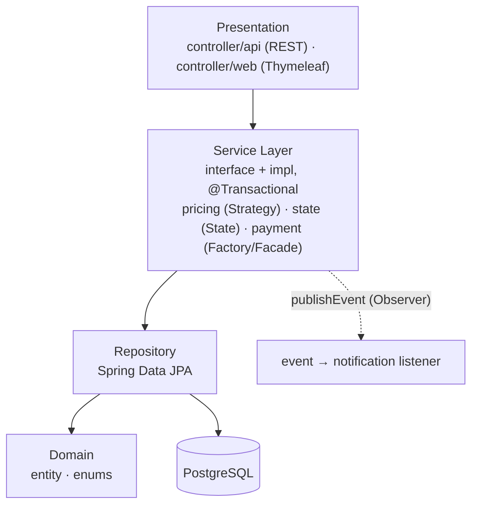
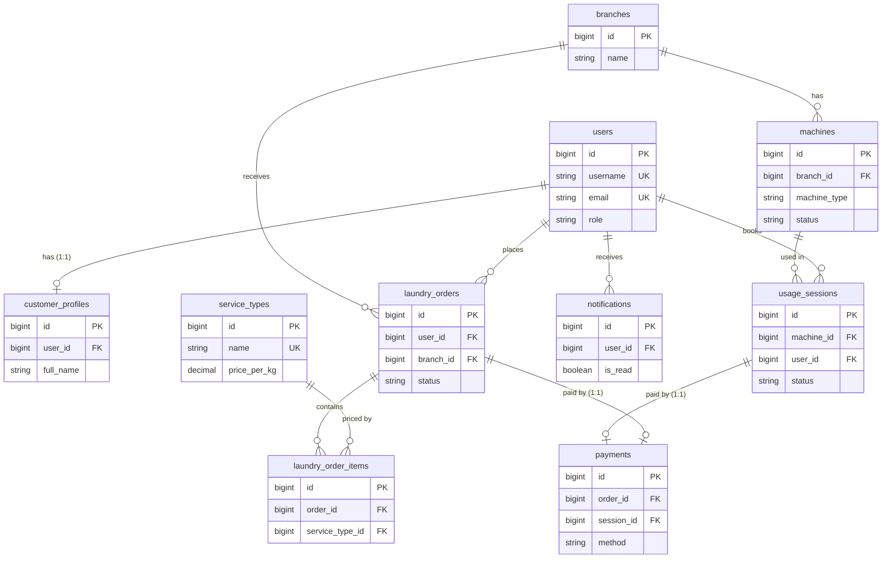

# LaundryHub

ระบบจัดการร้านซักรีดที่รวมบริการ 2 รูปแบบไว้ในระบบเดียว

- **Full-Service (ฝากซัก):** ลูกค้าฝากผ้า พนักงานซัก-อบ-รีดให้ ราคาคิดจากน้ำหนัก × ประเภทบริการ (ปกติ/ด่วน/รีดอย่างเดียว) ติดตามสถานะออเดอร์ได้
- **Self-Service (หยอดเหรียญ):** ลูกค้าจอง/ใช้เครื่องซัก-อบเอง ราคาคิดจากเวลาที่ใช้เครื่อง ระบบกันการจองเวลาซ้อนกัน
- รองรับ 3 บทบาท: `CUSTOMER`, `STAFF`, `ADMIN` พร้อมระบบชำระเงิน (เงินสด / QR จำลอง) และแจ้งเตือนในระบบ
- โปรเจกต์วิชา CP353002 Principles of Software Design and Development (Spring Boot)

## สมาชิกกลุ่ม

| ลำดับ | ชื่อ-นามสกุล | รหัสนักศึกษา | Section | Branch | หน้าที่รับผิดชอบ |
|---|---|---|---|---|---|
| 1 | วงศธร ธน.ยอด (โอ๊ค) | 673380425-2 | 3 | `Wongsathon_6733804252_03` | Foundation / Security / Infra / Deploy |
| 2 | คมชาญ น้อยเนียม (พีช) | 673380395-5 | 3 | `Komchan_6733803955_03` | Full-Service Order module |
| 3 | ปฏิภาณ มะนิลทิพย์ (ปอนด์) | 673380589-2 | 3 | `Pathiphan_6733805892_03` | Self-Service Machine module |
| 4 | ภีมเดช กลั่นกิ่ง (โชกุน) | 673380420-2 | 3 | `Peemdech_6733804202_03` | Payment / Notification / API Quality / Report |

## Tech Stack

| ส่วน | เทคโนโลยี |
|---|---|
| Language / Framework | Java 17, Spring Boot 3.5.7 |
| Build | Maven |
| Database | PostgreSQL 16 |
| ORM / Migration | Spring Data JPA (Hibernate), Flyway |
| Security | Spring Security (3 role, BCrypt, form login + HTTP Basic) |
| API Docs | springdoc-openapi 2.8.14 (Swagger UI) |
| Frontend | Thymeleaf + Bootstrap 5 |
| Testing | JUnit 5, Mockito, Spring Boot Test |
| Container / Deploy | Docker, docker-compose, Render (แอป) + Neon (ฐานข้อมูล) |

## System Architecture

แยกเป็นชั้น (Layered Architecture) และ **ห้ามข้ามชั้น** — Controller ไม่เรียก Repository โดยตรง



Pattern หลักที่ใช้: Layered, MVC, Repository, Service Layer, DTO + Mapper, Dependency Injection (constructor) และ GoF กลุ่ม Behavioral — Strategy (คิดราคา), State (สถานะออเดอร์/เครื่อง), Observer (แจ้งเตือน) พร้อม Factory Method, Facade, Builder เสริม
รายละเอียดและเหตุผลอยู่ใน `doc/design-patterns.md` และ `doc/solid-analysis.md`

## Database Design (ER Diagram)

10 ตาราง จัดการ schema ด้วย Flyway (`V1__init_schema.sql`, `V2__seed_data.sql`)
- **One-to-One:** `users`↔`customer_profiles`, `laundry_orders`↔`payments`, `usage_sessions`↔`payments`
- **One-to-Many:** `branches`→`machines`, `users`→`laundry_orders`→`laundry_order_items`, `machines`→`usage_sessions`



`payments` ผูกกับ order **หรือ** session อย่างใดอย่างหนึ่งเท่านั้น (บังคับด้วย `CHECK` ใน DB) ดู Data Dictionary ที่ `doc/data-dictionary.md`

## Installation & Setup

ต้องมี: **JDK 17**, **Maven 3.9+**, **Docker Desktop**, Git

```bash
git clone https://github.com/Oakiez/Laundry-Hub.git
cd Laundry-Hub
git checkout develop
```

> ฐานข้อมูลใน Docker เปิดที่พอร์ต **5433** (แมปเป็น 5433 เพื่อไม่ชนกับ PostgreSQL ที่ติดตั้งในเครื่องซึ่งมักใช้ 5432) ถ้าพอร์ต 5433 ถูกใช้อยู่ให้เปลี่ยนค่าใน `code/docker-compose.yml` และ `DB_URL`

## How to Run

### วิธีที่ 1: พัฒนาในเครื่อง (รันเฉพาะฐานข้อมูลใน Docker)
```bash
cd code
docker compose up -d db
mvn spring-boot:run
```
เปิด http://localhost:8080 — Flyway จะสร้างตารางและข้อมูลตัวอย่างให้เองตอนสตาร์ท

### วิธีที่ 2: รันทั้งระบบใน Docker
```bash
cd code
docker compose up --build
```
หยุดด้วย `docker compose down` (เพิ่ม `-v` ถ้าต้องการล้างข้อมูลฐานข้อมูล)

### ตัวแปรสภาพแวดล้อม

| ตัวแปร | ค่าเริ่มต้น | ความหมาย |
|---|---|---|
| `DB_URL` | `jdbc:postgresql://localhost:5433/laundryhub` | JDBC URL ของฐานข้อมูล |
| `DB_USER` | `laundry` | ชื่อผู้ใช้ฐานข้อมูล |
| `DB_PASSWORD` | `laundry` | รหัสผ่านฐานข้อมูล (ห้าม commit ค่าจริง) |
| `PORT` | `8080` | พอร์ตของแอป |

### บัญชีตัวอย่าง (จาก `V2__seed_data.sql`)

| username | role | password |
|---|---|---|
| `admin` | ADMIN | `password123` |
| `staff1` | STAFF | `password123` |
| `customer1` | CUSTOMER | `password123` |

รหัสผ่านเหล่านี้เป็นรหัสตัวอย่างสำหรับทดสอบเท่านั้น (เก็บในฐานข้อมูลเป็น BCrypt hash)

## API Documentation

เอกสาร API แบบโต้ตอบได้ด้วย Swagger UI: `/swagger-ui.html` (เช่น http://localhost:8080/swagger-ui.html)

**วิธีทดสอบ endpoint ที่ต้องล็อกอินใน Swagger** — ระบบใช้ HTTP Basic Authentication จึง **ไม่มี endpoint `/auth/login` แยก**:
1. กดปุ่ม **Authorize** มุมขวาบนของหน้า Swagger
2. กรอก username / password (เช่น `admin` / `password123`) แล้วกด **Authorize**
3. กด **Try it out** ที่ endpoint ใดก็ได้ ระบบจะแนบข้อมูลล็อกอินให้ทุกคำขอ

| Method | Endpoint | สิทธิ์ | ผลลัพธ์ |
|---|---|---|---|
| POST | `/api/v1/auth/register` | ทุกคน | 201 / 400 / 409 (ชื่อหรืออีเมลซ้ำ) |
| GET | `/api/v1/users/{id}` | เจ้าของ / ADMIN | 200 / 403 / 404 |
| GET, PUT | `/api/v1/users/{id}/profile` | เจ้าของ / ADMIN | 200 / 400 / 403 / 404 |
| GET | `/api/v1/branches`, `/{id}` | ผู้ที่ล็อกอิน | 200 / 404 |
| POST, PUT, DELETE | `/api/v1/branches`, `/{id}` | ADMIN | 201 / 200 / 204 / 400 / 404 / 409 |

endpoint ของโมดูลอื่น (ออเดอร์, เครื่อง, การชำระเงิน, แจ้งเตือน, รายงาน) ดูได้ครบใน Swagger UI

รูปแบบ error มาตรฐานทุก endpoint:
```json
{ "timestamp": "2026-10-09T10:15:30", "status": 404, "error": "Not Found",
  "message": "Branch 99 not found", "path": "/api/v1/branches/99", "fieldErrors": [] }
```

## How to Run Tests

โค้ดเทสต์อยู่ที่โฟลเดอร์ `test/` ระดับบนสุดของ repo (ตั้งค่าใน `code/pom.xml`)

```bash
cd code
mvn test
```
ไม่ต้องเปิดฐานข้อมูล เพราะเป็น unit test ที่ใช้ Mockito ผลทดสอบและ coverage อยู่ใน `doc/test-report/`

> Docker build ข้ามเทสต์ (`-Dmaven.test.skip=true`) เพราะ `test/` อยู่นอก `code/` จึงควรรัน `mvn test` ในเครื่องก่อน push ทุกครั้ง
>
> **CI:** GitHub Actions (`.github/workflows/ci.yml`) รัน `mvn test` และทดสอบ build Docker image อัตโนมัติทุกครั้งที่เปิด Pull Request เข้า `develop`/`main` และทุกครั้งที่ push เข้าสองสาขานี้

## Deployment URL

**https://laundry-hub-1ltc.onrender.com**

- Swagger UI: https://laundry-hub-1ltc.onrender.com/swagger-ui.html
- Deploy ด้วย Docker บน Render (Free plan) และฐานข้อมูล PostgreSQL บน Neon
- ⚠️ Free plan จะพักการทำงานเมื่อไม่มีผู้ใช้ การเปิดครั้งแรกอาจใช้เวลา 2 นาทีขึ้นไป

## Project Structure

```
Laundry-Hub/
├── code/                          # Maven project + Dockerfile + docker-compose.yml
│   ├── Dockerfile
│   ├── docker-compose.yml
│   ├── pom.xml
│   └── src/main/
│       ├── java/com/laundryhub/
│       │   ├── config/            # SecurityConfig, OpenApiConfig, PasswordEncoderConfig
│       │   ├── controller/
│       │   │   ├── api/           # *ApiController (@RestController)
│       │   │   └── web/           # *WebController (Thymeleaf)
│       │   ├── service/           # interfaces + impl/ + pricing/ state/ payment/
│       │   ├── repository/        # Spring Data JPA
│       │   ├── domain/            # entity/ enums/ Payable
│       │   ├── dto/               # request/ response/
│       │   ├── mapper/
│       │   ├── event/             # domain events (Observer)
│       │   ├── security/          # AppUserDetails, AppUserDetailsService
│       │   ├── exception/         # GlobalExceptionHandler, custom exceptions
│       │   └── common/            # SecurityUtils
│       └── resources/
│           ├── db/migration/      # Flyway V1, V2
│           ├── templates/         # Thymeleaf (fragments/layout.html, ...)
│           ├── static/
│           └── application.yml
├── test/                          # โค้ดเทสต์ทั้งหมด (JUnit 5 + Mockito)
├── doc/
│   ├── diagrams/                  # Use Case, Class, Sequence, Activity, ER, Component, Deployment, State
│   ├── test-report/
│   ├── slide/
│   ├── solid-analysis.md
│   ├── design-patterns.md
│   └── data-dictionary.md
└── img/
```
