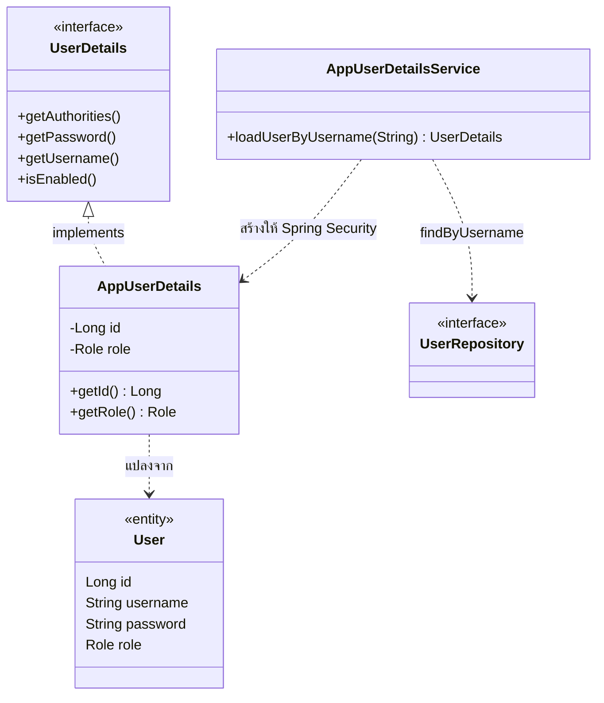
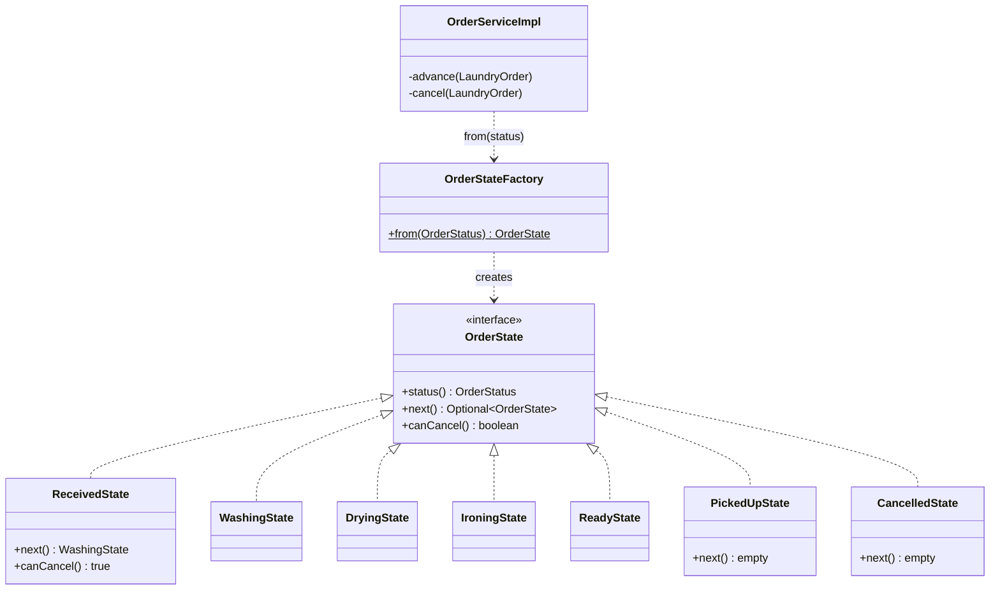
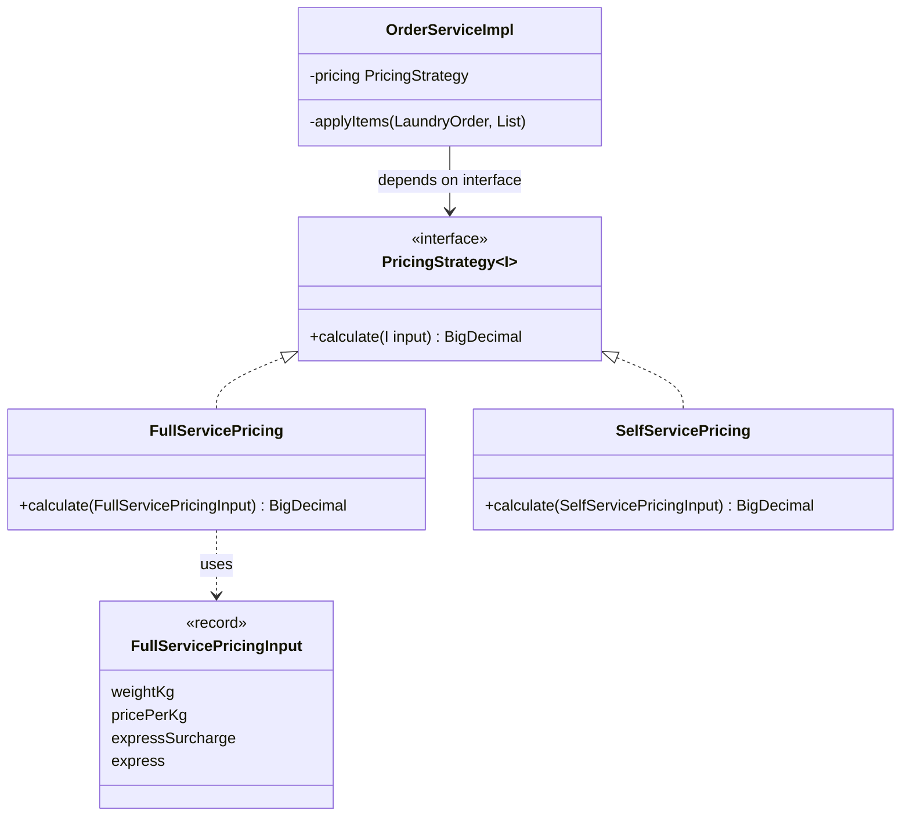
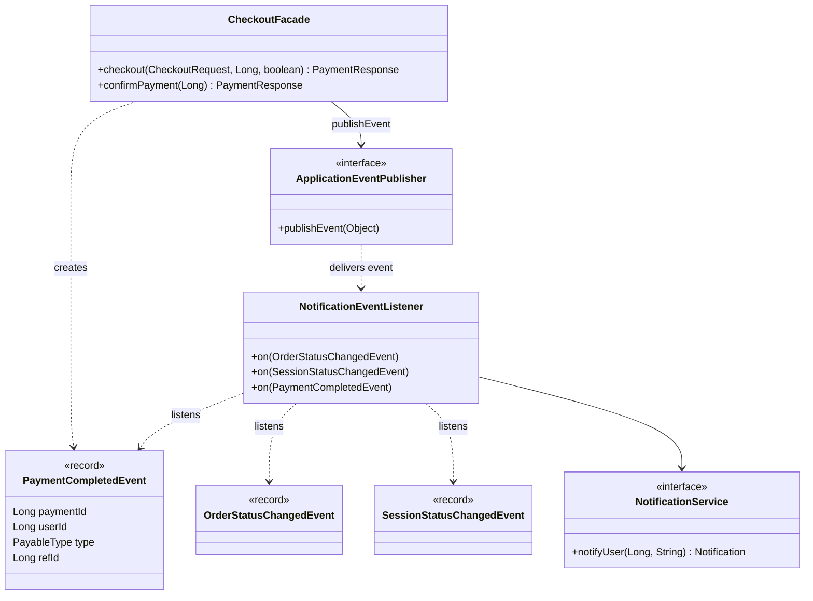
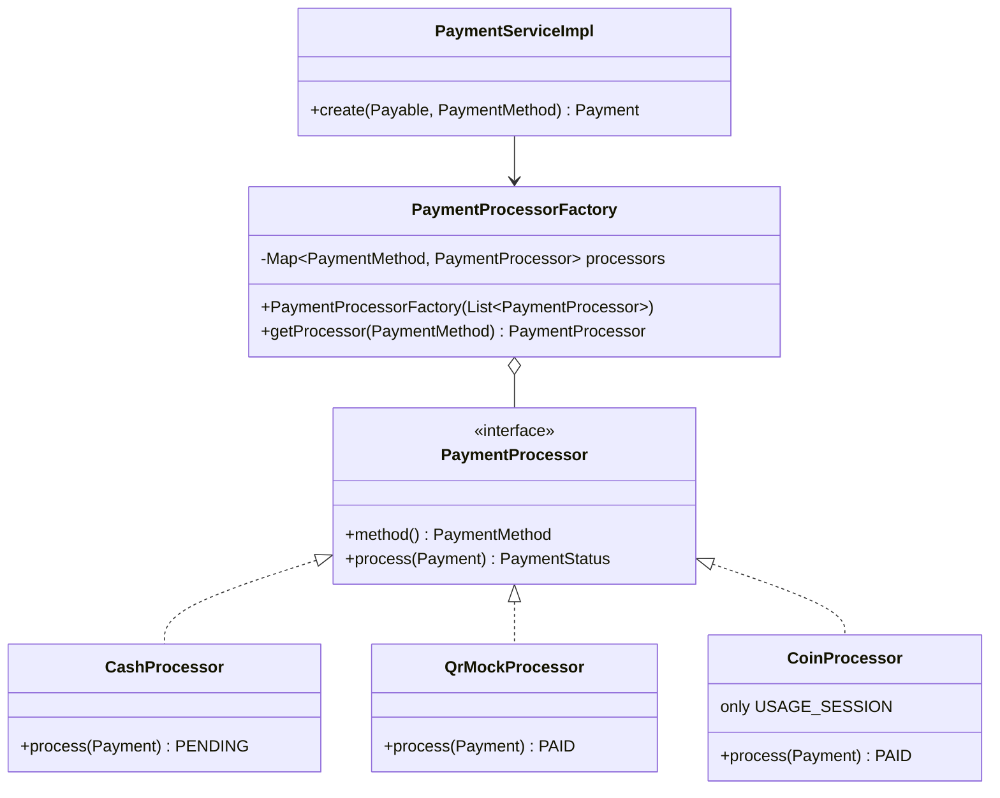
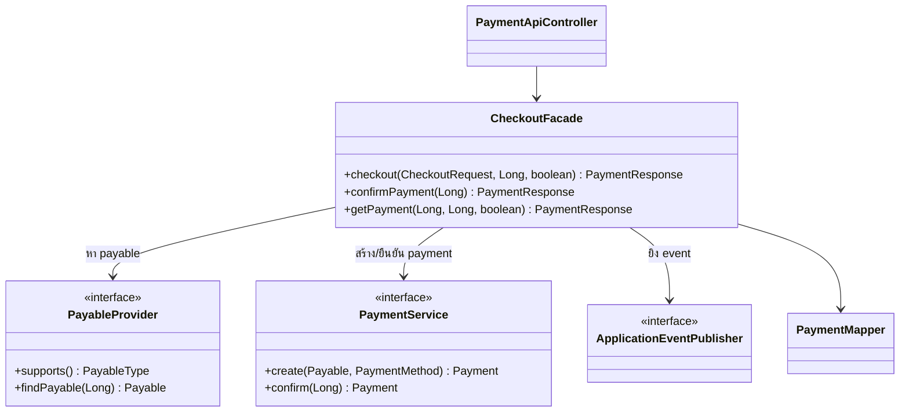

# Design Patterns

ทีมเลือก GoF กลุ่ม **Behavioral** (Strategy, State, Observer ครบ 3 แบบ) เสริมด้วย Facade, Builder, Adapter และใช้ Enterprise Patterns ที่บังคับทุกกลุ่ม ทุก pattern ระบุ **ปัญหาที่แก้ → ไฟล์/คลาสที่ใช้ → เหตุผลที่เลือก** ไม่ได้ยัดเพื่อให้ครบ

> path ย่อ: `code/src/main/java/com/laundryhub/` = `…/` · ต้นฉบับของแต่ละคนอยู่ใน `doc/sections/design-patterns-<ชื่อ>.md`
> Class Diagram รวมของทั้งระบบ: [`diagrams/class-diagram.md`](diagrams/class-diagram.md) · State Diagram ออเดอร์: [`diagrams/state-order.md`](diagrams/state-order.md)

## 1. สรุปภาพรวมทั้งทีม

| Pattern | กลุ่ม | ปัญหาที่แก้ | คลาสหลัก | ผู้รับผิดชอบ |
|---|---|---|---|---|
| **Strategy** | GoF Behavioral | วิธีคิดราคามีหลายแบบ ไม่ต้องแก้ if-else เมื่อเพิ่มแบบใหม่ | `PricingStrategy` → `FullServicePricing`, `SelfServicePricing` · `PaymentProcessor` (วิธีชำระเงิน) | พีช, ปอนด์, โชกุน |
| **State** | GoF Behavioral | สถานะต้องเปลี่ยนตามกฎ ห้ามข้ามขั้น/ย้อนผิด | `OrderState` และ state ทุกตัว · `MachineState` และ state ทุกตัว | พีช, ปอนด์ |
| **Observer** | GoF Behavioral | แจ้งเตือนเมื่อสถานะเปลี่ยน โดยผู้ยิงไม่ต้องรู้จักผู้รับ | `ApplicationEventPublisher` + `event/*Event` + `NotificationEventListener` | โชกุน (ผู้ฟัง) · พีช, ปอนด์, โชกุน (ผู้ยิง) |
| **Facade** | GoF Structural | ขั้นตอน checkout หลายขั้น ให้ Controller เรียกจุดเดียว | `CheckoutFacade` | โชกุน |
| **Factory** (แบบ registry) | Simple Factory (ไม่ใช่ GoF Factory Method ตามตำรา — ระบุเหตุผลไว้ในส่วนของแต่ละคน) | เลือก implementation ตามค่า enum โดยไม่ if-else ที่ผู้ใช้ | `PaymentProcessorFactory`, `OrderStateFactory`, `MachineStateFactory` | โชกุน, พีช, ปอนด์ |
| **Builder** | GoF Creational | DTO ที่มี field เยอะ สลับตำแหน่งได้ง่ายถ้าใช้ constructor | `OrderResponse` (`@Builder`) | พีช |
| **Adapter** | GoF Structural | ทำให้ `User` ของเราใช้กับ Spring Security ได้โดย Entity ไม่ผูกกับ framework | `AppUserDetails` | โอ๊ค |
| **Layered / Service Layer** | Enterprise | แยกหน้าจอ ธุรกิจ ข้อมูล | `controller` → `service` → `repository` → `domain` | ทุกคน |
| **MVC** | Enterprise | แยกหน้าจอจากตรรกะ | `controller/web/*` + Thymeleaf + Entity/DTO | โอ๊ค |
| **Repository** | Enterprise | ซ่อนการเข้าถึง DB | `repository/*` (Spring Data JPA) | ทุกคน |
| **DTO + Mapper** | Enterprise | ไม่เปิด Entity ออก API | `dto/*`, `mapper/*` | ทุกคน |
| **Dependency Injection** | Enterprise | ลดการผูกแน่น ทดสอบด้วย Mockito ได้ | Constructor Injection ทุกคลาส | ทุกคน |

## 2. ส่วนของโอ๊ค (Foundation / Security / Auth / Branch)

> path ย่อ: `code/src/main/java/com/laundryhub/` = `…/` · เลขบรรทัด ณ วันที่ 10 ต.ค. 2569
> **กลุ่ม GoF ของทีมคือ Behavioral (Strategy, State, Observer)** ซึ่งเป็นงานของพีช ปอนด์ โชกุน ส่วนของโอ๊คเป็นโครงสร้างพื้นฐาน จึงเน้น Enterprise Patterns ที่บังคับทุกกลุ่ม และมี Adapter ที่ใช้จริง 1 จุด

### Enterprise / Architectural Patterns (บังคับทุกกลุ่ม)

| Pattern | ปัญหาที่แก้ | ไฟล์/คลาสที่ใช้ | Class Diagram |
|---|---|---|---|
| **Layered Architecture** | ตรรกะหน้าจอ ธุรกิจ และข้อมูลปนกัน แก้จุดหนึ่งกระทบทุกที่ | แยก package `controller` → `service` → `repository` → `domain` ห้ามข้ามชั้น (ไม่มี Controller ไหน import Repository) | [Component Diagram](diagrams/component-diagram.md) |
| **MVC** | ไม่แยกหน้าจอออกจากตรรกะ | Controller: `…/controller/web/AuthWebController.java:17`, `ProfileWebController.java:19`, `BranchWebController.java:22` · Model: `…/domain/entity/User.java:16` และ DTO · View: `templates/**/*.html` (Thymeleaf) พร้อม layout กลาง `templates/fragments/layout.html` | [Component Diagram](diagrams/component-diagram.md) |
| **Repository** | โค้ดเข้าถึง DB กระจายในตรรกะธุรกิจ | `…/repository/UserRepository.java:8`, `CustomerProfileRepository.java:8`, `BranchRepository.java:6` (Spring Data JPA สร้างตัวทำงานให้จากชื่อเมธอด) | [ER Diagram](diagrams/er-diagram.md) |
| **Service Layer** | กฎธุรกิจและ transaction กระจายใน Controller | `…/service/AuthService.java:6` + `…/service/impl/AuthServiceImpl.java:17` (`@Transactional`), `UserServiceImpl.java:17`, `BranchServiceImpl.java:17` | [Component Diagram](diagrams/component-diagram.md) |
| **DTO + Mapper** | ส่ง Entity ออก API แล้ว `password` หลุด และ client ตั้ง `role` เองได้ (mass assignment) | `…/dto/request/RegisterRequest.java:8` (ไม่มีช่อง `role`) · `…/dto/response/UserResponse.java:6` (ไม่มี `password`) · `…/mapper/UserMapper.java:10`, `BranchMapper.java:9` | — |
| **Dependency Injection (Constructor)** | คลาสสร้าง dependency เอง ผูกแน่น ทดสอบยาก | `…/service/impl/AuthServiceImpl.java:23`, `UserServiceImpl.java:23`, `BranchServiceImpl.java:22`, Controller ทุกตัว (เช่น `AuthApiController.java:23`) ไม่มี `@Autowired` บน field | — |

### Pattern เสริมที่ใช้จริง

| Pattern | ปัญหาที่แก้ | ไฟล์/คลาสที่ใช้ | Class Diagram |
|---|---|---|---|
| **Adapter** (GoF Structural) | Spring Security รู้จักแต่ `UserDetails` ส่วนระบบเรามี `User` entity คนละรูปแบบ จึงต้องมีตัวแปลงให้ใช้งานร่วมกันได้ | `…/security/AppUserDetails.java:13` ห่อ `User` ให้เป็น `UserDetails` (ใส่ `ROLE_` นำหน้าบทบาท และพก `id` ไปด้วย) ใช้ผ่าน `AppUserDetailsService.java:10` | ดูด้านล่าง |

#### เหตุผลที่เลือก (ไม่ได้ยัด pattern) (Oak)

- **Layered + Service Layer:** ถ้าไม่แยกชั้น กฎ "สมัครแล้วต้องสร้าง profile ใน transaction เดียว" จะไปอยู่ใน Controller (ทั้งฝั่ง API และฝั่งหน้าเว็บ) ต้องเขียนซ้ำสองที่ เมื่อรวมไว้ที่ `AuthServiceImpl` ทั้งสองฝั่งเรียกจุดเดียวกัน
- **DTO + Mapper:** ทดสอบจริงแล้วว่าส่ง `"role":"ADMIN"` ในคำขอสมัคร ผลคือได้ `CUSTOMER` เพราะ `RegisterRequest` ไม่มีช่องนี้ และ `UserResponse` ไม่มี `password` ให้หลุด
- **Constructor Injection:** ทำให้ `AuthServiceTest` สร้าง `new AuthServiceImpl(mockRepo, mockEncoder, ...)` ได้โดยไม่ต้องเปิด Spring (field injection ทำแบบนี้ไม่ได้) และถ้าลืมส่ง dependency จะ compile ไม่ผ่านทันที
- **Adapter:** เลือกเพราะไม่อยากให้ `User` (Entity ของเรา) ไป implement `UserDetails` ตรงๆ จะทำให้ Entity ผูกกับ Spring Security ใช้ adapter ห่อแทน Entity จึงไม่ต้องรู้จัก Spring Security เลย
  - ข้อแลกเปลี่ยน: มีคลาสเพิ่มอีก 1 ตัว และต้องก๊อปค่า (id, username, password, role) จาก Entity ตอนสร้าง

#### Adapter

## 3. ส่วนของพีช (Full-Service Order)

> path ย่อ: `code/src/main/java/com/laundryhub/` = `…/` · เลขบรรทัด ณ วันที่ 9 ต.ค. 2569
> Class Diagram ทั้งระบบ: [`doc/diagrams/class-diagram.md`](diagrams/class-diagram.md) (รูปที่ 2 = โมดูลออเดอร์) · State Diagram: [`doc/diagrams/state-order.md`](diagrams/state-order.md)

### GoF Patterns (กลุ่ม Behavioral ของทีม + เสริม) (Peach)

| Pattern | ปัญหาที่แก้ | ไฟล์/คลาสที่ใช้ | Class Diagram |
|---|---|---|---|
| **State** | สถานะออเดอร์ต้องเดินตามลำดับ `RECEIVED → WASHING → DRYING → IRONING → READY → PICKED_UP` ห้ามข้าม/ย้อน และยกเลิกได้เฉพาะ `RECEIVED` ถ้าใช้ `if/switch` กฎจะกระจายอยู่หลายเมธอด | `…/service/state/OrderState.java` (interface) · 7 คลาส `ReceivedState` … `CancelledState` · `OrderStateFactory.java:10` · ผู้ใช้: `OrderServiceImpl.advance()` บรรทัด 151 และ `cancel()` บรรทัด 159 | [ดูด้านล่าง](#state-peach) · [state-order.md](diagrams/state-order.md) |
| **Strategy** | วิธีคิดราคามีหลายแบบ (ฝากซักคิดตามน้ำหนัก, ซักเองคิดตามเวลา, อนาคตอาจมีโปรลดราคา) ไม่อยากให้ Service ผูกกับสูตรใดสูตรหนึ่ง | `…/service/pricing/PricingStrategy.java` (interface) · `FullServicePricing.java:15` (พีช) · `SelfServicePricing` (ปอนด์) · ผู้ใช้: `OrderServiceImpl.java:51` (field) และบรรทัด 186 (เรียก) | [ดูด้านล่าง](#strategy-peach) |
| **Observer** (ฝั่งผู้ยิง) | เมื่อสถานะออเดอร์เปลี่ยนต้องแจ้งลูกค้า แต่ไม่อยากให้ `OrderService` รู้จักระบบแจ้งเตือน | `OrderServiceImpl.publishStatusChanged()` บรรทัด 169-172 ยิง `…/event/OrderStatusChangedEvent.java` → ผู้ฟัง `NotificationEventListener` (โชกุน) | ดูส่วนของโชกุน |
| **Builder** | `OrderResponse` มี 11 field ถ้าใช้ constructor จะสลับตำแหน่งผิดได้ง่าย (เช่น `customerId` กับ `branchId` เป็น `Long` ทั้งคู่ สลับกันก็ compile ผ่าน) | `…/dto/response/OrderResponse.java:11` (`@Builder` ของ Lombok) · ผู้ใช้: `…/mapper/OrderMapper.java:14` | — |

#### เหตุผลที่เลือก (ไม่ได้ยัด pattern) (Peach)

- **State:** ถ้าไม่ใช้ State จะต้องเขียน `switch (status) { case RECEIVED -> WASHING; case WASHING -> DRYING; ... }` ใน `advance()` และอีกชุดใน `cancel()` ถ้าวันหน้าเพิ่มสถานะ (เช่น `QUALITY_CHECK`) ต้องไล่แก้ทุก switch และลืมได้ง่าย เมื่อใช้ State กฎของแต่ละสถานะอยู่ในคลาสของมันเอง เพิ่มสถานะ = เพิ่ม 1 คลาส + 1 บรรทัดใน Factory
  - ออกแบบให้ผ่าน **LSP**: `next()` คืน `Optional<OrderState>` แทนการ throw สถานะสุดท้าย (`PickedUpState`, `CancelledState`) คืน `Optional.empty()` ผู้เรียกจึงใช้ทุก State ได้แบบเดียวกัน
  - ข้อแลกเปลี่ยน: มี 7 คลาสเล็กๆ แทนที่จะเป็นเมธอดเดียว และยังมี `switch` 1 จุดใน `OrderStateFactory` (แปลง enum ที่เก็บใน DB เป็นคลาส) ซึ่ง Java ตรวจว่าครบทุก case ตอน compile
- **Strategy:** ถ้าไม่ใช้ Strategy แล้ว `OrderServiceImpl` ต้องมีสูตรราคาฝังอยู่ข้างใน และถ้ามีโปรลดราคาต้องแก้ Service เมื่อใช้ Strategy Service ถือแค่ interface (Spring ฉีดตัวจริงให้ตาม generic type) สูตรเองทดสอบแยกได้โดยไม่ต้องใช้ DB (`FullServicePricingTest` 6 เคส)
  - เหตุผลที่ `if (express)` ใน `FullServicePricing` ไม่ขัด OCP: เป็นการอ่านค่าจากข้อมูล (ค่าด่วนต่อกิโลจาก `service_types.express_surcharge`) ไม่ใช่การแยกตามประเภทของวิธีคิดราคา
- **Observer:** ถ้าไม่ใช้ Observer แล้ว `OrderService` ต้องเรียก `NotificationService` ตรงๆ ทุกจุดที่เปลี่ยนสถานะ สองโมดูลจะผูกกัน เมื่อใช้ event ผู้ยิงแค่ `publishEvent` เพิ่มผู้ฟังได้โดยไม่แก้ OrderService
- **Builder:** ใช้เฉพาะ `OrderResponse` เพราะเป็น DTO เดียวของโมดูลที่มี field เยอะ DTO เล็กอื่น (`OrderItemResponse` 6 field) ยังใช้ constructor ปกติ ไม่ได้ใส่ Builder ทุกคลาสเพื่อให้ครบ

### Enterprise Patterns ในโมดูลออเดอร์

| Pattern | ปัญหาที่แก้ | ไฟล์/คลาสที่ใช้ |
|---|---|---|
| **Layered + Service Layer** | กฎธุรกิจปนกับ HTTP/DB | `OrderApiController` → `OrderService` (interface) → `OrderServiceImpl` → `LaundryOrderRepository` (Controller ไม่ import Repository) |
| **Repository** | SQL กระจายในตรรกะธุรกิจ | `…/repository/LaundryOrderRepository.java:12` query จากชื่อเมธอด (`findByUserId` บรรทัด 15) · `@EntityGraph` บรรทัด 23 ดึง items มาใน query เดียวสำหรับหน้า detail |
| **DTO + Mapper** | ถ้ารับ/คืน Entity ตรงๆ ลูกค้าจะส่ง `totalAmount` มาตั้งราคาเองได้ และ JSON วนไม่จบ (`order → items → order`) | `…/dto/request/CreateOrderRequest.java:11` (ไม่มีช่องราคา/สถานะโดยตั้งใจ) · `…/dto/response/OrderResponse.java` · `…/mapper/OrderMapper.java:11` · `PageResponse<T>` สำหรับรายการแบ่งหน้า |
| **Dependency Injection (Constructor)** | คลาสสร้าง dependency เอง ทดสอบยาก | `OrderServiceImpl.java:55` รับ 7 dependency ผ่าน constructor · `OrderServiceTest` ส่ง mock เข้าไปตรงๆ |

#### หมายเหตุด้านประสิทธิภาพ (N+1)
หน้ารายการออเดอร์แบบแบ่งหน้าเคยยิง SQL `1 + N` ครั้ง (items ทีละออเดอร์) แก้ด้วย `@BatchSize(size = 50)` ที่ `…/domain/entity/LaundryOrder.java:60` และ `…/domain/entity/ServiceType.java:12` เหลือ 3 query ต่อหน้า (วัดจาก log `org.hibernate.SQL`) ไม่ใช้ `@EntityGraph` กับหน้ารายการ เพราะ JOIN FETCH collection พร้อม pagination ทำให้ Hibernate ตัดหน้าในหน่วยความจำ

### Class Diagrams (Peach)

#### State (Peach)

#### Strategy (Peach)

## 4. ส่วนของปอนด์ (Self-Service Machine)

### Strategy (Pond)

`SelfServicePricing` implements `PricingStrategy<SelfServicePricingInput>`.
The algorithm is `basePrice + pricePerMinute * durationMinutes` using BigDecimal.
It rejects missing/negative prices and durations outside 10–180 minutes.
Tests exercise boundary values and pricing arithmetic. SessionService receives
PricingStrategy through constructor injection (`service/impl/SessionServiceImpl.java:42`)
and persists a server-calculated amount when booking.

### State (Pond)

MachineState declares `status`, `canStart`, `canFinish`, and `canSetOutOfService`.
AvailableState, ReservedState, InUseState, and OutOfServiceState supply the
capabilities. MachineService consults the current state's maintenance capability
before applying a manual status change. Starting/finishing a machine belongs to
the session lifecycle and cannot be bypassed through this manual operation.

MachineStateFactory is a **simple registry factory**, not the GoF Factory Method
pattern. Constructor injection collects implementations and rejects missing or
duplicate status registrations. Do not count this registry as another GoF pattern.

### Observer through Spring application events

MachineService publishes MachineStatusChangedEvent only when the status actually
changes. Repeating the current status is a no-op without another event. The service
depends on ApplicationEventPublisher, not a particular notification implementation.
A consumer for machine maintenance notifications is optional and not implemented
in this change. Publishing an event does not by itself guarantee delivery after a
transaction commits; a future consumer must choose appropriate transaction semantics.

### Repository and Service Layer

MachineRepository and UsageSessionRepository encapsulate persistence queries.
MachineServiceImpl coordinates duplicate checks, reference validation, lifecycle
restrictions, mapping and transactions. Database uniqueness remains authoritative
if two creates pass the preliminary duplicate-name check simultaneously.

Additional management rules in this implementation: preserve machines with session
history instead of deleting them; disallow moving/changing their type once they have
history. Manual status changes accept AVAILABLE/OUT_OF_SERVICE only; IN_USE is owned
by SessionService. These rules protect booking history and should be reviewed with
the team along with the core brief requirements.

### Current limits

SessionPayableProvider adapts SessionService.findPayable to the shared
PayableProvider interface and declares USAGE_SESSION. Spring collects it into
CheckoutFacade's provider registry through constructor injection. No checkout or
processor code is changed to add this supported payable type. Missing sessions
propagate ResourceNotFoundException; ownership remains CheckoutFacade's responsibility.

SessionService now composes the overlap query and machine lock in one transaction.
Booking remains RESERVED while the machine stays AVAILABLE. Start checks canStart,
changes both states to IN_USE; finish checks canFinish and releases the machine.
Cancel accepts RESERVED only and changes no machine status.

Session and machine events are published after flushing changes
(`service/impl/SessionServiceImpl.java:178`). The existing synchronous session
notification listener joins the transaction. Integration tests deliberately reject
a notification insert and verify session/machine changes roll back together.
Machine events currently have no notification consumer.

MachineApiController and SessionApiController now expose DTOs through their service
interfaces with constructor injection, @Valid requests, @PreAuthorize role rules
and PageResponse pagination. User identity/staff flags come from SecurityUtils.
UI remains pending. Start follows the brief's
session/machine status rules; it does not enforce a clock window or payment prerequisite.
Wrong lifecycle states use BusinessRuleException (400), following the shared handler
and the brief's unit-test contract; the API table's proposed 409 needs team agreement
with the team; the implemented endpoints retain the shared 400 mapping.
See doc/self-service-api.md for endpoints and verified HTTP behavior.
Database concurrency tests are opt-in via
LAUNDRY_DB_TESTS=true and run against an isolated generated PostgreSQL schema.

## 5. ส่วนของโชกุน (Payment / Notification / API Quality)

> path ย่อ: `code/src/main/java/com/laundryhub/` = `…/`

### GoF Patterns (กลุ่ม Behavioral ของทีม + เสริม) (Shogun)

| Pattern | ปัญหาที่แก้ | ไฟล์/คลาสที่ใช้ | Class Diagram |
|---|---|---|---|
| **Observer** | เมื่อสถานะออเดอร์/รอบใช้เครื่อง/การชำระเปลี่ยน ต้องแจ้งเตือนผู้ใช้ โดยไม่ให้โมดูลต้นทางต้องรู้จักระบบแจ้งเตือน (loose coupling) | `…/event/NotificationEventListener.java` (`@EventListener`) · event ใน `…/event/*Event.java` · ผู้ยิง `CheckoutFacade.publishCompleted` (บรรทัด 100) | [ดูด้านล่าง](#observer) |
| **Strategy** | วิธีชำระแต่ละแบบ (เงินสด/QR/เหรียญ) มีพฤติกรรมต่างกัน ไม่อยากเขียน `if-else` ตามวิธีชำระ | `…/service/payment/PaymentProcessor.java` (interface) · `CashProcessor` · `QrMockProcessor` · `CoinProcessor` | [ดูด้านล่าง](#strategy--factory) |
| **Factory** | เลือก processor ที่ถูกต้องตาม `PaymentMethod` โดยผู้เรียกไม่ต้องรู้จักคลาสจริง | `…/service/payment/PaymentProcessorFactory.java` | [ดูด้านล่าง](#strategy--factory) |
| **Facade** | ขั้นตอนชำระเงินมีหลายส่วน (หา payable, ตรวจสิทธิ์, สร้าง payment, ยิง event) ให้ Controller เรียกจุดเดียว | `…/service/payment/CheckoutFacade.java` | [ดูด้านล่าง](#facade) |

> **หมายเหตุความถูกต้องของ Factory:** `PaymentProcessorFactory` เป็นแบบ *Simple Factory แบบ registry* (Spring ฉีด processor ทุกตัวเข้ามา แล้วค้นด้วย Map ตาม enum) ซึ่งไม่ใช่ GoF *Factory Method* ตามตำรา (ที่ให้คลาสลูกเป็นคนตัดสินใจสร้าง) เราเลือกแบบนี้เพราะเพิ่มวิธีชำระใหม่ได้โดยไม่แก้ Factory (OCP) และให้ Spring จัดการวงจรชีวิตของ processor ให้

#### เหตุผลที่เลือก (ไม่ได้ยัด pattern) (Shogun)

- **Observer:** ถ้าไม่ใช้ Observer แล้ว `OrderService` ต้องเรียก `NotificationService` ตรงๆ ทุกจุดที่เปลี่ยนสถานะ ผูกโมดูลเข้าด้วยกัน เมื่อใช้ event ผู้ยิงแค่ `publishEvent(...)` และเพิ่มผู้ฟังได้โดยไม่แก้ผู้ยิง
  - ใช้ `@EventListener` แบบ synchronous จึงรันใน transaction เดียวกับผู้ยิง ถ้าบันทึกแจ้งเตือนพัง ธุรกรรมหลักจะ rollback ด้วย **เลือกแบบนี้เพราะต้องการความสอดคล้องของข้อมูล** (ไม่มีกรณีสถานะเปลี่ยนแล้วแต่ไม่มีแจ้งเตือน) ข้อแลกเปลี่ยนคือแจ้งเตือนที่ล้มเหลวกระทบงานหลัก ถ้าต้องแยกให้ใช้ `@TransactionalEventListener(AFTER_COMMIT)` หรือ `@Async` พร้อมเปิด transaction ใหม่ใน `notifyUser`
- **Strategy + Factory:** ตอนนี้มี 2 วิธีชำระ (+ COIN ที่เพิ่มได้) มีพฤติกรรมต่างกันชัดเจน (เงินสดต้องรอยืนยัน, QR สำเร็จทันที) การแยกเป็นคลาสทำให้เพิ่ม/ทดสอบแต่ละวิธีแยกกันได้
- **Facade:** `checkout` ต้องประสาน 4 ขั้นตอนและหลายโมดูล (provider ของ order/session, service, event) Controller จึงเรียกเมธอดเดียว

#### Class Diagrams (Shogun)

##### Observer

##### Strategy + Factory

##### Facade

### Enterprise / Architectural Patterns ในโมดูลนี้

| Pattern | ไฟล์ที่เห็นชัด |
|---|---|
| Repository | `…/repository/PaymentRepository.java`, `NotificationRepository.java` (Spring Data JPA) |
| Service Layer | `…/service/PaymentService.java` + `impl/PaymentServiceImpl.java`, `NotificationService` + `impl/NotificationServiceImpl.java` |
| DTO + Mapper | `…/dto/request/CheckoutRequest.java`, `…/dto/response/PaymentResponse.java`, `NotificationResponse.java`, `…/mapper/PaymentMapper.java`, `NotificationMapper.java` |
| Dependency Injection (Constructor) | ทุกคลาสข้างต้นรับ dependency ทาง constructor |
| MVC / REST | `…/controller/api/PaymentApiController.java`, `NotificationApiController.java` |
| Global Exception Handling (Advice) | `…/exception/GlobalExceptionHandler.java` (`@RestControllerAdvice`) |
