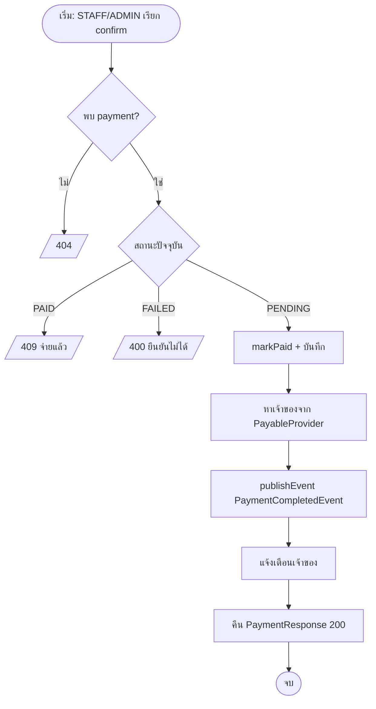

# Activity Diagram — ขั้นตอน Checkout (ชำระเงิน)

อ้างอิงโค้ด: `CheckoutFacade.checkout`, `PaymentServiceImpl.create`, `NotificationEventListener`

## 1) ลูกค้า/พนักงานชำระเงิน — `POST /api/v1/payments`

```mermaid
flowchart TD
    A([เริ่ม: รับ CheckoutRequest]) --> B{ข้อมูลครบและถูกต้อง?<br/>@Valid}
    B -- ไม่ --> E400a[/400 + fieldErrors/]
    B -- ใช่ --> C{มี PayableProvider<br/>ของ payableType นี้?}
    C -- ไม่ --> E400b[/400 Unsupported payable type/]
    C -- ใช่ --> D[provider.findPayable id]
    D --> D1{พบ payable?}
    D1 -- ไม่ --> E404[/404 ResourceNotFound/]
    D1 -- ใช่ --> F{เป็นเจ้าของ<br/>หรือเป็น STAFF/ADMIN?}
    F -- ไม่ --> E403[/403 AccessDenied/]
    F -- ใช่ --> G{payable นี้มี payment แล้ว?}
    G -- ใช่ --> E409[/409 Duplicate/]
    G -- ไม่ --> H[สร้าง Payment<br/>amount = payable.getPayableAmount]
    H --> I{PaymentProcessorFactory<br/>รองรับ method นี้?}
    I -- ไม่ --> E400c[/400 Unsupported payment method/]
    I -- ใช่ --> J[processor.process payment]
    J --> K{ผลลัพธ์}
    K -- PAID<br/>QR_MOCK --> L[markPaid + บันทึก]
    K -- PENDING<br/>CASH --> M[บันทึกสถานะ PENDING]
    L --> N[publishEvent PaymentCompletedEvent]
    N --> O[NotificationEventListener<br/>สร้างแจ้งเตือนให้เจ้าของ]
    O --> R
    M --> R[คืน PaymentResponse<br/>201 Created]
    R --> Z([จบ])
```

## 2) พนักงานยืนยันรับเงินสด — `PATCH /api/v1/payments/{id}/confirm`



## หมายเหตุการออกแบบ

- ทุกขั้นตอนใน `checkout` อยู่ใน transaction เดียว (`@Transactional`) และ listener เป็น `@EventListener` แบบ synchronous จึงรันใน transaction เดียวกัน: ถ้าบันทึกแจ้งเตือนพัง การชำระเงินจะ rollback ด้วย เลือกแบบนี้เพื่อให้ข้อมูลสอดคล้อง (ไม่มีกรณีจ่ายแล้วแต่ไม่มีแจ้งเตือน) ข้อแลกเปลี่ยนคือแจ้งเตือนที่ล้มเหลวจะกระทบงานหลัก
- ยอดเงินมาจาก `Payable` ฝั่งเซิร์ฟเวอร์เท่านั้น ไม่รับจาก client
- กันชำระซ้ำสองชั้น: เช็คใน service (ได้ข้อความ error อ่านง่าย) และ `UNIQUE` ใน DB (ป้องกันกรณีสองคำขอพร้อมกัน ซึ่ง `GlobalExceptionHandler` แปลงเป็น 409)
