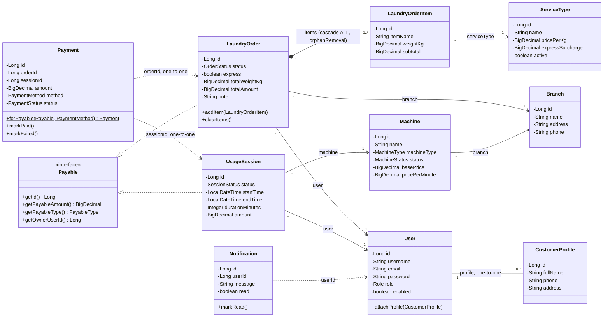
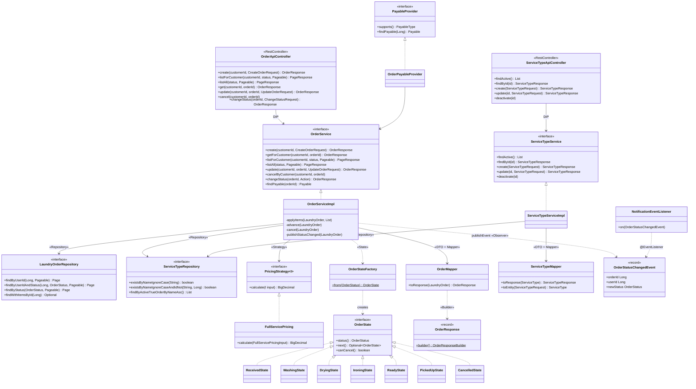
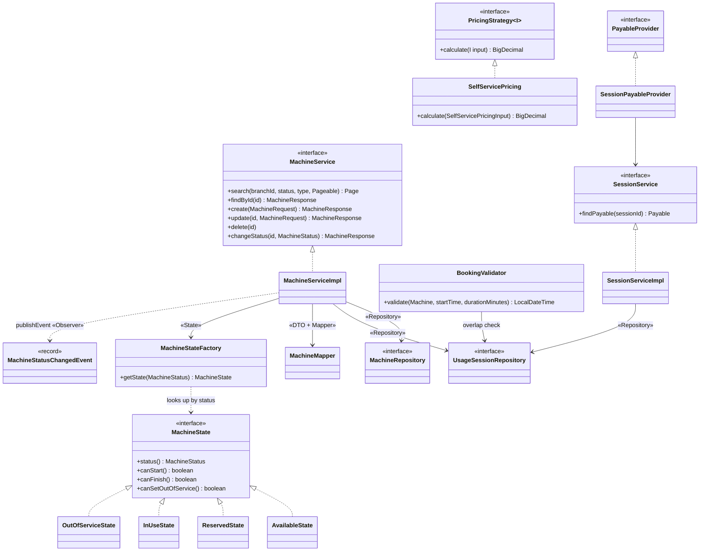
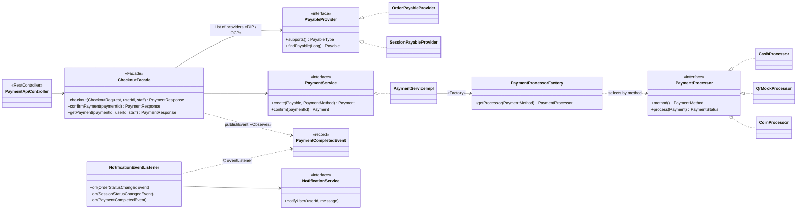

# Class Diagram — LaundryHub

> แบ่งเป็น 4 รูปเพื่อให้อ่านง่าย: (1) Domain Model ทั้งระบบ (2) โมดูลออเดอร์ฝากซัก + ประเภทบริการ (3) โมดูลซักเอง (เครื่อง/รอบใช้งาน) (4) Payment / Notification
> สัญลักษณ์: `<|..` implements · `-->` ใช้งาน (dependency ผ่าน constructor) · `*--` composition · `..>` สร้าง/ส่งต่อ · `«...»` ชื่อ Pattern

## 1. Domain Model (Entity และความสัมพันธ์)

- เส้นทึบ `-->` = ความสัมพันธ์ JPA (`@ManyToOne` / `@OneToMany` / `@OneToOne`) ทุกเส้นเป็น `FetchType.LAZY`
- เส้นประ `..>` = เก็บเป็น FK แบบ `Long` ไม่ผูก entity ตรง เพื่อให้โมดูลไม่รู้จักกัน (เช่น `Payment` ไม่ต้องรู้จัก `LaundryOrder`)
- `LaundryOrder` *-- `LaundryOrderItem` เป็น composition: item ไม่มีความหมายถ้าไม่มี order ลบ order แล้ว item ถูกลบด้วย
- `ServiceType` ไม่ถูกลบจริง (soft delete ด้วย `active = false`) เพราะ `LaundryOrderItem` ของออเดอร์เก่ายังอ้างถึง

## 2. โมดูลออเดอร์ฝากซัก + ประเภทบริการ (Layer + Pattern)

## 3. โมดูลซักเอง: เครื่องและรอบใช้งาน (Layer + Pattern)

- `MachineStateFactory` ได้ state ทุกตัวจาก Spring (`List<MachineState>`) แล้วเก็บใน `EnumMap` ต่างจาก `OrderStateFactory` ที่ใช้ `switch` แบบ static ทั้งคู่ทำหน้าที่เดียวกันคือแปลง enum ในฐานข้อมูลเป็นคลาส State
- ณ วันที่ปรับรูปนี้ `BookingValidator` และ `SelfServicePricing` ยังไม่มี Service ตัวไหนเรียกใช้ (มีเทสต์ของตัวเองแล้ว) ส่วน `MachineStatusChangedEvent` ยังไม่มี listener รูปนี้จึงไม่ได้วางเส้นจาก Service ไปหาคลาสเหล่านั้น

## 4. Payment / Notification (Strategy + Factory, Facade, Observer)

## ตำแหน่ง Design Pattern ในระบบ

| Pattern | กลุ่ม | คลาส | ไฟล์ | เจ้าของ |
|---|---|---|---|---|
| Strategy | Behavioral | `PricingStrategy` ← `FullServicePricing`, `SelfServicePricing` · `PaymentProcessor` ← `Cash/QrMock/CoinProcessor` | `service/pricing/`, `service/payment/` | พีช, ปอนด์, โชกุน |
| State | Behavioral | `OrderState` ← 7 สถานะ + `OrderStateFactory` · `MachineState` ← 4 สถานะ + `MachineStateFactory` | `service/state/` | พีช, ปอนด์ |
| Observer | Behavioral | `OrderStatusChangedEvent`, `MachineStatusChangedEvent`, `PaymentCompletedEvent` → `NotificationEventListener` | `event/` | พีช, ปอนด์ (ยิง), โชกุน (ยิง/ฟัง) |
| Factory (Simple Factory แบบ registry) | Creational | `PaymentProcessorFactory` → `PaymentProcessor` | `service/payment/` | โชกุน |
| Facade | Structural | `CheckoutFacade` | `service/payment/CheckoutFacade.java` | โชกุน |
| Builder | Creational | `OrderResponse.builder()` (Lombok `@Builder`) | `dto/response/OrderResponse.java` | พีช |
| Adapter | Structural | `AppUserDetails` แปลง `User` ให้ Spring Security ใช้ | `security/AppUserDetails.java` | โอ๊ค |
| Repository | Enterprise | `*Repository extends JpaRepository` | `repository/` | ทุกคน |
| Service Layer | Enterprise | `*Service` (interface) + `impl/*ServiceImpl` | `service/` | ทุกคน |
| DTO + Mapper | Enterprise | `dto/request`, `dto/response`, `mapper/*Mapper` | `dto/`, `mapper/` | ทุกคน |
| Dependency Injection | Enterprise | constructor injection ทุก `@Service` / `@RestController` | ทั้งระบบ | ทุกคน |

> รูปนี้สะท้อนโค้ดใน `develop` ณ วันที่ 10 ต.ค. 2569 (หลัง merge PR #17 และ #18) ถ้าเพิ่มคลาสใหม่ (เช่น controller ของเครื่อง/รอบใช้งาน) ให้เจ้าของโมดูลเติมลงในรูปที่ 3 และตาราง
