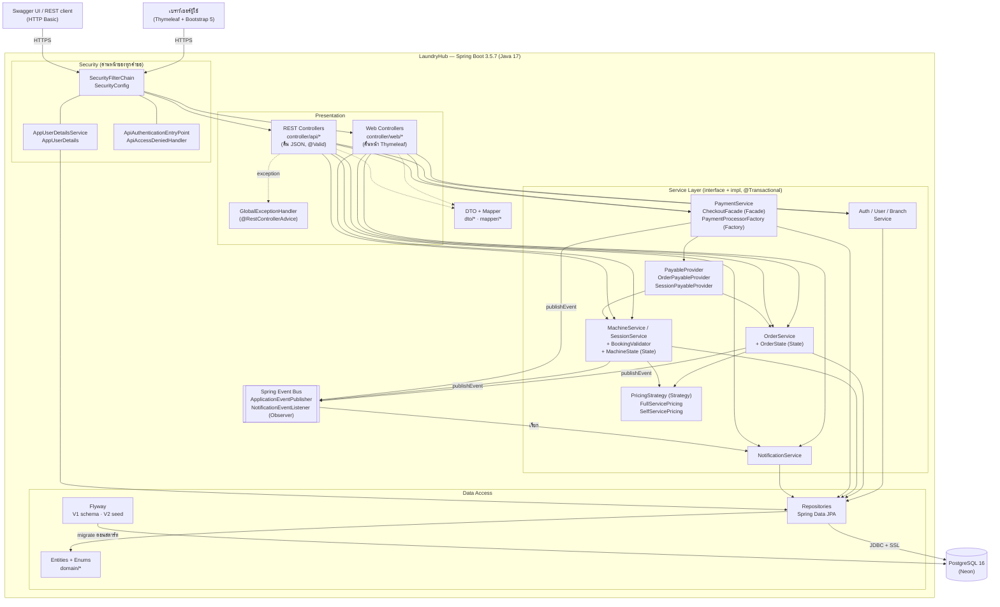

# Component Diagram

แสดงส่วนประกอบหลักของ LaundryHub และการพึ่งพากัน ตามสถาปัตยกรรมแบบชั้น (Layered) กฎคือ **ลูกศรไปได้เฉพาะชั้นล่างลงไป** และ Controller ไม่เรียก Repository โดยตรง

## คำอธิบายส่วนประกอบ

| ส่วนประกอบ | หน้าที่ | ตัวอย่างในโค้ด |
|---|---|---|
| **Security** | ตรวจตัวตนและสิทธิ์ก่อนถึง Controller รองรับฟอร์มล็อกอิน (หน้าเว็บ) และ HTTP Basic (API) คืน 401/403 เป็น JSON มาตรฐานสำหรับ `/api/**` | `config/SecurityConfig`, `security/*` |
| **Presentation** | รับคำขอ ตรวจข้อมูลด้วย `@Valid` เรียก Service และคืนผล (หน้าเว็บ/JSON) ไม่มีตรรกะธุรกิจ | `controller/web/*`, `controller/api/*` |
| **GlobalExceptionHandler** | แปลง exception จากทุก REST Controller เป็น `ApiErrorResponse` รูปแบบเดียวกัน (400/404/409/500) | `exception/GlobalExceptionHandler` |
| **Service Layer** | ตรรกะธุรกิจและ transaction แต่ละโมดูลพึ่งพา interface ไม่ใช่ implementation (DIP) | `service/*`, `service/impl/*` |
| **Strategy (Pricing)** | วิธีคิดราคาสลับได้โดยไม่แก้ผู้เรียก | `service/pricing/*` |
| **State** | ควบคุมลำดับการเปลี่ยนสถานะออเดอร์และเครื่อง | `service/state/*` |
| **PayableProvider** | ให้ Payment หา "สิ่งที่ต้องจ่าย" โดยไม่รู้จักโมดูล Order/Session ตรงๆ (DIP + ISP) | `service/payment/PayableProvider` |
| **Spring Event Bus** | ผู้เปลี่ยนสถานะแค่ `publishEvent` ส่วนการแจ้งเตือนเป็นผู้ฟัง (Observer) โมดูลต้นทางไม่รู้จักระบบแจ้งเตือน | `event/*` |
| **DTO + Mapper** | ไม่เปิด Entity ออก API (เช่น ไม่ให้ `password` หลุด) | `dto/*`, `mapper/*` |
| **Data Access** | Repository (Spring Data JPA) + Entity + Flyway migration | `repository/*`, `domain/*`, `db/migration/*` |
| **PostgreSQL (Neon)** | ฐานข้อมูลหลัก 10 ตาราง | ดู `er-diagram.md` |

## ส่วนประกอบภายนอกที่ระบบพึ่งพา
- **PostgreSQL บน Neon** (ผ่าน JDBC + SSL)
- **Bootstrap 5** โหลดจาก CDN โดยเบราว์เซอร์ (ไม่ผ่านเซิร์ฟเวอร์ของเรา)
- **springdoc-openapi** สร้างหน้า Swagger UI ที่ `/swagger-ui.html`

---

**ตรวจก่อนส่ง (โอ๊ค):** ชื่อคลาสในแผนภาพต้องมีอยู่จริงใน `main` (โดยเฉพาะ `OrderService`, `MachineService`/`SessionService`, `OrderPayableProvider`/`SessionPayableProvider`, `*State`)
