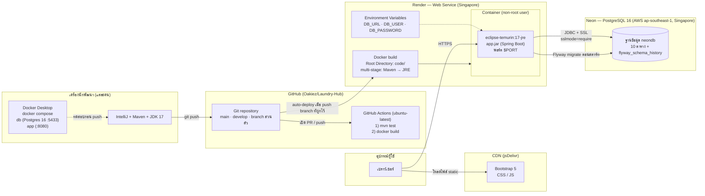

# Deployment Diagram

แสดงว่าระบบรันที่ไหน และไหลจากโค้ดไปสู่ผู้ใช้อย่างไร (Docker → Render ← Neon)

## รายละเอียดแต่ละโหนด

| โหนด | เทคโนโลยี | หน้าที่ |
|---|---|---|
| **เบราว์เซอร์ผู้ใช้** | Chrome/Edge ฯลฯ | เปิดหน้าเว็บและ Swagger UI ผ่าน HTTPS |
| **Render Web Service** | Docker, Free plan, region Singapore | build จาก `code/Dockerfile` แล้วรัน container ตัวเดียว (non-root) รับพอร์ตจากตัวแปร `PORT` |
| **Neon PostgreSQL** | Postgres 16 แบบ serverless, region Singapore | เก็บข้อมูลถาวร แยกจากแอป จึง **ข้อมูลไม่หายเมื่อ redeploy** |
| **GitHub** | Git + Pull Request | เก็บโค้ด ทุกการรวมงานผ่าน PR + รีวิวอย่างน้อย 1 คน |
| **GitHub Actions** | `.github/workflows/ci.yml` | ทุก PR/push เข้า `develop`/`main` รัน `mvn test` และทดสอบ build Docker image กันโค้ดพังก่อน deploy |
| **เครื่องนักพัฒนา** | JDK 17, Maven, Docker Desktop | พัฒนาและรันทั้งระบบด้วย `docker compose up --build` |

## ขั้นตอน deploy (สรุป)
1. push โค้ดเข้า branch ที่ Render ผูกไว้ → Render รับสัญญาณจาก GitHub อัตโนมัติ
2. Render build image จาก `code/Dockerfile` (ขั้น build ข้ามเทสต์ เพราะเทสต์อยู่นอก `code/` และรันใน CI แทน)
3. สตาร์ท container พร้อมตัวแปร `DB_URL`, `DB_USER`, `DB_PASSWORD` (ตั้งในหน้า Render **ไม่เก็บในโค้ด**)
4. แอปเชื่อม Neon (ต้องใช้ `sslmode=require`) และ Flyway สร้าง/อัปเดตตารางให้อัตโนมัติ
5. เมื่อ health check ผ่าน Render เปิดรับทราฟฟิกที่ URL สาธารณะ

## ข้อจำกัดของ Free plan
- Web Service **หยุดทำงานเมื่อไม่มีผู้ใช้** การเปิดครั้งแรกหลังหยุดใช้เวลาสตาร์ท 2 นาทีขึ้นไป (CPU 0.1) จึงควรเปิดปลุกก่อนนำเสนอ
- RAM 512 MB จึงตั้ง JVM ด้วย `-XX:MaxRAMPercentage=75`

URL ที่ deploy: https://laundry-hub-1ltc.onrender.com

---

**ตรวจก่อนส่ง (โอ๊ค):** Render ต้องผูกกับ branch `main` (ช่วงพัฒนาใช้ branch ส่วนตัวชั่วคราว) และ URL ด้านบนยังเปิดได้
