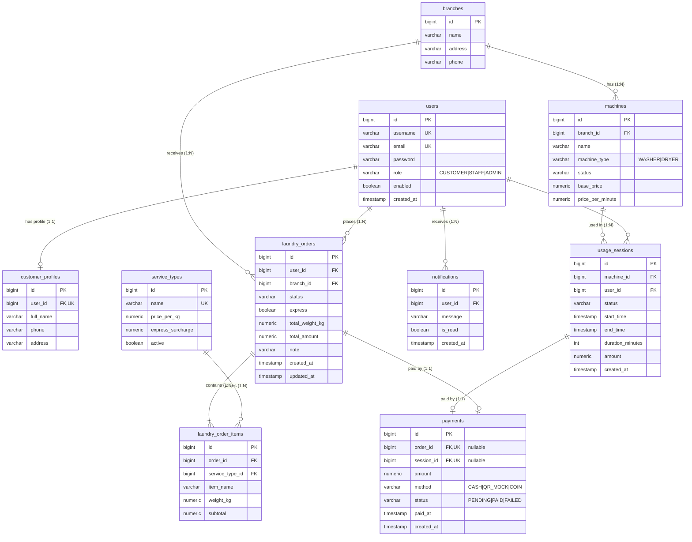

# ER Diagram — LaundryHub

ที่มา: `code/src/main/resources/db/migration/V1__init_schema.sql` (PostgreSQL 16, 10 ตาราง)

## ความสัมพันธ์

## ความสัมพันธ์ตามข้อกำหนด

| ชนิด | ความสัมพันธ์ | บังคับด้วย |
|---|---|---|
| One-to-One | `users` ↔ `customer_profiles` | `customer_profiles.user_id` เป็น `UNIQUE` |
| One-to-One | `laundry_orders` ↔ `payments` | `payments.order_id` เป็น `UNIQUE` |
| One-to-One | `usage_sessions` ↔ `payments` | `payments.session_id` เป็น `UNIQUE` |
| One-to-Many | `branches` → `machines` | FK `machines.branch_id` |
| One-to-Many | `users` → `laundry_orders` → `laundry_order_items` | FK `laundry_orders.user_id`, `laundry_order_items.order_id` |
| One-to-Many | `machines` → `usage_sessions` | FK `usage_sessions.machine_id` |
| One-to-Many | `users` → `notifications` | FK `notifications.user_id` |

## ทำไม `payments` มี FK 2 ตัวพร้อม CHECK

การชำระเงินหนึ่งรายการจ่ายให้ "ออเดอร์ฝากซัก" **หรือ** "รอบใช้เครื่อง" อย่างใดอย่างหนึ่งเท่านั้น จึงมี `order_id` และ `session_id` ที่เป็น nullable ทั้งคู่ แล้วใช้ constraint คุม 2 ชั้น

1. **`chk_payment_target`**: บังคับให้มีค่า **เพียงตัวเดียว** (`order_id IS NOT NULL AND session_id IS NULL` หรือกลับกัน) ป้องกันแถวที่ผูกทั้งสองหรือไม่ผูกอะไรเลย
2. **`UNIQUE` บน `order_id` และ `session_id`**: ป้องกันการชำระซ้ำ — 1 ออเดอร์หรือ 1 รอบใช้เครื่องมีใบชำระเงินได้ใบเดียว (PostgreSQL อนุญาตให้ `NULL` ซ้ำได้ ค่า `NULL` ของอีกฝั่งจึงไม่ชนกัน)

ทางเลือกอื่นที่ไม่ใช้: ตาราง `payments` แยกสองตาราง (ซ้ำโค้ด) หรือใช้ `payable_type + payable_id` แบบ polymorphic (ตั้ง FK จริงไม่ได้ เสียความสมบูรณ์เชิงอ้างอิง)
