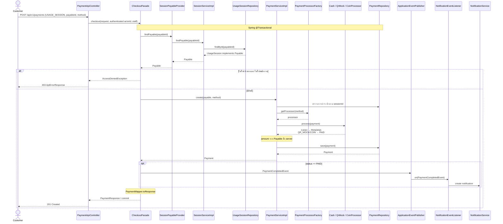

# Sequence 3 — ชำระเงินสำหรับรอบใช้งาน

ตรวจ flow จาก develop a21cb2a และตรวจซ้ำหลังรวม PR #24 ที่ 6a877cd ใช้ API ของโชกุนและ SessionPayableProvider ของปอนด์ ไม่พึ่ง getPayableSummary ซึ่งถูกลบแล้ว

COIN ใช้กับ USAGE_SESSION เท่านั้น CASH รอพนักงาน confirm ทาง `PATCH /api/v1/payments/{id}/confirm` แล้วจึงประกาศ PaymentCompletedEvent การชำระซ้ำตอบ 409 และไม่สร้าง payment ตัวที่สอง Diagram นี้ไม่อ้างว่ามีหน้าชำระเงินเว็บหรือบังคับจ่ายก่อน start

หลักฐาน: `code/src/main/java/com/laundryhub/controller/api/PaymentApiController.java:55`, `code/src/main/java/com/laundryhub/service/payment/CheckoutFacade.java`, `code/src/main/java/com/laundryhub/service/payment/SessionPayableProvider.java`, `test/java/com/laundryhub/service/SessionPaymentIntegrationTest.java`
