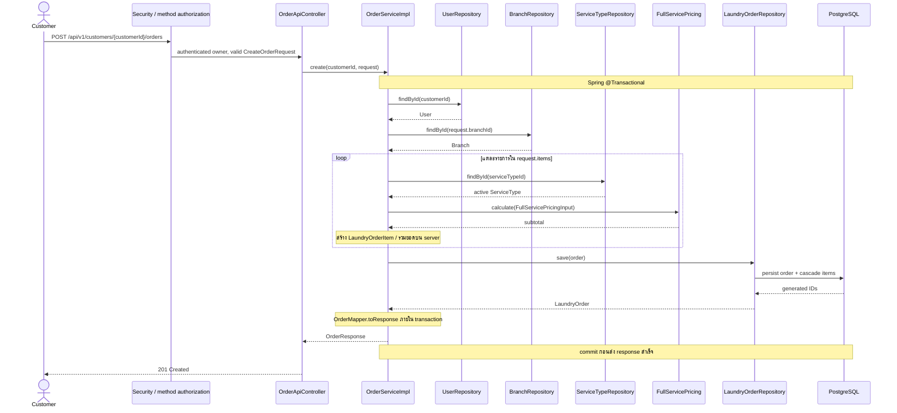

# Sequence 1 — สร้าง Full-Service order

ตรวจจาก develop a21cb2a และ OrderServiceImpl ของพีช เป็น scenario ร่วมของทีม ไม่ใช่โค้ดที่ปอนด์เขียน

`create()` ไม่ประกาศ OrderStatusChangedEvent; event ของ Order ถูกประกาศเมื่อเปลี่ยน/ยกเลิกสถานะ ห้ามวาด notification ในการสร้าง order โดยไม่มี publisher จริง หาก user/branch/service type ไม่พบหรือ service type ปิดใช้ จะหยุดก่อนบันทึกสำเร็จ

หลักฐาน: `code/src/main/java/com/laundryhub/controller/api/OrderApiController.java:46`, `code/src/main/java/com/laundryhub/service/impl/OrderServiceImpl.java:70` และ `:174` (applyItems)
