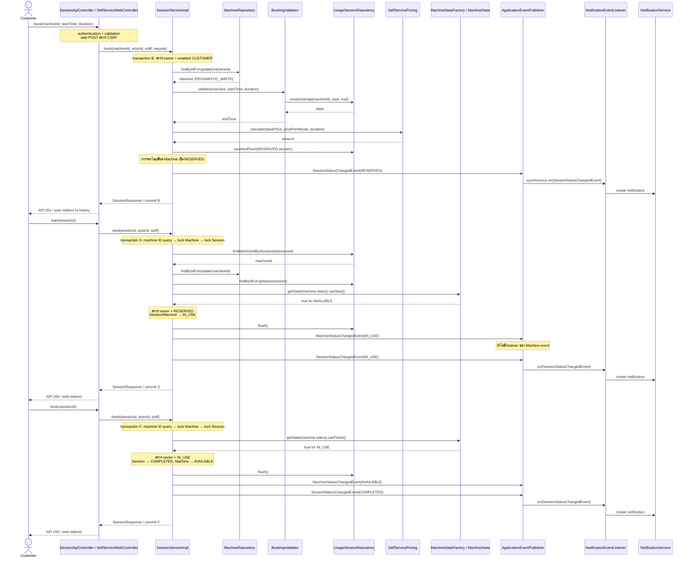

# Sequence 2 — จอง เริ่ม และจบรอบ Self-Service

ตรวจจาก develop a21cb2a; หน้าเว็บใน PR นี้ใช้ SessionService เดียวกับ API

- lock ของ Machine อยู่จน transaction จบ ครอบคลุม overlap check และ insert; overlap ตรวจเฉพาะ RESERVED/IN_USE และช่วงติดกันยอมรับได้
- ราคา = basePrice + pricePerMinute × durationMinutes; web ไม่รับ owner หรือ amount จาก form
- เมื่อ overlap เกิดขึ้น API ตอบ 409; เว็บคืน form พร้อม error โดยยังเก็บค่าที่กรอก Wrong owner ตอบ 403
- Listener แจ้งเตือนทำงาน synchronous ใน transaction เดียวกัน หาก listener ล้มเหลว การบันทึกสถานะ rollback ด้วย
- start ยังไม่บังคับ payment prerequisite หรือ clock window; cancel ทำได้เฉพาะ RESERVED และไม่เปลี่ยน Machine ของรอบอื่น

หลักฐาน: `code/src/main/java/com/laundryhub/service/impl/SessionServiceImpl.java:56`, `:83`, `:98`, `:160`, `:178`; เทสต์การแข่งขันและ rollback: `test/java/com/laundryhub/service/SessionLifecycleIntegrationTest.java`
