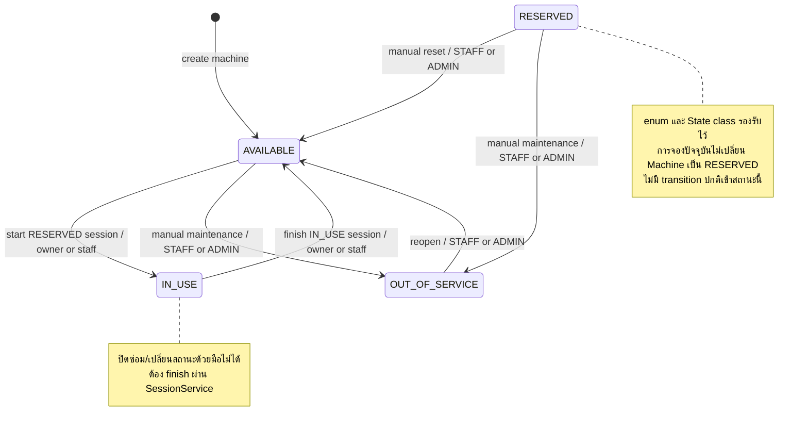
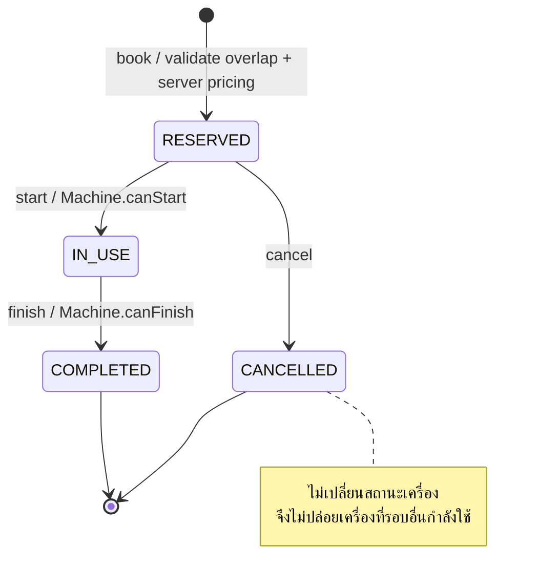

# State Diagram — Machine และ UsageSession

รูปแสดง transition ที่ Service อนุญาตจริง ไม่อนุมานจากการมีค่า enum เพียงอย่างเดียว

- booking ใช้ lock Machine + ตรวจช่วงเวลาทั้ง RESERVED/IN_USE แต่ไม่เปลี่ยนสถานะเครื่อง เพราะอาจจองในอนาคต
- start/finish ล็อก Machine แล้ว Session ตรวจเจ้าของและเปลี่ยนทั้งสอง entity ใน transaction เดียว
- State classes ให้ capability; `MachineStateFactory` เป็น simple registry factory ไม่ใช่ GoF Factory Method
- ความผิดสถานะตอบ BusinessRuleException (400 ตาม shared handler); maintenance ระหว่าง IN_USE ตอบ BookingConflictException (409)
- event ของ Session มี NotificationEventListener; event ของ Machine ยังไม่มี listener

หลักฐาน: `code/src/main/java/com/laundryhub/service/impl/MachineServiceImpl.java:109`, `code/src/main/java/com/laundryhub/service/impl/SessionServiceImpl.java:83`, `:98`, `:113` และ `code/src/main/java/com/laundryhub/service/state/`
