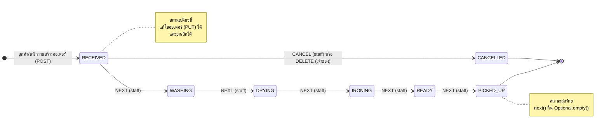

# State Diagram — LaundryOrder

> สถานะของออเดอร์ฝากซัก (`OrderStatus`) และกฎการเปลี่ยนสถานะ ซึ่งเขียนด้วย **State Pattern** ใน `service/state/`
> ผู้รับผิดชอบ: พีช

## กฎการเปลี่ยนสถานะ

- เดินหน้าได้**ทีละขั้น**เท่านั้น ห้ามข้ามขั้น (เช่น `RECEIVED → DRYING`) และห้ามย้อนกลับ
- ยกเลิกได้**เฉพาะ `RECEIVED`** เมื่อเริ่มซักแล้ว (`WASHING` ขึ้นไป) ยกเลิกไม่ได้
- `PICKED_UP` และ `CANCELLED` เป็นสถานะสุดท้าย ไม่มีขั้นต่อไป
- ทำผิดกฎ → `BusinessRuleException` → **400** และสถานะไม่เปลี่ยน
- ทุกครั้งที่สถานะเปลี่ยน → ยิง `OrderStatusChangedEvent` (Observer) → `NotificationEventListener` สร้างแจ้งเตือนให้ลูกค้า

## สถานะ ↔ คลาสในโค้ด

| สถานะ | คลาส (`service/state/`) | `next()` | `canCancel()` | แก้ไขออเดอร์ (PUT) |
|---|---|---|---|---|
| `RECEIVED` | `ReceivedState` | `WashingState` | ✅ `true` | ✅ |
| `WASHING` | `WashingState` | `DryingState` | ❌ | ❌ |
| `DRYING` | `DryingState` | `IroningState` | ❌ | ❌ |
| `IRONING` | `IroningState` | `ReadyState` | ❌ | ❌ |
| `READY` | `ReadyState` | `PickedUpState` | ❌ | ❌ |
| `PICKED_UP` | `PickedUpState` | `Optional.empty()` | ❌ | ❌ |
| `CANCELLED` | `CancelledState` | `Optional.empty()` | ❌ | ❌ |

- `OrderStateFactory.from(OrderStatus)` แปลงค่าที่เก็บใน DB (enum) เป็นคลาส State
- `OrderServiceImpl.advance()` เรียก `next()` ถ้าว่างแปลว่าไปต่อไม่ได้ ส่วน `cancel()` เรียก `canCancel()` ทำให้ Service ไม่มี `if/else` ตามสถานะเลย
- ทุก State คืน `Optional` แทนการ throw `UnsupportedOperationException` จึงใช้แทนกันได้ทุกตัว (**LSP**)
- เพิ่มสถานะใหม่ = เพิ่มคลาส State 1 คลาส + 1 บรรทัดใน Factory ไม่ต้องแก้ `OrderServiceImpl` (**OCP**)

## Endpoint ที่ทำให้สถานะเปลี่ยน

| การกระทำ | Endpoint | สิทธิ์ | ผล |
|---|---|---|---|
| สร้างออเดอร์ | `POST /api/v1/customers/{customerId}/orders` | เจ้าของ / STAFF | เริ่มที่ `RECEIVED` → 201 |
| เลื่อนสถานะ | `PATCH /api/v1/orders/{orderId}/status` `{"action":"NEXT"}` | STAFF / ADMIN | ขั้นถัดไป → 200 · สถานะสุดท้าย → 400 |
| ยกเลิก (พนักงาน) | `PATCH /api/v1/orders/{orderId}/status` `{"action":"CANCEL"}` | STAFF / ADMIN | `CANCELLED` → 200 · หลัง `RECEIVED` → 400 |
| ยกเลิก (ลูกค้า) | `DELETE /api/v1/customers/{customerId}/orders/{orderId}` | เจ้าของ | `CANCELLED` → 204 · หลัง `RECEIVED` → 400 |

เทสต์ที่ยืนยันกฎทั้งหมด: `test/java/com/laundryhub/service/state/OrderStateTest.java` (15 เคส) และ `test/java/com/laundryhub/service/OrderServiceTest.java`
