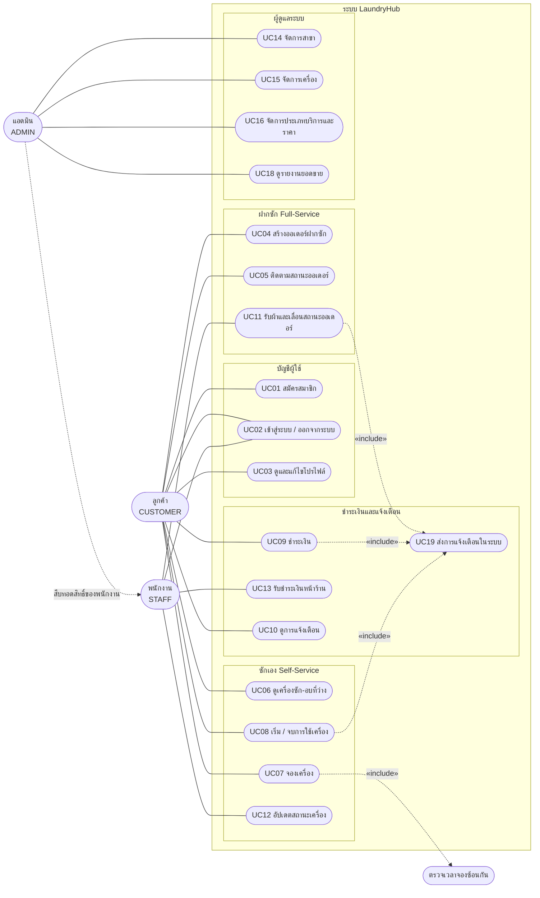

# Use Case Diagram และ Use Case Description

ระบบ **LaundryHub** มีผู้ใช้ 3 บทบาท (`CUSTOMER`, `STAFF`, `ADMIN`) ใช้งานได้ทั้งผ่านหน้าเว็บ (Thymeleaf) และ REST API (Swagger)

## 1) Use Case Diagram

หมายเหตุการอ่านแผนภาพ
- เส้นทึบ = ผู้ใช้ทำ use case นั้นได้ · เส้นประ `«include»` = use case นั้นเรียกอีก use case เสมอ
- **แอดมิน** ทำได้ทุกอย่างที่พนักงานทำ (UC02, UC11, UC12, UC13) จึงแสดงเป็นการสืบทอดสิทธิ์
- **UC19 ส่งการแจ้งเตือน** ไม่มีผู้ใช้เรียกโดยตรง เกิดขึ้นเองเมื่อสถานะออเดอร์/รอบใช้เครื่องเปลี่ยนหรือชำระเงินสำเร็จ (Observer ด้วย Spring Event)
- การสมัครสมาชิกสร้างได้เฉพาะบัญชี `CUSTOMER` บัญชี `STAFF` และ `ADMIN` ถูกสร้างโดยผู้ดูแลระบบ (ข้อมูลเริ่มต้นใน `V2__seed_data.sql`)

### ขอบเขตที่ไม่ได้ทำ (ตัดออกเพื่อให้จบทันเวลา)
- ไม่ต่อระบบชำระเงินจริง (ใช้เงินสด และ QR จำลอง)
- ไม่ส่ง SMS / LINE (แจ้งเตือนเฉพาะในระบบ)
- ไม่มีหน้าจัดการบัญชีผู้ใช้โดยแอดมิน (แอดมินดูข้อมูลผู้ใช้รายคนได้ผ่าน `GET /api/v1/users/{id}`)

## 2) Use Case Description

### UC01 สมัครสมาชิก
| หัวข้อ | รายละเอียด |
|---|---|
| ผู้กระทำ | ผู้เยี่ยมชม (ยังไม่มีบัญชี) |
| เงื่อนไขก่อน | ยังไม่ได้เข้าสู่ระบบ |
| ขั้นตอนหลัก | 1) เปิดหน้า `/register` 2) กรอกชื่อผู้ใช้ อีเมล รหัสผ่าน ชื่อ-นามสกุล (เบอร์โทร/ที่อยู่ไม่บังคับ) 3) ระบบตรวจรูปแบบข้อมูล 4) ระบบตรวจว่าชื่อผู้ใช้และอีเมลยังไม่ถูกใช้ (ไม่สนตัวพิมพ์เล็ก-ใหญ่) 5) ระบบเข้ารหัสผ่านด้วย BCrypt แล้วสร้าง `User` (role = CUSTOMER) พร้อม `CustomerProfile` ใน transaction เดียว 6) พาไปหน้าเข้าสู่ระบบ |
| ขั้นตอนทางเลือก / ข้อผิดพลาด | ข้อมูลไม่ถูกต้อง → แสดงข้อความใต้ช่องที่ผิด (API: 400 + `fieldErrors`) · ชื่อผู้ใช้หรืออีเมลซ้ำ → แจ้งเตือน (API: 409) · บันทึก profile ไม่สำเร็จ → rollback ไม่เหลือบัญชีครึ่งเดียว |
| ผลลัพธ์ | มีบัญชีลูกค้าใหม่ที่เข้าสู่ระบบได้ |

### UC02 เข้าสู่ระบบ / ออกจากระบบ
| หัวข้อ | รายละเอียด |
|---|---|
| ผู้กระทำ | ลูกค้า, พนักงาน, แอดมิน |
| เงื่อนไขก่อน | มีบัญชีและบัญชียังเปิดใช้งาน (`enabled`) |
| ขั้นตอนหลัก | 1) เปิดหน้า `/login` 2) กรอกชื่อผู้ใช้และรหัสผ่าน 3) Spring Security ตรวจรหัสผ่านกับ BCrypt hash 4) เข้าสู่หน้าแรก เมนูแสดงตามบทบาท 5) ออกจากระบบด้วยปุ่ม "ออกจากระบบ" (POST `/logout`) |
| ขั้นตอนทางเลือก / ข้อผิดพลาด | รหัสผ่านผิด → กลับหน้า login พร้อมข้อความ · เรียกหน้าที่ไม่มีสิทธิ์ → 403 · ยังไม่ล็อกอินแล้วเรียกหน้าที่ต้องล็อกอิน → ถูกพาไป `/login` · REST API ใช้ HTTP Basic (Swagger กด Authorize) ไม่ล็อกอิน/รหัสผิด → 401 JSON มาตรฐาน |
| ผลลัพธ์ | ผู้ใช้อยู่ในสถานะล็อกอินหรือออกจากระบบแล้ว |

### UC04 สร้างออเดอร์ฝากซัก
| หัวข้อ | รายละเอียด |
|---|---|
| ผู้กระทำ | ลูกค้า (พนักงานสร้างแทนลูกค้าได้) |
| เงื่อนไขก่อน | ล็อกอินแล้ว · มีสาขาและประเภทบริการที่เปิดใช้งาน |
| ขั้นตอนหลัก | 1) เลือกสาขา 2) เพิ่มรายการผ้า (ชื่อ น้ำหนัก ประเภทบริการ) 3) เลือกว่าเป็นงานด่วนหรือไม่ 4) ระบบคำนวณราคาด้วย `FullServicePricing` ราคา = น้ำหนัก × (ราคาต่อกก. + ค่าด่วนต่อกก.) โดย **ค่าด่วนคิดต่อกิโล** ไม่ได้บวกก้อนเดียว (เช่น 2 กก. ด่วน (25+10) = 70.00) 5) บันทึกออเดอร์สถานะ `RECEIVED` |
| ขั้นตอนทางเลือก / ข้อผิดพลาด | น้ำหนักไม่เป็นบวก/ข้อมูลไม่ครบ → 400 · ประเภทบริการถูกปิดใช้งาน → 400 · ไม่พบสาขาหรือประเภทบริการ → 404 · ลูกค้าสร้างออเดอร์ให้ `customerId` ของคนอื่น → 403 (`@PreAuthorize`) |
| ผลลัพธ์ | มีออเดอร์ใหม่ พร้อมราคารวม |

### UC05 ติดตามสถานะออเดอร์
| หัวข้อ | รายละเอียด |
|---|---|
| ผู้กระทำ | ลูกค้า |
| เงื่อนไขก่อน | ล็อกอินแล้ว และเป็นเจ้าของออเดอร์ |
| ขั้นตอนหลัก | 1) เปิดรายการออเดอร์ของตัวเอง `GET /api/v1/customers/{customerId}/orders` (แบ่งหน้า เรียงลำดับ กรองตามสถานะได้) 2) เลือกออเดอร์ดูสถานะปัจจุบัน `RECEIVED → WASHING → DRYING → IRONING → READY → PICKED_UP` 3) ขณะที่ยังเป็น `RECEIVED` ลูกค้าแก้ไข (PUT) หรือยกเลิก (DELETE) ออเดอร์ของตัวเองได้ |
| ขั้นตอนทางเลือก / ข้อผิดพลาด | ใส่ `customerId` ของคนอื่นใน URL → 403 (`@PreAuthorize`) · ใส่ `orderId` ของคนอื่นใต้ `customerId` ของตัวเอง → 404 (ตั้งใจไม่บอกว่ามีออเดอร์นี้อยู่) · ไม่พบออเดอร์ → 404 · แก้หรือยกเลิกหลังพ้นสถานะ `RECEIVED` → 400 |
| ผลลัพธ์ | ลูกค้าเห็นสถานะล่าสุด |

### UC07 จองเครื่อง
| หัวข้อ | รายละเอียด |
|---|---|
| ผู้กระทำ | ลูกค้า |
| เงื่อนไขก่อน | ล็อกอินแล้ว · เครื่องสถานะไม่ใช่ `OUT_OF_SERVICE` |
| ขั้นตอนหลัก | 1) เลือกเครื่องที่ว่าง 2) ระบุเวลาเริ่มและระยะเวลา 3) `BookingValidator` ตรวจว่าช่วงเวลาไม่ซ้อนกับการจองอื่นของเครื่องเดียวกัน 4) ระบบคำนวณราคาด้วย `SelfServicePricing` 5) สร้างรอบใช้งานสถานะ `RESERVED` |
| ขั้นตอนทางเลือก / ข้อผิดพลาด | เวลาซ้อนกัน → 409 · เครื่องใช้งานไม่ได้ → 400 |
| ผลลัพธ์ | มีการจองเครื่อง รอเริ่มใช้งาน |

### UC09 ชำระเงิน
| หัวข้อ | รายละเอียด |
|---|---|
| ผู้กระทำ | ลูกค้า (พนักงานรับชำระหน้าร้านแทนได้ — UC13) |
| เงื่อนไขก่อน | มีออเดอร์ฝากซัก **หรือ** รอบใช้เครื่องที่ยังไม่ชำระ และผู้ชำระเป็นเจ้าของหรือเป็นพนักงาน/แอดมิน |
| ขั้นตอนหลัก | 1) เลือกประเภทสิ่งที่ชำระ (ออเดอร์/รอบใช้เครื่อง) และวิธีชำระ (เงินสด / QR จำลอง) 2) `CheckoutFacade` หา `Payable` ผ่าน `PayableProvider` ตรวจสิทธิ์ และตรวจว่ายังไม่มีการชำระ 3) สร้าง `Payment` ยอดเงินตามที่ระบบคิด 4) `PaymentProcessor` ที่เลือกโดย Factory ประมวลผล: QR จำลอง → `PAID` ทันที, เงินสด → `PENDING` รอพนักงานยืนยัน 5) ยิง `PaymentCompletedEvent` เมื่อชำระสำเร็จ |
| ขั้นตอนทางเลือก / ข้อผิดพลาด | ชำระซ้ำ → 409 · ไม่ใช่เจ้าของ → 403 · ไม่พบรายการ → 404 · วิธีชำระที่ไม่รองรับ → 400 |
| ผลลัพธ์ | มีรายการชำระเงิน และเจ้าของได้รับการแจ้งเตือน (ดู Activity Diagram: `activity-checkout.md`) |

### UC11 รับผ้าและเลื่อนสถานะออเดอร์
| หัวข้อ | รายละเอียด |
|---|---|
| ผู้กระทำ | พนักงาน, แอดมิน |
| เงื่อนไขก่อน | ล็อกอินด้วยบทบาท STAFF หรือ ADMIN · มีออเดอร์ที่ยังไม่ปิด |
| ขั้นตอนหลัก | 1) เปิดบอร์ดออเดอร์ `GET /api/v1/orders?status=` 2) เลือกออเดอร์แล้วสั่งเลื่อนสถานะไปขั้นถัดไปด้วย `PATCH /api/v1/orders/{id}/status` 3) State Pattern ตรวจว่าเปลี่ยนได้เฉพาะลำดับที่ถูกต้อง 4) บันทึกสถานะใหม่ 5) ยิง `OrderStatusChangedEvent` แจ้งเตือนลูกค้า |
| ขั้นตอนทางเลือก / ข้อผิดพลาด | ข้ามขั้นหรือย้อนผิดกฎ → 400 · **ยกเลิกได้เฉพาะออเดอร์ที่เป็น `RECEIVED`** (ส่ง `{"action":"CANCEL"}` ที่ endpoint เดียวกัน) · ไม่พบออเดอร์ → 404 · ลูกค้าเรียก endpoint นี้ → 403 · กฎทั้งหมดดู State Diagram ที่ `state-order.md` |
| ผลลัพธ์ | ออเดอร์อยู่ในสถานะใหม่ ลูกค้าได้รับแจ้งเตือน |

### UC14 จัดการสาขา
| หัวข้อ | รายละเอียด |
|---|---|
| ผู้กระทำ | แอดมิน |
| เงื่อนไขก่อน | ล็อกอินด้วยบทบาท ADMIN |
| ขั้นตอนหลัก | 1) เปิด `/admin/branches` 2) เพิ่มสาขาใหม่ หรือเลือกสาขาเพื่อแก้ไข/ลบ 3) ระบบตรวจข้อมูล (ชื่อไม่ว่าง) แล้วบันทึก |
| ขั้นตอนทางเลือก / ข้อผิดพลาด | ลบสาขาที่ยังมีเครื่องหรือออเดอร์อ้างอิงอยู่ → ไม่ลบและแจ้งเหตุผล (API: 409) · ไม่พบสาขา → 404 · ผู้ใช้ที่ไม่ใช่แอดมิน → 403 |
| ผลลัพธ์ | ข้อมูลสาขาถูกเพิ่ม/แก้ไข/ลบ |

---

**ตรวจก่อนส่ง (โอ๊ค):** use case แต่ละตัวต้องมีอยู่จริงในระบบที่ส่ง (หน้าเว็บหรือ endpoint) ถ้าโมดูลใดตัดออก ให้ลบ use case นั้นออกจากแผนภาพและตารางด้านบน
