# ส่วนรายงานของโอ๊ค — Foundation / Security / Infra / Deploy (และเจ้าภาพบทที่ 1)

> ผู้รับผิดชอบ: วงศธร ธน.ยอด รหัส 673380425-2 (GitHub: Oakiez, branch Wongsathon_6733804252_03)
> เขียนจากโค้ด เอกสาร และผลทดสอบจริงของโปรเจค ไม่ได้ระบุสิ่งที่ยังไม่ได้ทำ ข้อความใน *( ... )* คือจุดที่ต้องตรวจซ้ำก่อนส่งเล่มจริง
> `…/` = `code/src/main/java/com/laundryhub/` · ภาพทั้งหมดอยู่ในโฟลเดอร์ `img/` (แผนภาพสร้างจากไฟล์ Mermaid ใน `doc/diagrams/` และ `README.md`)
> สคริปต์ตรวจเลขบรรทัดและลิงก์ของเอกสารอ้างอิง (`doc/solid-analysis.md`, `doc/design-patterns.md`) ผ่านครบ ณ วันที่เขียน

---

## บทที่ 1 บทนำ

### 1.1 ที่มาและความสำคัญ
ร้านซักรีดขนาดเล็กมักให้บริการสองรูปแบบพร้อมกัน รูปแบบแรกคือ **ฝากซัก** (Full-Service) ที่ลูกค้าส่งผ้าให้พนักงานซัก อบ รีด แล้วมารับภายหลัง รูปแบบที่สองคือ **ซักเอง** (Self-Service) ที่ลูกค้าใช้เครื่องซักและเครื่องอบหยอดเหรียญด้วยตนเอง การจัดการทั้งสองรูปแบบด้วยการจดบันทึกหรือโปรแกรมแยกกันทำให้ติดตามสถานะผ้า ตรวจสอบว่าเครื่องใดว่าง และสรุปการชำระเงินได้ยาก

โครงงานนี้พัฒนาระบบ **LaundryHub** เพื่อรวมการทำงานทั้งสองรูปแบบไว้ในระบบเดียว โดยใช้ Spring Boot ตามสถาปัตยกรรมแบบชั้น (Layered Architecture) และประยุกต์หลัก SOLID กับ Design Pattern ตามวัตถุประสงค์ของรายวิชา CP353002 Principles of Software Design and Development โครงงานดำเนินการโดยกลุ่มนักศึกษา 4 คน ระหว่างวันที่ 8 ถึง 10 ตุลาคม 2569 และนำระบบขึ้นให้บริการจริงบนอินเทอร์เน็ต

### 1.2 วัตถุประสงค์
1. พัฒนาระบบจัดการร้านซักรีดที่รองรับทั้งการฝากซักและการซักเอง พร้อมผู้ใช้ 3 บทบาท ได้แก่ ลูกค้า พนักงาน และผู้ดูแลระบบ
2. ออกแบบระบบตามสถาปัตยกรรมแบบชั้น โดย Controller ไม่เรียก Repository โดยตรง และประยุกต์ SOLID กับ Design Pattern อย่างมีเหตุผลรองรับ
3. ออกแบบฐานข้อมูลเชิงสัมพันธ์ที่มีความสัมพันธ์แบบ One-to-One และ One-to-Many และจัดการเวอร์ชันของโครงสร้างด้วย Flyway
4. พัฒนา REST API ที่มีเอกสาร Swagger รูปแบบ error มาตรฐาน และหน้าเว็บด้วย Thymeleaf
5. ทำงานเป็นทีมด้วย Git และ Pull Request ที่มีการรีวิวโค้ด ทดสอบอัตโนมัติด้วย CI และ deploy ระบบด้วย Docker ขึ้นบริการคลาวด์
6. (ส่วนของผู้เขียนคนนี้) พัฒนาโครงสร้างพื้นฐานของระบบ ได้แก่ ระบบยืนยันตัวตนและสิทธิ์ ข้อมูลผู้ใช้และสาขา โครงหน้าเว็บ การ deploy และ CI

### 1.3 ขอบเขตของการศึกษา
- **ผู้ใช้และบทบาท:** ลูกค้า (`CUSTOMER`) พนักงาน (`STAFF`) และผู้ดูแลระบบ (`ADMIN`) โดยผู้ดูแลระบบทำได้ทุกอย่างที่พนักงานทำได้
- **ฟังก์ชันหลักที่พัฒนา:** สมัครสมาชิกและเข้าสู่ระบบ, จัดการโปรไฟล์ลูกค้า, จัดการสาขา, ฝากซักพร้อมคิดราคาและติดตามสถานะตามลำดับ, จัดการประเภทบริการและราคา, จัดการเครื่องซัก-อบ จองและใช้งานเครื่อง, ชำระเงิน (เงินสด QR จำลอง เหรียญ) และแจ้งเตือนในระบบ
- **เทคโนโลยี:** Java 17, Spring Boot 3.5.7, Spring Data JPA, Spring Security, PostgreSQL 16, Flyway, Thymeleaf กับ Bootstrap 5, JUnit 5 กับ Mockito, Docker, GitHub Actions, Render และ Neon
- **ไม่ทำ (ตัดตามขอบเขตเพื่อให้จบภายในเวลา):** ไม่เชื่อมระบบชำระเงินจริง (ใช้การจำลอง), ไม่ส่ง SMS หรือ LINE จริง (แจ้งเตือนในระบบเท่านั้น), ไม่ทำแอปมือถือแยก, ไม่มีหน้าจัดการบัญชีผู้ใช้สำหรับผู้ดูแลระบบ, ไม่มีรายงานยอดขายและแดชบอร์ด
- *(ตรวจก่อนส่ง: ทุกโมดูลมีหน้าเว็บใน develop แล้ว (ออเดอร์ เครื่องซัก-อบ ชำระเงิน แจ้งเตือน) ให้ยืนยันอีกครั้งว่าทั้งหมดอยู่ใน main ณ วันส่งงาน)*

### 1.4 ประโยชน์ที่คาดว่าจะได้รับ
1. ได้ระบบตัวอย่างที่ใช้งานได้จริงและเข้าถึงได้ผ่านอินเทอร์เน็ต สำหรับร้านซักรีดที่มีทั้งบริการฝากซักและเครื่องหยอดเหรียญ
2. ได้ตัวอย่างการประยุกต์ SOLID Design Pattern และสถาปัตยกรรมแบบชั้นกับโจทย์จริง พร้อมเอกสารอ้างอิงตำแหน่งในโค้ด
3. ได้ประสบการณ์ทำงานเป็นทีมด้วยกระบวนการที่ใช้ในงานจริง ได้แก่ Pull Request, Code Review, CI และการ deploy ด้วยคอนเทนเนอร์

### 1.5 นิยามศัพท์
| คำ | ความหมาย |
|---|---|
| Full-Service (ฝากซัก) | บริการที่ลูกค้าส่งผ้าให้พนักงานดำเนินการ คิดราคาจากน้ำหนักและประเภทบริการ |
| Self-Service (ซักเอง) | บริการที่ลูกค้าใช้เครื่องซักหรือเครื่องอบด้วยตนเอง คิดราคาจากเวลาที่ใช้เครื่อง |
| Entity | คลาสที่แทนแถวข้อมูลในตารางฐานข้อมูล ใช้ผ่าน JPA |
| DTO (Data Transfer Object) | คลาสที่ใช้รับหรือส่งข้อมูลผ่าน API โดยแยกจาก Entity เพื่อไม่เปิดเผยข้อมูลที่ไม่ควรเปิดเผย |
| ORM (Object-Relational Mapping) | เทคนิคแปลงข้อมูลระหว่างอ็อบเจ็กต์ในโปรแกรมกับตารางในฐานข้อมูล |
| Flyway | เครื่องมือจัดการเวอร์ชันของโครงสร้างฐานข้อมูลด้วยไฟล์ SQL เรียงลำดับ |
| BCrypt | ฟังก์ชันแฮชรหัสผ่านทางเดียวที่มีค่าสุ่ม (salt) และปรับความช้าได้ |
| Authentication / Authorization | การยืนยันว่าผู้ใช้คือใคร / การตรวจว่าผู้ใช้มีสิทธิ์ทำสิ่งนั้นหรือไม่ |
| HTTP Basic | วิธียืนยันตัวตนที่ส่งชื่อผู้ใช้และรหัสผ่านมากับทุกคำขอ ใช้กับการเรียก API |
| CI (Continuous Integration) | การรวมโค้ดและรันทดสอบอัตโนมัติทุกครั้งที่มีการเปลี่ยนแปลง |
| Container / Docker image | ชุดซอฟต์แวร์พร้อมสภาพแวดล้อมที่รันได้เหมือนกันทุกเครื่อง / ต้นแบบที่ใช้สร้าง container |
| Swagger / OpenAPI | มาตรฐานและเครื่องมือสร้างเอกสาร API ที่ทดลองเรียกได้ผ่านเบราว์เซอร์ |

---

## บทที่ 2 ทฤษฎีและเทคโนโลยีที่เกี่ยวข้อง

### 2.x Spring Boot และ Spring Data JPA
Spring Boot เป็นเฟรมเวิร์กที่ตั้งค่าส่วนประกอบของแอปพลิเคชัน Spring ให้อัตโนมัติ (auto-configuration) และฝังเว็บเซิร์ฟเวอร์ไว้ในตัวแอป ทำให้สร้างไฟล์ที่รันได้เองได้ และใช้ **Dependency Injection** ในการส่งต่อส่วนประกอบที่คลาสต้องใช้ผ่าน constructor จึงทดสอบแต่ละคลาสแยกกันได้ง่าย [Spring Boot Reference]

**Spring Data JPA** ทำงานบน Hibernate ซึ่งเป็น ORM สำหรับแปลงระหว่าง Entity กับตาราง ความสัมพันธ์ระหว่างตารางกำหนดด้วยแอนโนเทชัน เช่น `@OneToOne` และ `@OneToMany` โดยฝั่งที่ถือ foreign key เรียกว่า *owning side* ส่วนอีกฝั่งระบุ `mappedBy` ว่าอ้างจากฝั่งใด การโหลดข้อมูลมีแบบ `LAZY` (โหลดเมื่อใช้งาน) และ `EAGER` (โหลดทันที) ส่วน `cascade` กำหนดว่าการบันทึกหรือลบอ็อบเจ็กต์หลักจะส่งผลถึงอ็อบเจ็กต์ที่ผูกอยู่ด้วยหรือไม่ [Bauer, King & Gregory, 2015]

**ธุรกรรม (Transaction)** ทำให้การเขียนข้อมูลหลายขั้นตอนสำเร็จทั้งหมดหรือยกเลิกทั้งหมด (คุณสมบัติ ACID) ใน Spring ใช้ `@Transactional` โดย Spring สร้างตัวห่อ (proxy) ที่เปิดธุรกรรมก่อนเข้าเมธอด ยืนยัน (commit) เมื่อจบปกติ และย้อนกลับ (rollback) เมื่อเกิด `RuntimeException` นอกจากนี้ Hibernate ตรวจจับการแก้ไขอ็อบเจ็กต์ที่อยู่ในธุรกรรมและเขียนลงฐานข้อมูลให้เมื่อ commit (dirty checking)

### 2.x การจัดการเวอร์ชันฐานข้อมูลด้วย Flyway
Flyway จัดการการเปลี่ยนแปลงโครงสร้างฐานข้อมูลด้วยไฟล์ SQL ที่มีหมายเลขเวอร์ชัน (เช่น `V1__init_schema.sql`) รันตามลำดับเพียงครั้งเดียวต่อไฟล์ และบันทึกประวัติพร้อมค่าตรวจสอบ (checksum) ในตาราง `flyway_schema_history` ถ้าไฟล์ที่รันไปแล้วถูกแก้ไข Flyway จะไม่ยอมทำงานต่อ จึงต้องเพิ่มการเปลี่ยนแปลงเป็นไฟล์เวอร์ชันใหม่ [Flyway Documentation] วิธีนี้ต่างจากการตั้ง `ddl-auto: update` ให้ Hibernate คาดเดาและแก้ตารางเอง ซึ่งไม่มีประวัติและให้ผลไม่แน่นอนระหว่างเครื่อง โปรเจคนี้ตั้ง `ddl-auto: validate` เพื่อให้ Hibernate เพียงตรวจว่า Entity ตรงกับตารางหรือไม่

### 2.x Spring Security และการเก็บรหัสผ่าน
Spring Security ทำงานเป็นชุดตัวกรอง (filter chain) ที่ทุกคำขอต้องผ่านก่อนถึง Controller ขั้น **Authentication** ตรวจว่าผู้ใช้คือใคร โดยเรียก `UserDetailsService` ไปค้นผู้ใช้ แล้วให้ `PasswordEncoder` เทียบรหัสผ่านที่ส่งมากับค่าที่เก็บ ขั้น **Authorization** ตรวจว่ามีสิทธิ์หรือไม่ ทั้งแบบกำหนดตาม URL และแบบกำหนดที่เมธอดด้วย `@PreAuthorize` ซึ่งเขียนเงื่อนไขด้วยนิพจน์ได้ (SpEL) เช่น "เป็นแอดมิน หรือเป็นเจ้าของข้อมูล" รหัสสถานะที่เกี่ยวข้องคือ 401 เมื่อยังไม่ยืนยันตัวตน และ 403 เมื่อยืนยันแล้วแต่ไม่มีสิทธิ์ [Spring Security Reference]

การเก็บรหัสผ่านต้องเก็บเป็นค่าแฮชทางเดียวและไม่เก็บข้อความจริง **BCrypt** เป็นอัลกอริทึมที่ออกแบบให้ปรับความช้าได้ (cost factor) และใส่ค่าสุ่ม (salt) ทุกครั้ง ทำให้รหัสผ่านเดียวกันได้ค่าแฮชต่างกัน และการเดารหัสด้วยการลองจำนวนมากทำได้ยากขึ้น [Provos & Mazières, 1999; OWASP] ระบบรองรับการยืนยันตัวตนสองช่องทาง คือ **ฟอร์มล็อกอินพร้อมเซสชัน** สำหรับหน้าเว็บ และ **HTTP Basic** สำหรับ REST API นอกจากนี้ หน้าเว็บที่ใช้เซสชันต้องป้องกัน CSRF (การหลอกให้เบราว์เซอร์ส่งคำขอโดยใช้เซสชันที่ล็อกอินค้างอยู่) ด้วยโทเค็นในแบบฟอร์ม

### 2.x Docker และ Container
Docker แพ็กแอปพลิเคชันพร้อมสภาพแวดล้อมที่ต้องใช้เป็น **image** แล้วรันเป็น **container** ที่ใช้ทรัพยากรน้อยกว่าเครื่องเสมือนเพราะแบ่งปันเคอร์เนลของระบบปฏิบัติการ ทำให้แอปทำงานเหมือนกันในเครื่องนักพัฒนาและบนเซิร์ฟเวอร์ [Merkel, 2014] ไฟล์ `Dockerfile` ระบุขั้นตอนสร้าง image แบบ **multi-stage** ใช้ชั้นแรกที่มีเครื่องมือ build สร้างไฟล์แอป แล้วคัดลอกเฉพาะผลลัพธ์ไปยังชั้นที่สองซึ่งมีเพียงตัวรัน ทำให้ image สุดท้ายเล็กและไม่พกซอร์สโค้ดหรือเครื่องมือ build ส่วน `docker-compose` ใช้กำหนดและรันหลาย container ร่วมกัน เช่น แอปและฐานข้อมูล [Docker Documentation]

### 2.x CI/CD และเวิร์กโฟลว์ของ Git
**Continuous Integration** คือการรวมงานของสมาชิกเข้าด้วยกันบ่อยๆ พร้อมสร้างและทดสอบโดยอัตโนมัติทุกครั้ง เพื่อพบข้อผิดพลาดตั้งแต่เนิ่นๆ [Fowler, 2006] โปรเจคนี้ใช้ GitHub Actions ซึ่งนิยาม *workflow* เป็นไฟล์ YAML ประกอบด้วย *job* ที่รันบนเครื่องรันที่ GitHub จัดให้ และตั้ง *required status checks* ใน branch protection เพื่อห้าม merge ถ้า job ไม่ผ่าน [GitHub Docs] ส่วน **Continuous Deployment** ทำโดยผูกที่เก็บโค้ดกับบริการ Render ที่ build image จาก Dockerfile และปล่อยเวอร์ชันใหม่โดยอัตโนมัติเมื่อมีการ push

การทำงานร่วมกันใช้ Git แบบแตกสาขา (branching) โดย `main` เก็บเวอร์ชันส่งมอบ `develop` ใช้รวมงาน และแต่ละคนทำงานบนสาขาของตนเอง การรวมงานทุกครั้งผ่าน **Pull Request** ที่ต้องมีผู้รีวิวอย่างน้อยหนึ่งคนอนุมัติ [Chacon & Straub, 2014]

---

## บทที่ 3 วิธีดำเนินการและการออกแบบระบบ

### 3.x สถาปัตยกรรมภาพรวม
ระบบแบ่งเป็นชั้น (Layered Architecture) ตามภาพด้านล่าง คำขอผ่าน Presentation ไปยัง Service แล้วจึงถึง Repository และฐานข้อมูล ตามกฎที่ตรวจได้คือ **Controller ไม่ import Repository** (ตรวจด้วยคำสั่งค้นหาทั้งโปรเจคแล้วไม่พบ) และทุกคลาสรับ dependency ผ่าน constructor เท่านั้น เมื่อสถานะในระบบเปลี่ยน Service ประกาศ Domain Event ผ่าน `ApplicationEventPublisher` ให้ส่วนแจ้งเตือนรับไปทำต่อ (Observer) โดยไม่ผูกกับผู้ประกาศ

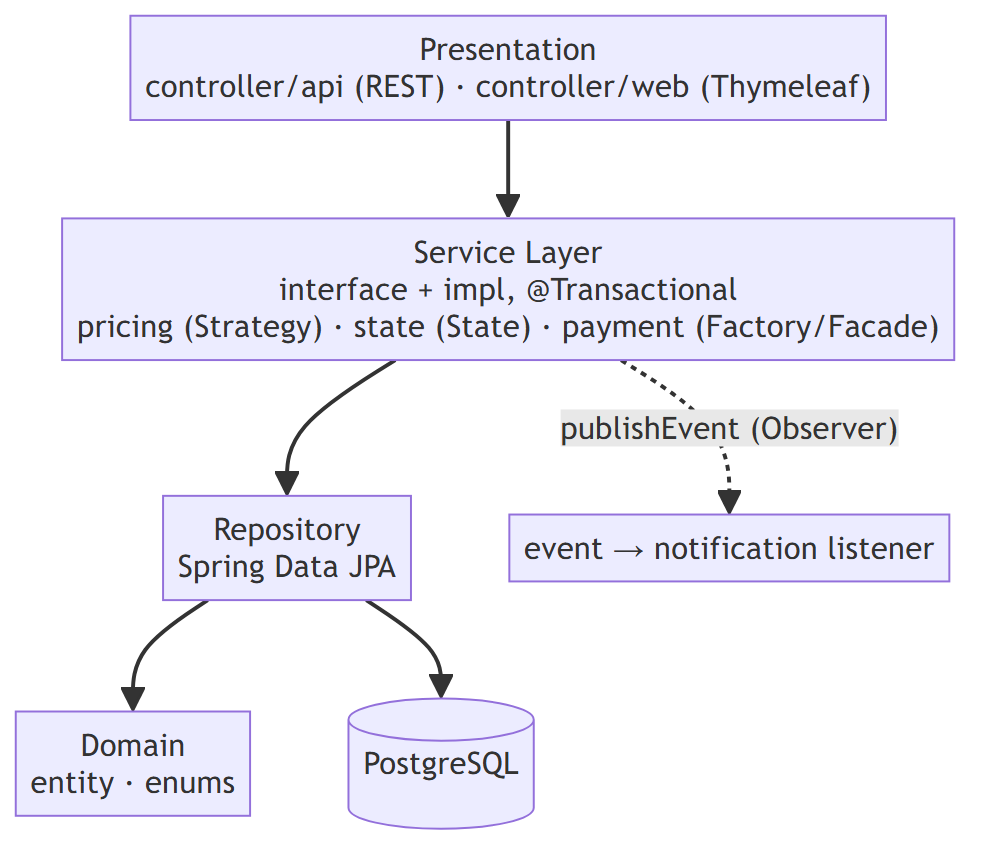

| ชั้น / แพ็กเกจ | หน้าที่ | ตัวอย่างในส่วนของผู้เขียน |
|---|---|---|
| `controller/api`, `controller/web` | รับคำขอ ตรวจข้อมูล (`@Valid`) และสิทธิ์ ส่งต่อให้ Service | `AuthApiController`, `BranchApiController`, `AuthWebController` |
| `service`, `service/impl` | กฎธุรกิจและธุรกรรม | `AuthServiceImpl`, `UserServiceImpl`, `BranchServiceImpl` |
| `repository` | เข้าถึงฐานข้อมูลด้วย Spring Data JPA | `UserRepository`, `BranchRepository` |
| `domain/entity`, `domain/enums` | Entity และค่าคงที่ที่ตรงกับ `CHECK` ในฐานข้อมูล | `User`, `CustomerProfile`, `Branch`, `Role` |
| `dto`, `mapper` | แยกข้อมูลเข้า/ออก API จาก Entity | `RegisterRequest`, `UserResponse`, `UserMapper` |
| `security`, `config`, `common` | ความปลอดภัย การตั้งค่า และเครื่องมือกลาง | `SecurityConfig`, `AppUserDetails`, `SecurityUtils` |

### 3.x แผนภาพ Use Case
ผู้ใช้มี 3 บทบาท ผู้ดูแลระบบสืบทอดสิทธิ์ของพนักงาน และมี use case ที่ระบบทำเองคือการส่งแจ้งเตือน ดังภาพด้านล่าง รายละเอียดขั้นตอนหลัก ขั้นตอนทางเลือก และรหัสสถานะของ use case หลัก 8 รายการ อยู่ที่ภาคผนวก ข

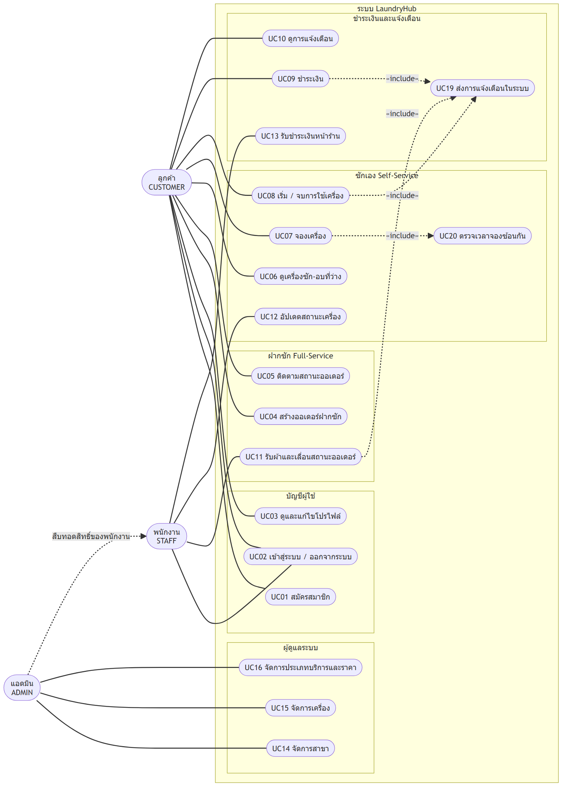

| บทบาท | Use case หลัก |
|---|---|
| ลูกค้า | สมัครสมาชิก เข้าสู่ระบบ จัดการโปรไฟล์ สร้างและติดตามออเดอร์ฝากซัก ดูเครื่องว่างและจองเครื่อง เริ่ม/จบการใช้เครื่อง ชำระเงิน ดูการแจ้งเตือน |
| พนักงาน | เลื่อนสถานะออเดอร์ อัปเดตสถานะเครื่อง รับชำระเงินหน้าร้าน |
| ผู้ดูแลระบบ | จัดการสาขา จัดการเครื่อง จัดการประเภทบริการและราคา (และทำได้ทุกอย่างของพนักงาน) |

### 3.x แผนภาพ Component
ภาพด้านล่างแสดงส่วนประกอบหลักและทิศทางการพึ่งพา ด่านความปลอดภัยอยู่หน้าสุดของทุกคำขอ ชั้น Presentation เรียก Service ผ่าน interface Service บางส่วนพึ่งพาตัวคำนวณราคา (Strategy) และตัวควบคุมสถานะ (State) ส่วน Payment หาสิ่งที่ต้องชำระผ่าน `PayableProvider` จึงไม่ต้องรู้จักโมดูลออเดอร์หรือเครื่องซักโดยตรง

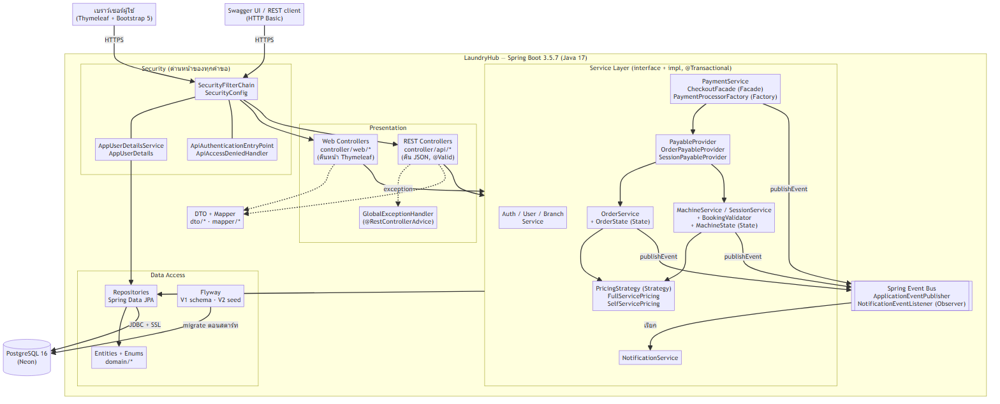

### 3.x แผนภาพ Deployment
ภาพด้านล่างแสดงเส้นทางตั้งแต่โค้ดจนถึงผู้ใช้ นักพัฒนา push โค้ดขึ้น GitHub ซึ่งรัน CI และแจ้ง Render ให้ build image จาก `code/Dockerfile` แล้วรันเป็น container ที่เชื่อมต่อฐานข้อมูลบน Neon ผ่าน JDBC แบบเข้ารหัส (`sslmode=require`) ค่าเชื่อมต่อฐานข้อมูลอยู่ในตัวแปรสภาพแวดล้อมบน Render ไม่อยู่ในโค้ด

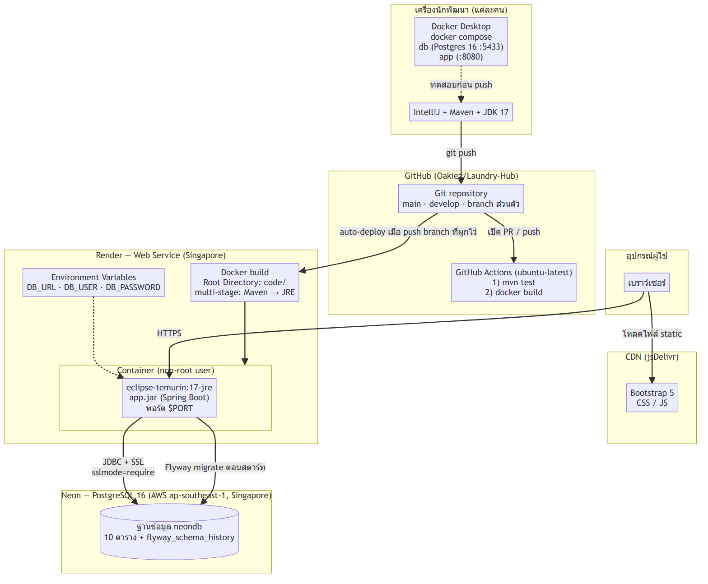

### 3.x การออกแบบระบบยืนยันตัวตนและความปลอดภัย

#### ช่องทางการยืนยันตัวตน
- **หน้าเว็บ:** ฟอร์มที่ `/login` ใช้เซสชัน เมื่อสำเร็จ Spring Security เก็บผู้ใช้ไว้ในเซสชัน ต่อมาจึงไม่ต้องกรอกซ้ำ ฟอร์มทุกอันมีโทเค็น CSRF
- **REST API และ Swagger:** ใช้ HTTP Basic ส่งชื่อและรหัสผ่านมากับทุกคำขอ ผู้ทดสอบกดปุ่ม Authorize ใน Swagger จึงไม่จำเป็นต้องมี endpoint เข้าสู่ระบบแยก (ปิด CSRF เฉพาะ `/api/**`)
- `AppUserDetailsService` ค้นผู้ใช้จากฐานข้อมูลแล้วคืน `AppUserDetails` ที่เก็บค่าแฮช บทบาท (นำหน้าด้วย `ROLE_`) และ id ของผู้ใช้ไว้ในตัว เพื่อให้เงื่อนไขสิทธิ์อ้าง id ได้โดยไม่ต้องค้นฐานข้อมูลซ้ำ

#### การเก็บรหัสผ่านและการป้องกันข้อมูลหลุด
รหัสผ่านถูกเข้ารหัสด้วย BCrypt ก่อนบันทึก และจำกัดความยาวไม่เกิน 72 ตัวอักษรเพราะ BCrypt ใช้เพียง 72 ไบต์แรก แบบฟอร์มสมัครสมาชิก (`RegisterRequest`) **ไม่มีช่อง `role`** จึงสมัครได้เฉพาะบัญชีลูกค้า ส่วนข้อมูลที่ตอบกลับ (`UserResponse`) **ไม่มีช่องรหัสผ่าน** ชื่อผู้ใช้และอีเมลตรวจความซ้ำโดยไม่สนตัวพิมพ์เล็ก-ใหญ่

#### การควบคุมสิทธิ์
| ทรัพยากร | ผู้ที่ไม่ล็อกอิน | ลูกค้า | พนักงาน | ผู้ดูแลระบบ |
|---|---|---|---|---|
| สมัครสมาชิก, หน้า login, Swagger | ทำได้ | ทำได้ | ทำได้ | ทำได้ |
| ข้อมูลผู้ใช้และโปรไฟล์ของ id หนึ่ง | 401 | เฉพาะเจ้าของ | เฉพาะเจ้าของ | ทำได้ทุก id |
| ดูสาขา | 401 | ทำได้ | ทำได้ | ทำได้ |
| เพิ่ม/แก้/ลบสาขา | 401 | 403 | 403 | ทำได้ |
| หน้า `/admin/**` | เด้งไปหน้า login | 403 | 403 | ทำได้ |
| หน้า `/staff/**` | เด้งไปหน้า login | 403 | ทำได้ | ทำได้ |

กฎระดับโซน (`/admin/**`, `/staff/**`) อยู่ใน `SecurityConfig` ส่วนกฎระดับ endpoint ให้แต่ละ Controller ประกาศเองด้วย `@PreAuthorize` เช่น `hasRole('ADMIN') or #id == authentication.principal.id` (เจ้าของหรือแอดมิน) เพื่อให้โมดูลใหม่เพิ่มกฎได้โดยไม่ต้องแก้ไฟล์กลาง ผลคือเมื่อสิทธิ์ไม่พอ ระบบตอบ 403 ก่อนตรวจว่ามีข้อมูลนั้นหรือไม่ เพื่อไม่ให้ผู้ไม่มีสิทธิ์ไล่เดา id ได้

#### รูปแบบ error จากชั้นความปลอดภัย
`GlobalExceptionHandler` ดักได้เฉพาะ exception ที่เกิดใน Controller ส่วน 401/403 ที่ตัวกรองความปลอดภัยตัดสินเกิดก่อนถึงจุดนั้น จึงเพิ่ม `ApiAuthenticationEntryPoint` และ `ApiAccessDeniedHandler` ที่เขียน `ApiErrorResponse` (`timestamp`, `status`, `error`, `message`, `path`, `fieldErrors`) ออกมาเป็น JSON รูปแบบเดียวกับ error อื่นของระบบ สำหรับ `/api/**` ส่วนหน้าเว็บยังเปลี่ยนเส้นทางไปหน้า login ตามปกติ

### 3.x การออกแบบฐานข้อมูล
ส่วนของผู้เขียนคือตาราง `users`, `customer_profiles` และ `branches` (ดังภาพด้านล่าง) ที่สร้างด้วย `V1__init_schema.sql` และมีข้อมูลตัวอย่างจาก `V2__seed_data.sql`

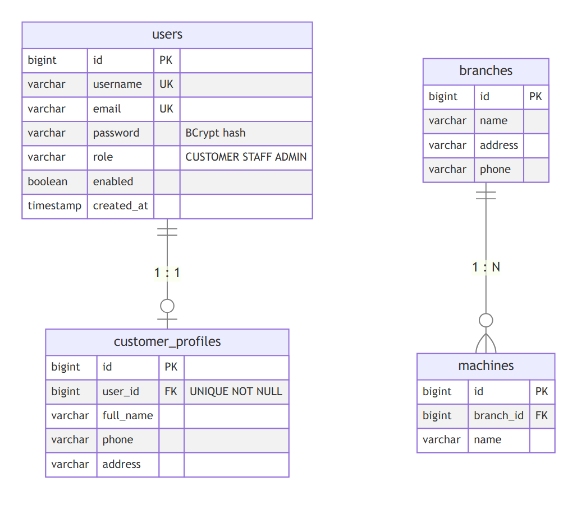

| ตาราง | ข้อกำหนดสำคัญ |
|---|---|
| `users` | `username` และ `email` เป็น `UNIQUE`, `role` มี `CHECK` ให้เป็น CUSTOMER/STAFF/ADMIN, `password` เก็บค่าแฮช BCrypt, `enabled` ค่าเริ่มต้นจริง |
| `customer_profiles` | `user_id` เป็น `NOT NULL` และ `UNIQUE` พร้อม FK ไป `users` แบบ `ON DELETE CASCADE` |
| `branches` | ชื่อ ที่อยู่ เบอร์โทร และเป็นฝั่ง "หนึ่ง" ของความสัมพันธ์ One-to-Many กับ `machines` |

ความสัมพันธ์ One-to-One ระหว่าง `users` กับ `customer_profiles` บังคับที่ฐานข้อมูลด้วย `UNIQUE` บน `user_id` (ถ้าไม่มี หนึ่งผู้ใช้จะมีได้หลายโปรไฟล์) และแมปใน JPA โดยฝั่ง `CustomerProfile` เป็นเจ้าของ FK (`@OneToOne` + `@JoinColumn(unique = true)`) ฝั่ง `User` ใช้ `@OneToOne(mappedBy = "user", cascade = ALL)` เพื่อให้บันทึกผู้ใช้แล้วโปรไฟล์ถูกบันทึกตามในธุรกรรมเดียว ตั้ง `fetch = LAZY` และเมธอด `attachProfile()` ตั้งค่าความสัมพันธ์ทั้งสองทิศให้ตรงกัน บัญชีพนักงานและผู้ดูแลระบบไม่มีโปรไฟล์ จึงเป็นความสัมพันธ์ "หนึ่งต่อศูนย์หรือหนึ่ง"

### 3.x การออกแบบ API
| Method | Endpoint | สิทธิ์ | ผลที่ออกแบบ |
|---|---|---|---|
| POST | `/api/v1/auth/register` | ทุกคน | 201, ข้อมูลผิด 400, ชื่อหรืออีเมลซ้ำ 409 |
| GET | `/api/v1/users/{id}` | เจ้าของ / ADMIN | 200, ไม่มีสิทธิ์ 403, ไม่พบ 404 |
| GET, PUT | `/api/v1/users/{id}/profile` | เจ้าของ / ADMIN | 200, ข้อมูลผิด 400, ไม่มีโปรไฟล์ 404 |
| GET | `/api/v1/branches`, `/{id}` | ผู้ที่ล็อกอิน | 200, ไม่พบ 404 |
| POST, PUT, DELETE | `/api/v1/branches`, `/{id}` | ADMIN | 201 / 200 / 204, ข้อมูลผิด 400, สาขาที่ยังมีข้อมูลอ้างอิง 409 |

การสมัครสมาชิกสร้าง `User` และ `CustomerProfile` ใน `@Transactional` เดียวกัน หากบันทึกโปรไฟล์ไม่สำเร็จ บัญชีก็ถูกย้อนกลับ จึงไม่เกิดบัญชีที่ไม่มีโปรไฟล์ การลบสาขาสั่ง `flush()` ทันทีหลังลบ เพื่อให้ข้อผิดพลาดจาก foreign key (สาขายังมีเครื่องหรือออเดอร์อ้างอิง) เกิดภายในเมธอดแล้วถูกแปลงเป็น 409 ไม่หลุดเป็น 500

### 3.x การออกแบบหน้าเว็บ
หน้าเว็บใช้ Thymeleaf และ Bootstrap 5 โดยทุกหน้าใช้ส่วนประกอบร่วมจาก `templates/fragments/layout.html` ได้แก่ ส่วนหัว แถบเมนูที่แสดงตามบทบาทด้วยคำสั่ง `sec:authorize` ส่วนแสดงข้อความแจ้งผล (success/error/info) และส่วนท้าย โมดูลอื่นเพิ่มเมนูของตนในจุดที่กำหนดไว้ในไฟล์เดียวกัน การส่งฟอร์มใช้รูปแบบ **Post/Redirect/Get** คือหลังบันทึกสำเร็จจะเปลี่ยนเส้นทางไปหน้าแสดงผลพร้อมข้อความ (flash message) เพื่อกันการส่งฟอร์มซ้ำเมื่อรีเฟรช หน้าของผู้เขียนมี หน้าแรก เข้าสู่ระบบ สมัครสมาชิก โปรไฟล์ของฉัน และจัดการสาขา (รายการ/ฟอร์ม)

### 3.x การออกแบบการ Deploy และ CI/CD
1. **Dockerfile แบบ multi-stage:** ชั้น build ใช้ Maven กับ JDK 17 คัดลอก `pom.xml` และดาวน์โหลด dependency ก่อนคัดลอกโค้ด เพื่อให้ Docker จำชั้นนี้ไว้ได้เมื่อแก้โค้ด ชั้นรันใช้เฉพาะ JRE 17 คัดลอกไฟล์ `.jar` มา รันด้วยผู้ใช้ที่ไม่ใช่ root และตั้ง `-XX:MaxRAMPercentage=75` เพื่อให้เหมาะกับหน่วยความจำ 512 MB ของแผนฟรี ขั้น build ข้ามเทสต์เพราะโฟลเดอร์ `test/` อยู่นอก `code/` ตามข้อกำหนดของรายวิชา
2. **docker-compose:** มีบริการฐานข้อมูล PostgreSQL 16 พร้อม healthcheck และบริการแอปที่รอจนฐานข้อมูลพร้อมรับการเชื่อมต่อก่อนสตาร์ท
3. **Render และ Neon:** แอปรันบน Render แบบ Docker (ภูมิภาคสิงคโปร์ Southeast Asia) ฐานข้อมูลอยู่บน Neon (ภูมิภาคสิงคโปร์) แยกจากแอป ข้อมูลจึงไม่หายเมื่อ deploy ใหม่ ค่า `DB_URL`, `DB_USER`, `DB_PASSWORD` ตั้งเป็นตัวแปรสภาพแวดล้อมบน Render และใช้ที่อยู่แบบเชื่อมต่อตรง (ไม่ผ่าน connection pooler) เพราะ Flyway ต้องการการเชื่อมต่อโดยตรงขณะรัน migration
4. **GitHub Actions:** ไฟล์ `.github/workflows/ci.yml` มี 2 งาน คือ `Test (mvn test)` และ `Docker build` รันทุก Pull Request ที่เข้า `develop` หรือ `main` และทุกการ push เข้าสองสาขานี้
5. **Branch protection:** ตั้ง ruleset บน `main` และ `develop` ห้ามลบและห้าม force push ต้องผ่าน Pull Request ที่ได้รับอนุมัติอย่างน้อย 1 คน และต้องผ่าน CI ทั้งสองงาน

### 3.x วิธีทดสอบ
1. **Unit Test ชั้น Service** ด้วย JUnit 5 และ Mockito โดยจำลอง Repository จึงไม่ต้องใช้ฐานข้อมูล ทำได้เพราะทุกคลาสรับ dependency ผ่าน constructor
2. **ทดสอบกฎสิทธิ์ระดับ Controller** (`SecurityRulesTest`) ด้วย `@WebMvcTest` และ MockMvc โดยนำ `SecurityConfig` จริงมาใช้ ตรวจว่าใครเรียก endpoint ใดได้ และรูปแบบ error ถูกต้อง
3. **พิสูจน์ว่าเทสต์จับข้อผิดพลาดได้จริง:** ถอดการแก้ที่เกี่ยวข้องออกชั่วคราวแล้วรันเทสต์ ต้องล้มตามที่คาด จากนั้นใส่กลับแล้วผ่าน
4. **ทดสอบกับระบบจริง:** รันแอปบน PostgreSQL ใน Docker แล้วเรียก API ด้วย `curl` ใช้บัญชีตัวอย่างจากไฟล์ seed และทดสอบหน้าเว็บ ได้แก่ สมัคร เข้าสู่ระบบ ออกจากระบบ ด้วยการจำลองการทำงานของเบราว์เซอร์ รวมถึงบันทึกภาพหน้าจอ
5. **ตรวจเอกสาร:** ใช้สคริปต์ตรวจเลขบรรทัดอ้างอิงในเอกสาร SOLID และ Design Pattern กับโค้ดจริง ตรวจลิงก์ และตรวจไวยากรณ์แผนภาพ

---

## บทที่ 4 ผลการพัฒนาและการทดสอบ

### 4.x ผลการพัฒนา
ส่วนของผู้เขียนพัฒนาครบตามบทที่ 3 ได้แก่ ระบบสมัครสมาชิกและยืนยันตัวตนทั้งฟอร์มและ HTTP Basic, การควบคุมสิทธิ์ 3 บทบาท, ข้อมูลผู้ใช้และโปรไฟล์, การจัดการสาขา, โครงหน้าเว็บกลางพร้อมหน้าที่เกี่ยวข้อง, Dockerfile และ docker-compose, การ deploy บน Render กับ Neon, และ CI ด้วย GitHub Actions ระบบที่ deploy แล้วเข้าถึงได้ที่ https://laundry-hub-1ltc.onrender.com (เอกสาร API ที่ `/swagger-ui.html`)

### 4.x ผลหน้าเว็บ
ภาพต่อไปนี้เป็นภาพหน้าจอจากแอปที่รันจริง ใช้ข้อมูลตัวอย่างจากไฟล์ seed

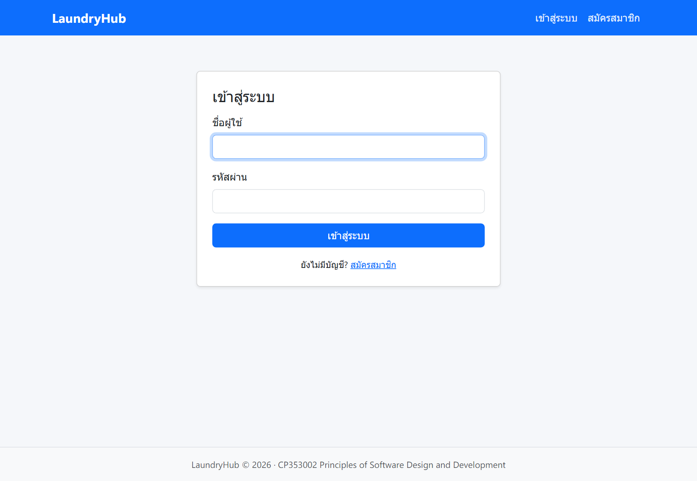

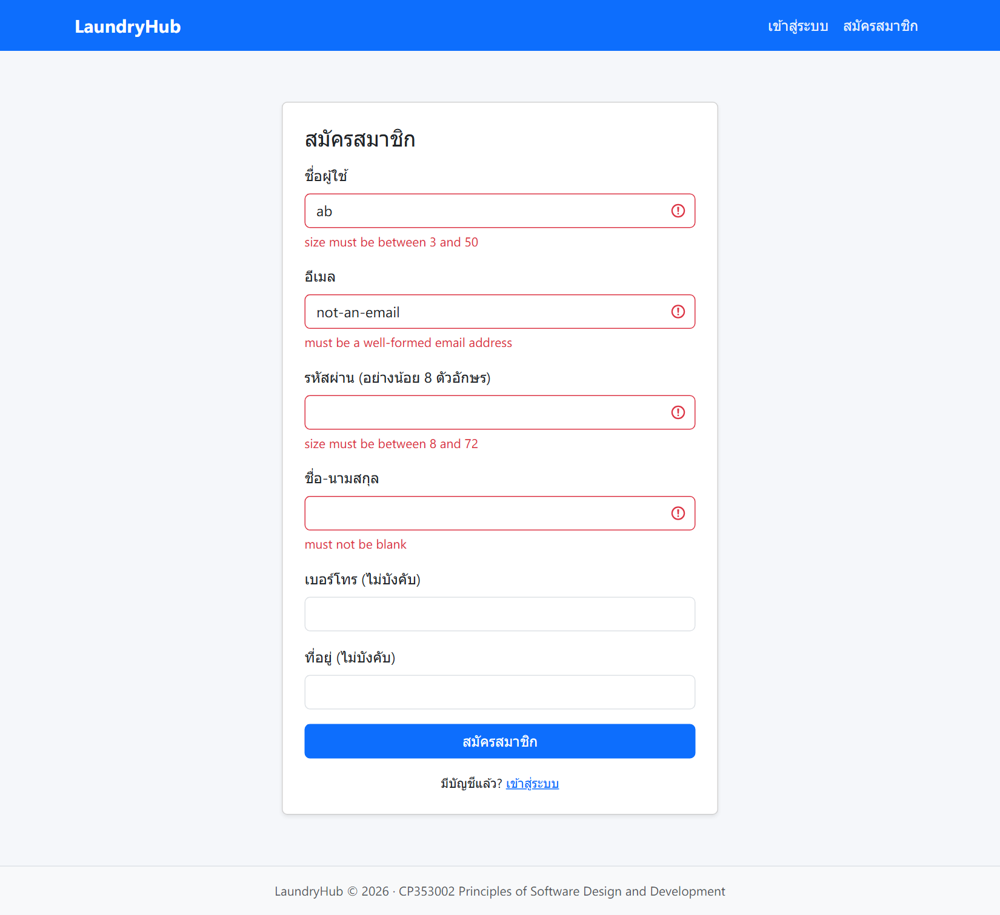

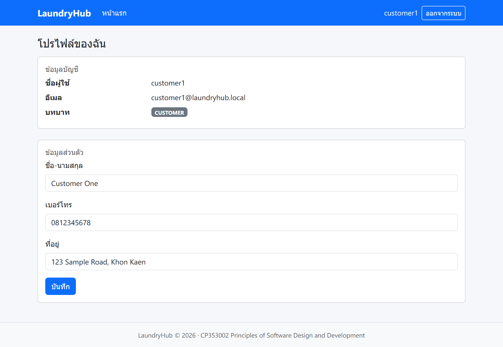

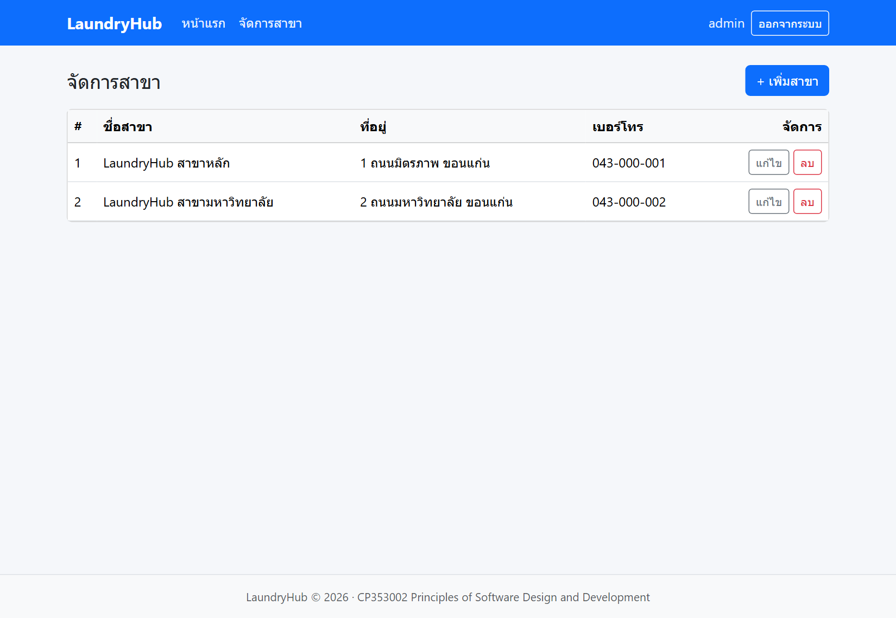

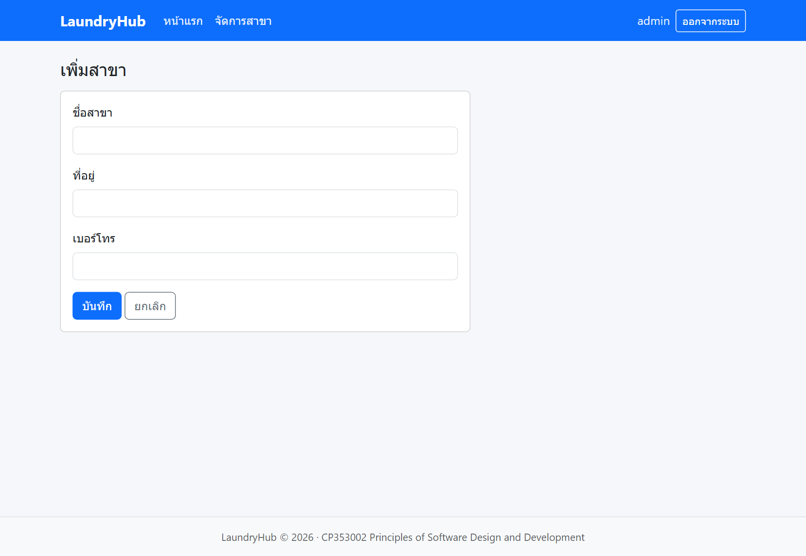

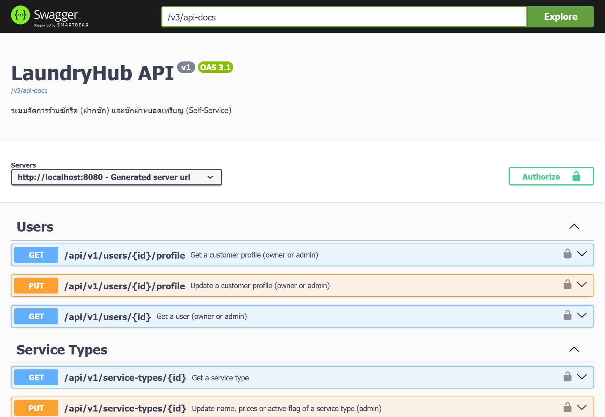

### 4.x ผล Unit Test
รันเมื่อ 10 ตุลาคม 2569 ด้วย `mvn test` ผลของส่วนที่ผู้เขียนรับผิดชอบ:

| คลาสเทสต์ | ทดสอบอะไร | จำนวน | ผ่าน | ล้มเหลว |
|---|---|---:|---:|---:|
| `AuthServiceTest` | สมัครสำเร็จ (เข้ารหัสผ่าน, role เป็นลูกค้า, ผูกโปรไฟล์), ชื่อซ้ำ, อีเมลซ้ำ ต้องไม่บันทึก | 3 | 3 | 0 |
| `BranchServiceTest` | ดู/สร้าง/แก้/ลบ, ไม่พบ, ลำดับลบแล้ว flush | 8 | 8 | 0 |
| `UserServiceTest` | ดูผู้ใช้ ดู/แก้โปรไฟล์ ไม่พบ ผลตอบกลับไม่มีรหัสผ่าน | 5 | 5 | 0 |
| `SecurityRulesTest` | สิทธิ์ตามบทบาท, เจ้าของหรือแอดมิน, รูปแบบ error 401/403/400 | 13 | 13 | 0 |
| **รวม** | | **29** | **29** | **0** |

*(ตัวเลขนี้เป็นของโมดูลผู้เขียนเท่านั้น ตัวเลขรวมทั้งโปรเจคให้ใช้จาก doc/test-report/test-report.md ตอนรวมเล่ม)*

การพิสูจน์ว่าเทสต์สิทธิ์จับข้อผิดพลาดได้จริง: เมื่อถอดการแก้รูปแบบ error 401 ออกชั่วคราว เทสต์ `api_withoutLogin_returns401WithStandardErrorBody` ล้ม และผ่านเมื่อใส่กลับ

### 4.x ผลทดสอบแอปจริงของโมดูลบัญชีผู้ใช้และสาขา
ทดสอบด้วย `curl` กับแอปที่รันบน PostgreSQL ใน Docker และใช้บัญชีตัวอย่างจากไฟล์ seed

| กรณีทดสอบ | ผลที่ได้ | ผลที่คาด |
|---|---|---|
| สมัครด้วยข้อมูลถูกต้อง | 201 ได้บัญชีลูกค้าพร้อมโปรไฟล์ในฐานข้อมูล | ตรง |
| ชื่อผู้ใช้ซ้ำ / อีเมลซ้ำ (รวมกรณีตัวพิมพ์ต่าง) | 409 | ตรง |
| ข้อมูลสมัครไม่ถูกต้อง | 400 พร้อมรายการ `fieldErrors` 4 ช่อง | ตรง |
| ส่ง `"role":"ADMIN"` มาตอนสมัคร | ได้บัญชี CUSTOMER (ไม่รับค่า role) | ตรง |
| รหัสผ่านถูกเก็บเป็นแฮช | ในฐานข้อมูลขึ้นต้นด้วย `$2a$10$` | ตรง |
| เจ้าของอ่านและแก้โปรไฟล์ตนเอง | 200 และอ่านกลับได้ค่าใหม่ | ตรง |
| ลูกค้าอ่านข้อมูลของผู้ใช้คนอื่น | 403 | ตรง |
| แอดมินอ่านโปรไฟล์ลูกค้า | 200 | ตรง |
| ขอโปรไฟล์ของพนักงาน / ผู้ใช้ที่ไม่มีอยู่ | 404 | ตรง |
| ไม่ล็อกอินเรียก API | 401 พร้อม JSON มาตรฐาน | ตรง |
| ใช้รหัสผ่านผิดเรียก API | 401 พร้อม JSON มาตรฐาน ไม่มี header ที่ทำให้เบราว์เซอร์เด้งหน้าต่างล็อกอิน | ตรง (หลังแก้ ดูตารางข้อบกพร่อง) |
| ลูกค้าเพิ่มสาขา | 403 พร้อม JSON มาตรฐาน | ตรง |
| แอดมินเพิ่ม / แก้ / ลบสาขา | 201 / 200 / 204 | ตรง |
| ลบสาขาที่มีเครื่องอ้างอิง | 409 และข้อมูลไม่ถูกลบ | ตรง |
| เปิดหน้า `/admin/branches` ด้วยบัญชีลูกค้า | 403 | ตรง |
| ทดสอบหน้าเว็บ: กรอกฟอร์มสมัครผิด / ถูก / ซ้ำ | แสดงข้อความใต้ช่อง / พาไปหน้า login / แจ้งชื่อซ้ำ | ตรง |
| ล็อกอินผิด / ถูก / ออกจากระบบ | กลับ `/login?error` / ไปหน้าแรก / กลับ `/login?logout` และเข้าหน้าแรกไม่ได้อีก | ตรง |

### 4.x ผล Deploy และ CI
ตรวจระบบที่ deploy บน Render ผ่านอินเทอร์เน็ต:

| รายการ | ผล |
|---|---|
| `/login`, `/register`, `/swagger-ui.html`, `/v3/api-docs` | 200 ทั้งหมด |
| เรียก API โดยไม่ล็อกอิน | 401 |
| เรียก API ด้วยบัญชีแอดมิน | ได้ข้อมูลสาขาจากฐานข้อมูลบน Neon (Flyway สร้างตารางและข้อมูลตัวอย่างให้เองตอนสตาร์ทครั้งแรก) |
| เวลาสตาร์ทครั้งแรกบน Render แผนฟรี | ประมาณ 137 วินาที (เทียบกับ 4–5 วินาทีบนเครื่องพัฒนา เนื่องจาก CPU 0.1 คอร์) |
| ขนาด Docker image | ประมาณ 558 MB |

ผลของ CI ที่รันบน GitHub: งาน `Test (mvn test)` ใช้เวลา 39 วินาที (รอบแรก) และ 23 วินาที (รอบหลัง ซึ่งใช้ cache) งาน `Docker build` ใช้เวลาประมาณ 1 นาที 28 วินาที และผ่านทั้งคู่ จากนั้นตั้งทั้งสองงานเป็น required check ทำให้ Pull Request ที่เทสต์หรือการ build ไม่ผ่านจะ merge ไม่ได้ *(ตรวจก่อนส่ง: Render ผูกกับ branch main และ URL ยังเปิดได้)*

### 4.x ผลการทำงานร่วมกันด้วย Git
ผู้เขียนมี commit ของตนเอง 51 รายการ (ไม่นับ merge commit) กระจายตลอดช่วงพัฒนา และเปิด Pull Request เข้า `develop` 7 รายการ ได้แก่ โครงโปรเจค, ระบบยืนยันตัวตนกับสาขากับหน้าเว็บ, Dockerfile, CI กับการแก้ error 401/403, แผนภาพ, เอกสารรวม SOLID/Pattern, และส่วนรายงานพร้อมภาพหน้าจอ ทุกรายการผ่านการรีวิวและอนุมัติก่อน merge รวมถึงทำหน้าที่รีวิว Pull Request ของเพื่อนสมาชิก *(อัปเดตตัวเลข commit และ Pull Request ก่อนส่ง)*

### 4.x ข้อบกพร่องที่พบและแก้ไข
| # | พบจาก | ปัญหา | การแก้ไข |
|---|---|---|---|
| 1 | ทดสอบเริ่มระบบ | PostgreSQL ที่ติดตั้งในเครื่องใช้พอร์ต 5432 ชนกับฐานข้อมูลใน Docker ทำให้แอปเชื่อมต่อผิดตัวและยืนยันตัวตนฐานข้อมูลไม่ผ่าน | ยืนยันสาเหตุด้วย container แยกที่พอร์ตอื่น แล้วทีมเปลี่ยนพอร์ตของฐานข้อมูลใน Docker เป็น 5433 |
| 2 | ตั้งค่า Deploy | สตริงเชื่อมต่อ Neon ที่ได้มามี `-pooler` ในชื่อโฮสต์และพารามิเตอร์ `channel_binding` ซึ่ง JDBC ไม่รู้จัก | ใช้ที่อยู่แบบเชื่อมต่อตรงและตัดพารามิเตอร์ที่ไม่ใช้ออก |
| 3 | ทดสอบกับระบบจริง | รหัสผ่านผิดในการเรียก API ได้ 401 แบบไม่มี JSON เพราะตัวกรอง Basic ตอบเองโดยไม่ผ่านตัวจัดการ error | ตั้ง entry point ของ HTTP Basic ให้ตอบ `ApiErrorResponse` และเพิ่มเทสต์ |
| 4 | รีวิวโค้ด (เพื่อนสมาชิก) | ตรวจชื่อผู้ใช้ซ้ำแบบสนตัวพิมพ์ ทำให้ `Admin` กับ `admin` สมัครได้ทั้งคู่ | เปลี่ยนเป็นการตรวจแบบไม่สนตัวพิมพ์ทั้งชื่อผู้ใช้และอีเมล |
| 5 | รีวิวโค้ด (เพื่อนสมาชิก) | กฎสิทธิ์รายสาขาอยู่ในไฟล์ `SecurityConfig` กลาง เสี่ยงที่หลายคนต้องแก้ไฟล์เดียวกัน | ย้ายไปประกาศด้วย `@PreAuthorize` ที่ Controller ของแต่ละโมดูล |
| 6 | รีวิวโค้ด (เพื่อนสมาชิก) | เมนูมีลิงก์ไปหน้าโปรไฟล์และจัดการสาขาที่ยังไม่มี | พัฒนาสองหน้านี้ก่อน merge |
| 7 | ตรวจภาพหน้าจอ | ลิงก์ในแถบเมนูมีสีซีดจนอ่านยากบนพื้นน้ำเงิน | ปรับสีตัวอักษรของลิงก์ด้วย CSS |
| 8 | ผลของ CI | คำเตือนว่าเวอร์ชันของ action ที่ใช้อิง Node.js 20 ซึ่งเลิกสนับสนุน | ปรับเป็นเวอร์ชันที่รองรับ |
| 9 | ตรวจเอกสาร | เลขบรรทัดอ้างอิงในเอกสารเพี้ยนเมื่อมีการแก้โค้ดของโมดูลอื่นระหว่างทาง | เขียนสคริปต์ตรวจเลขบรรทัดและลิงก์ทั้งหมดกับโค้ดจริง และรันซ้ำก่อนส่ง |

---

## บทที่ 5 สรุปผล อภิปรายผล และข้อเสนอแนะ

### 5.x สรุปผลการดำเนินงาน
โครงงาน LaundryHub พัฒนาระบบจัดการร้านซักรีดที่รองรับการฝากซักและการซักเอง พร้อมผู้ใช้ 3 บทบาท ตามสถาปัตยกรรมแบบชั้นที่ไม่มี Controller เรียก Repository โดยตรง ใช้ SOLID และ Design Pattern ที่ตรวจตำแหน่งในโค้ดได้ มีฐานข้อมูล 10 ตารางที่จัดการด้วย Flyway ระบบ deploy แล้วที่ https://laundry-hub-1ltc.onrender.com และมี CI ที่ตรวจเทสต์ทุก Pull Request ส่วนของผู้เขียนซึ่งเป็นโครงสร้างพื้นฐาน ผ่านการทดสอบครบ ทั้งเทสต์อัตโนมัติ 29 ข้อ และการทดสอบกับระบบจริง *(ตรวจก่อนส่ง: ปรับประโยคนี้ให้ตรงกับสถานะสุดท้ายของทุกโมดูลที่ merge เข้า main)*

### 5.x อภิปรายผล
- **ยืนยันตัวตนสองช่องทาง:** ฟอร์มกับเซสชันเหมาะกับหน้าเว็บ ส่วน HTTP Basic ทำให้ทดสอบ API ผ่าน Swagger ได้ง่ายโดยไม่ต้องมี endpoint เข้าสู่ระบบแยก ข้อแลกเปลี่ยนคือ Basic ส่งรหัสผ่านทุกคำขอ จึงควรใช้ผ่าน HTTPS เสมอ ซึ่งเว็บที่ deploy ใช้อยู่
- **กระจายกฎสิทธิ์ไปที่ Controller:** ลดการแก้ไฟล์กลางพร้อมกันหลายคนและทำให้กฎอยู่ใกล้ endpoint ที่ใช้ ข้อแลกเปลี่ยนคือกฎกระจายอยู่หลายไฟล์ ต้องมีเทสต์สิทธิ์ครอบคลุมจึงจะมั่นใจว่าไม่มี endpoint ใดตกหล่น
- **แยกฐานข้อมูลออกจากแอป:** ข้อมูลอยู่รอดเมื่อ deploy ใหม่ แต่ต้องจัดการการเชื่อมต่อแบบเข้ารหัสและตัวแปรสภาพแวดล้อมเพิ่ม
- **บังคับผ่าน CI ก่อน merge:** ป้องกันโค้ดที่เทสต์พังไปถึงการ deploy ได้ โดยเฉพาะเมื่อ Docker build ข้ามเทสต์ ข้อแลกเปลี่ยนคือถ้า CI ขัดข้องจากฝั่งผู้ให้บริการ ต้องปรับกฎชั่วคราวจึงจะ merge ได้
- **ตรวจเอกสารด้วยเครื่องมือ:** การตรวจเลขบรรทัดด้วยสคริปต์พบว่าเลขเพี้ยนได้ง่ายเมื่อมีผู้แก้โค้ดต่อ จึงควรตรวจซ้ำทุกครั้งก่อนส่ง

### 5.x ผลลัพธ์การเรียนรู้
ผู้เขียนได้เรียนรู้ว่ากฎสิทธิ์ที่ถูกต้องต้องตรวจทั้งในโค้ดและด้วยเทสต์อัตโนมัติ เพราะ error บางชนิดเกิดนอกตัวจัดการ error ของ Controller (เช่น 401 จากตัวกรอง) และมองไม่เห็นจากเทสต์ชั้น Service การทดสอบกับระบบจริงจึงพบปัญหาที่เทสต์จำลองไม่พบ นอกจากนี้การทำ Code Review ระหว่างเพื่อนสมาชิกช่วยจับข้อบกพร่องที่ผู้เขียนมองไม่เห็นเอง และการทำ CI ตั้งแต่ต้นช่วยให้มั่นใจเมื่อรวมงานของหลายคน

### 5.x ปัญหาที่พบในการดำเนินงาน
ดูตารางข้อบกพร่อง 9 ข้อในบทที่ 4 นอกจากนี้ มีปัญหาด้านการประสานงานคือโมดูลของสมาชิกแต่ละคนต้องรอโครงสร้างพื้นฐานและ Shared Contracts จากส่วนของผู้เขียนก่อนจึงเริ่มได้ ระยะเวลาโครงงานสั้นเพียงสามวัน จึงต้องเรียงลำดับงานให้ส่งมอบโครงโปรเจคและ deploy ก่อน และการ deploy บนแผนฟรีมีข้อจำกัดเรื่องหน่วยความจำและ CPU ทำให้สตาร์ทช้าตามที่ระบุในบทที่ 4

### 5.x ข้อจำกัด
- บัญชีตัวอย่างใน `V2__seed_data.sql` (admin, staff1, customer1) ใช้รหัสผ่านตัวอย่างเดียวกัน และอยู่ใน repository ที่เป็นสาธารณะ จึงใช้เพื่อการทดสอบและนำเสนอเท่านั้น ไม่เหมาะกับการใช้งานจริง
- ระบบไม่มีการล็อกบัญชีเมื่อกรอกรหัสผิดหลายครั้ง ไม่มีการจำกัดอัตราการเรียก ไม่มีการลืมรหัสผ่านหรือยืนยันอีเมล
- ไม่มีหน้าจัดการบัญชีผู้ใช้สำหรับผู้ดูแลระบบ (ผู้ดูแลระบบดูข้อมูลผู้ใช้รายคนได้ผ่าน API) และไม่มีรายงานยอดขาย
- ปิดการตรวจ CSRF เฉพาะ `/api/**` เพราะ API ออกแบบให้ยืนยันตัวตนด้วย Basic ทุกคำขอ แต่ถ้าเบราว์เซอร์มีเซสชันจากการล็อกอินผ่านฟอร์มอยู่ เซสชันนั้นก็ใช้เรียก API ได้เช่นกัน ซึ่งเบราว์เซอร์รุ่นใหม่ลดความเสี่ยงด้วยการไม่ส่ง cookie ข้ามเว็บสำหรับคำขอแบบ POST โดยปริยาย
- เอกสาร API (`/v3/api-docs`, `/swagger-ui.html`) เปิดเป็นสาธารณะเพื่อให้ตรวจงานได้ ควรปิดเมื่อใช้งานจริง
- บริการแผนฟรีบน Render จะหยุดทำงานเมื่อไม่มีผู้ใช้ การเปิดครั้งแรกหลังหยุดใช้เวลา 2 นาทีขึ้นไป
- เทสต์ของบางโมดูลที่ต้องใช้ฐานข้อมูลจริงเป็นแบบเลือกรัน จึงไม่ถูกรันใน CI ปัจจุบัน

### 5.x ข้อเสนอแนะและแนวทางพัฒนาต่อ
1. เปลี่ยนรหัสผ่านของบัญชีตัวอย่างและตัดบัญชีตัวอย่างออกจากการ deploy จริง (เพิ่ม migration ใหม่) พร้อมเพิ่มการล็อกบัญชีและการยืนยันอีเมล
2. เพิ่มบริการ PostgreSQL ใน CI เพื่อรันเทสต์ที่ใช้ฐานข้อมูลจริงทุก Pull Request
3. เพิ่มหน้าจัดการผู้ใช้สำหรับผู้ดูแลระบบ และหน้ารายงานยอดขาย
4. ใช้ token (เช่น JWT) แทนการส่ง Basic ทุกคำขอ หากต้องรองรับแอปมือถือหรือไคลเอนต์ภายนอก
5. ย้ายไปแผนที่ไม่หยุดทำงานเมื่อไม่มีผู้ใช้ และเพิ่มการเฝ้าระวัง (monitoring) เมื่อใช้งานจริง

---

## เอกสารอ้างอิง

- Bauer, C., King, G., & Gregory, G. (2015). Java Persistence with Hibernate (2nd ed.). Manning.
- Chacon, S., & Straub, B. (2014). Pro Git (2nd ed.). Apress.
- Docker Documentation. https://docs.docker.com
- Flyway Documentation. https://flywaydb.org
- Fowler, M. (2006). Continuous Integration. https://martinfowler.com/articles/continuousIntegration.html
- GitHub Docs: GitHub Actions. https://docs.github.com/actions
- Merkel, D. (2014). Docker: Lightweight Linux containers for consistent development and deployment. Linux Journal, 2014(239).
- OWASP Foundation. Password Storage Cheat Sheet. https://cheatsheetseries.owasp.org
- Provos, N., & Mazières, D. (1999). A future-adaptable password scheme. Proceedings of the USENIX Annual Technical Conference.
- Spring Boot Reference Documentation. https://spring.io
- Spring Security Reference. https://spring.io

## ภาคผนวก
- **ภาคผนวก ก:** คู่มือการติดตั้ง รัน และทดสอบระบบ (`README.md`)
- **ภาคผนวก ข:** Use Case Diagram และ Use Case Description (`doc/diagrams/use-case.md`)
- **ภาคผนวก ค:** Component Diagram และ Deployment Diagram (`doc/diagrams/component-diagram.md`, `doc/diagrams/deployment-diagram.md`)
- **ภาคผนวก ง:** ส่วนของผู้เขียนในเอกสาร SOLID และ Design Pattern (`doc/sections/solid-analysis-oak.md`, `doc/sections/design-patterns-oak.md`) และฉบับรวม (`doc/solid-analysis.md`, `doc/design-patterns.md`)
