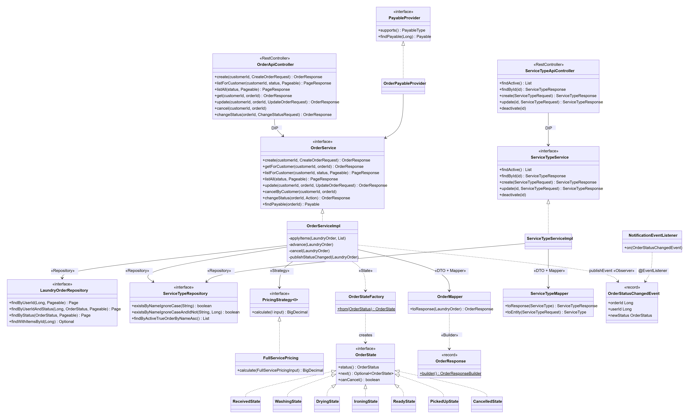
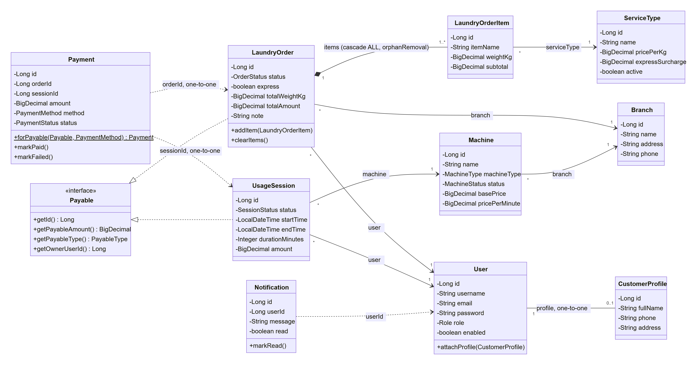
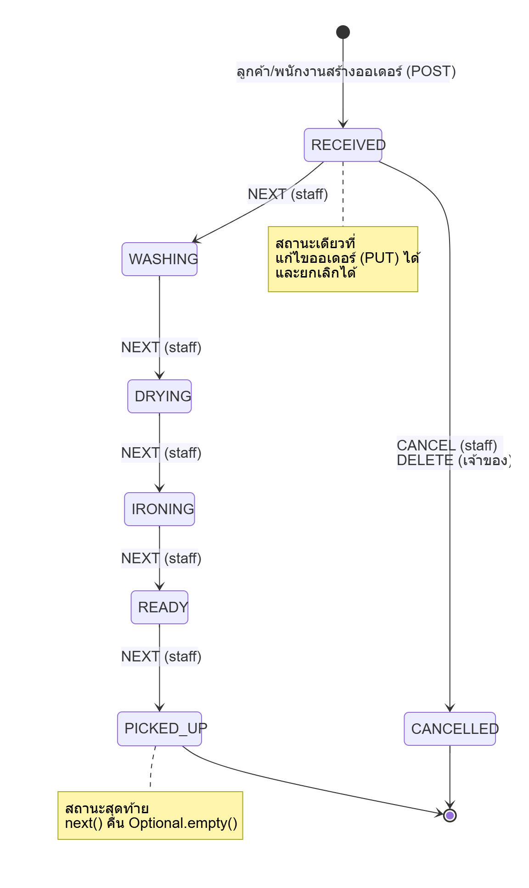
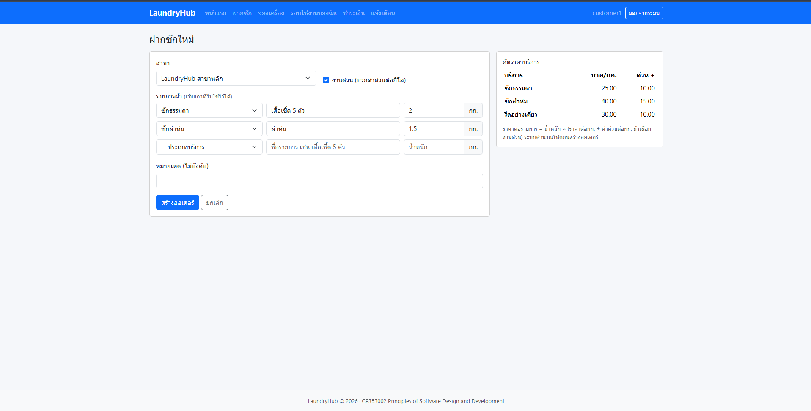
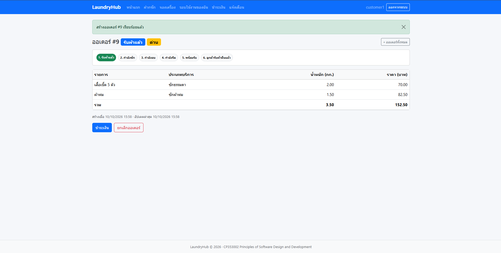
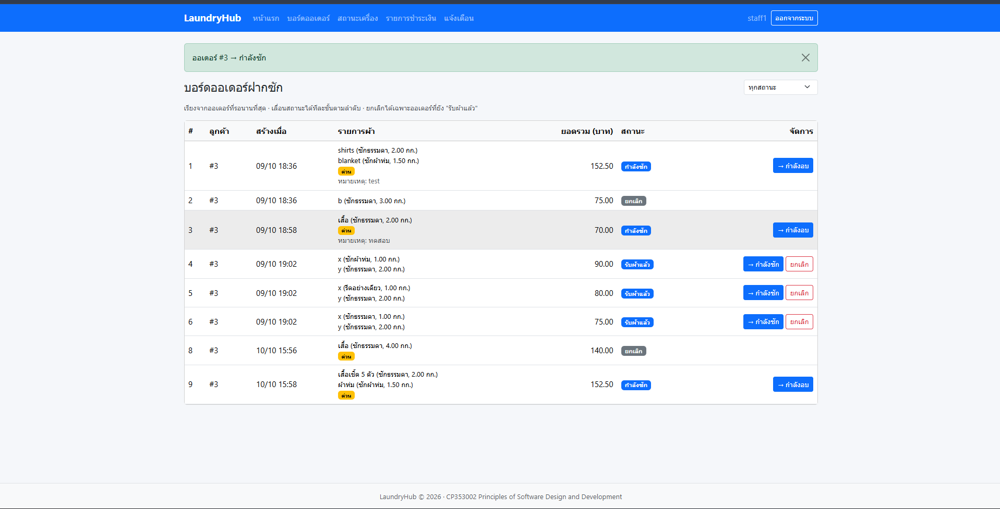

# ร่างรายงาน — ส่วนของพีช (Full-Service Order)

> ส่วนนี้ให้โชกุนรวมเข้าเล่ม ตามรูปแบบใน doc/report/README.md
> เขียนจากโค้ดและผลทดสอบจริงใน develop ณ วันที่ 10 ต.ค. 2569 ไม่ได้อ้างสิ่งที่ยังไม่ได้ทำ
> ตัวเลขเทสต์ต้องตรวจซ้ำกับ doc/test-report/test-report.md รอบสุดท้ายก่อนส่ง
> path ย่อ: …/ = code/src/main/java/com/laundryhub/

---

## บทที่ 2 ทฤษฎีและเทคโนโลยีที่เกี่ยวข้อง

### State Pattern สำหรับสถานะออเดอร์
State Pattern ให้วัตถุเปลี่ยนพฤติกรรมตามสถานะภายใน โดยแยกพฤติกรรมของแต่ละสถานะเป็นคลาสของตัวเองที่ implement interface เดียวกัน ผู้เรียกจึงไม่ต้องเขียน `if/switch` ตามสถานะทุกครั้งที่ต้องตัดสินใจ [Gamma et al., 1994]
ในโมดูลออเดอร์ interface `OrderState` มี 3 เมธอด คือ `status()`, `next()` และ `canCancel()` และมีคลาส State 7 คลาสตามสถานะในตาราง `laundry_orders` ได้แก่ `ReceivedState`, `WashingState`, `DryingState`, `IroningState`, `ReadyState`, `PickedUpState` และ `CancelledState`
เมธอด `next()` คืนค่า `Optional<OrderState>` สถานะสุดท้ายจึงคืน `Optional.empty()` แทนการโยน `UnsupportedOperationException` ทุก State ใช้แทนกันได้ตามหลัก Liskov Substitution

### Strategy Pattern สำหรับการคิดราคา
Strategy Pattern แยกกลุ่มอัลกอริทึมที่ทำงานเรื่องเดียวกันออกเป็นคลาสที่สลับใช้แทนกันได้ผ่าน interface เดียว ผู้ใช้อัลกอริทึมขึ้นกับ interface ไม่ใช่คลาสจริง [Gamma et al., 1994]
ทีมใช้ interface กลาง `PricingStrategy<I>` ที่มีเมธอดเดียว `calculate(I input)` โมดูลฝากซักใช้ `FullServicePricing` (คิดตามน้ำหนัก) ส่วนโมดูลซักเองใช้ `SelfServicePricing` (คิดตามเวลา) การเพิ่มวิธีคิดราคาใหม่ทำได้ด้วยการเพิ่มคลาส ไม่ต้องแก้ Service เดิม ตามหลัก Open/Closed

### Builder Pattern สำหรับสร้างข้อมูลตอบกลับ
Builder Pattern แยกขั้นตอนการสร้างวัตถุที่มีหลายส่วนออกจากตัววัตถุ ช่วยให้สร้างวัตถุที่มีพารามิเตอร์จำนวนมากได้อ่านง่ายและไม่สลับตำแหน่งผิด [Gamma et al., 1994; Bloch, 2018]
`OrderResponse` มี 11 field และมีหลาย field เป็นชนิด `Long` เหมือนกัน (`id`, `customerId`, `branchId`) ถ้าสร้างด้วย constructor ธรรมดาแล้วสลับตำแหน่ง โปรแกรมยัง compile ผ่าน โมดูลนี้จึงใช้ `@Builder` ของ Lombok และสร้างผ่าน `OrderResponse.builder().customerId(..).branchId(..).build()` ส่วน DTO ที่มี field น้อยยังใช้ constructor ปกติ

### ความสัมพันธ์แบบ One-to-Many และการโหลดข้อมูลใน JPA
ออเดอร์หนึ่งใบมีรายการผ้าหลายรายการ จึงใช้ `@OneToMany(mappedBy = "order", cascade = ALL, orphanRemoval = true)` ฝั่งออเดอร์ และ `@ManyToOne(fetch = LAZY)` ฝั่งรายการ `cascade = ALL` ทำให้บันทึกหรือลบออเดอร์แล้วรายการถูกบันทึกหรือลบตาม ส่วน `orphanRemoval` ลบแถวของรายการที่ถูกนำออกจาก list ขณะแก้ไขออเดอร์
การโหลดแบบ LAZY ช่วยไม่ให้ดึงข้อมูลที่ไม่ได้ใช้ แต่ทำให้เกิดปัญหา N+1 query ได้เมื่อวนอ่านความสัมพันธ์ของหลายแถว ซึ่งแก้ได้ด้วย `@EntityGraph` (ดึงพร้อมกันในคำสั่งเดียว) หรือ `@BatchSize` (ดึงเป็นชุดด้วย `IN (...)`) [Hibernate ORM, 2024]

---

## บทที่ 3 วิธีดำเนินการและการออกแบบระบบ

### การออกแบบโมดูลออเดอร์ฝากซัก
โมดูลออเดอร์ทำงานตามสถาปัตยกรรมแบบชั้น Controller เรียก Service ผ่าน interface และ Service เรียก Repository โดย Controller ไม่ import Repository เลย

| ชั้น | คลาส | หน้าที่ |
|---|---|---|
| Presentation | `OrderApiController`, `ServiceTypeApiController` (REST) · `OrderWebController` (Thymeleaf) | รับคำขอ ตรวจสิทธิ์ด้วย `@PreAuthorize` ตรวจข้อมูลด้วย `@Valid` แล้วส่งต่อ |
| Service | `OrderService` / `OrderServiceImpl`, `ServiceTypeService` / `ServiceTypeServiceImpl`, `OrderPayableProvider` | กฎธุรกิจ คิดราคา เปลี่ยนสถานะ ตรวจเจ้าของ ยิง event |
| Pattern | `PricingStrategy` + `FullServicePricing` · `OrderState` + 7 State + `OrderStateFactory` | คิดราคา (Strategy) และควบคุมลำดับสถานะ (State) |
| Data Access | `LaundryOrderRepository`, `ServiceTypeRepository` | Spring Data JPA ไม่มีการเขียน SQL เอง |
| DTO + Mapper | `CreateOrderRequest`, `OrderResponse`, `PageResponse`, `OrderMapper`, `ServiceTypeMapper` | แยก Entity ออกจากรูปแบบข้อมูลของ API |

### การออกแบบฐานข้อมูลของโมดูลออเดอร์
โมดูลนี้ใช้ 3 ตารางจาก `V1__init_schema.sql` ได้แก่ `service_types`, `laundry_orders` และ `laundry_order_items`

| ความสัมพันธ์ | ชนิด | การตั้งค่าใน Entity |
|---|---|---|
| `users` → `laundry_orders` | One-to-Many | `LaundryOrder.user` เป็น `@ManyToOne(fetch = LAZY)` |
| `branches` → `laundry_orders` | One-to-Many | `LaundryOrder.branch` เป็น `@ManyToOne(fetch = LAZY)` |
| `laundry_orders` → `laundry_order_items` | One-to-Many (composition) | `cascade = ALL`, `orphanRemoval = true` |
| `service_types` → `laundry_order_items` | One-to-Many | `LaundryOrderItem.serviceType` เป็น `@ManyToOne(fetch = LAZY)` |

ประเภทบริการลบแบบ soft delete (`active = false`) แทนการลบแถวจริง เพราะรายการผ้าของออเดอร์เก่ายังอ้างถึงผ่าน foreign key `service_type_id`

### การคิดราคา
ราคาคิดที่ฝั่งเซิร์ฟเวอร์เสมอ คำขอสร้างออเดอร์ (`CreateOrderRequest`) ไม่มีช่องราคาหรือยอดรวม ลูกค้าจึงตั้งราคาเองไม่ได้
- ราคาต่อรายการ = น้ำหนัก × (ราคาต่อกก. + ค่าด่วนต่อกก. ถ้าเลือกงานด่วน) ปัดทศนิยม 2 ตำแหน่งแบบ HALF_UP
- ยอดรวมและน้ำหนักรวม = ผลรวมของทุกรายการ คำนวณใน `OrderServiceImpl.applyItems()`
- ข้อมูลที่ใช้คิดราคาถูกตรวจใน compact constructor ของ `FullServicePricingInput` (น้ำหนักต้องมากกว่า 0 ราคาห้ามว่าง) ข้อมูลผิดได้ 400 แทน 500
- ตัวอย่าง: ซักธรรมดา 25 บาท/กก. ค่าด่วน 10 บาท/กก. น้ำหนัก 2 กก. แบบด่วน = 2 × (25 + 10) = 70.00 บาท

### การออกแบบสถานะออเดอร์
ออเดอร์เริ่มที่ `RECEIVED` และเดินหน้าได้ทีละขั้นจนถึง `PICKED_UP` ยกเลิกได้เฉพาะตอน `RECEIVED` และแก้ไขรายการได้เฉพาะตอน `RECEIVED` เช่นกัน การทำผิดกฎได้ `BusinessRuleException` (400) และสถานะไม่เปลี่ยน
`OrderServiceImpl.advance()` เรียก `OrderStateFactory.from(status).next()` และ `cancel()` เรียก `canCancel()` จึงไม่มี `if/switch` ตามสถานะใน Service ปุ่ม "ขั้นถัดไป" บนบอร์ดพนักงานก็ถาม `next()` จากคลาส State เช่นกัน ลำดับสถานะจึงกำหนดไว้ที่เดียว
ทุกครั้งที่สถานะเปลี่ยน Service ยิง `OrderStatusChangedEvent` ผ่าน `ApplicationEventPublisher` แล้ว `NotificationEventListener` ของโมดูลแจ้งเตือนสร้างข้อความให้ลูกค้า (Observer) โดย Service ไม่รู้จักระบบแจ้งเตือน

### การออกแบบ API และสิทธิ์การเข้าถึง

| Method | Endpoint | สิทธิ์ | ผลลัพธ์ |
|---|---|---|---|
| POST | `/api/v1/customers/{customerId}/orders` | เจ้าของ / STAFF | 201 / 400 / 403 / 404 |
| GET | `/api/v1/customers/{customerId}/orders?page&size&sort&status` | เจ้าของ / STAFF | 200 (แบ่งหน้า) / 400 / 403 |
| GET | `/api/v1/customers/{customerId}/orders/{orderId}` | เจ้าของ / STAFF | 200 / 403 / 404 |
| PUT | `/api/v1/customers/{customerId}/orders/{orderId}` | เจ้าของ | 200 / 400 / 403 |
| DELETE | `/api/v1/customers/{customerId}/orders/{orderId}` | เจ้าของ (ยกเลิก) | 204 / 400 / 403 |
| PATCH | `/api/v1/orders/{orderId}/status` `{"action":"NEXT" หรือ "CANCEL"}` | STAFF / ADMIN | 200 / 400 / 404 |
| GET | `/api/v1/orders?status&page&size&sort` | STAFF / ADMIN | 200 (บอร์ดพนักงาน) |
| GET | `/api/v1/service-types`, `/{id}` | ผู้ที่ล็อกอิน | 200 / 404 |
| POST, PUT, DELETE | `/api/v1/service-types`, `/{id}` | ADMIN | 201 / 200 / 204 / 400 / 404 / 409 |

- สิทธิ์ตรวจ 2 ชั้น ชั้นแรก `@PreAuthorize` ตรวจว่า `customerId` ใน URL เป็นของผู้ที่ล็อกอิน (ไม่ใช่ได้ 403) ชั้นที่สองใน Service ตรวจว่าออเดอร์เป็นของลูกค้าคนนั้นจริง (ไม่ใช่ได้ 404) เพื่อไม่เปิดเผยว่ามีออเดอร์เลขนั้นอยู่
- การเรียงลำดับรับเฉพาะฟิลด์ที่อนุญาต (`id`, `createdAt`, `updatedAt`, `status`, `totalAmount`, `totalWeightKg`) ฟิลด์อื่นได้ 400 แทนที่จะเป็น 500
- ผลลัพธ์แบบแบ่งหน้าตอบเป็น `PageResponse<T>` (`content`, `page`, `size`, `totalElements`, `totalPages`)

### การเชื่อมกับโมดูลชำระเงิน
`LaundryOrder` implement interface `Payable` (4 เมธอด) และ `OrderPayableProvider` ส่งออเดอร์ให้ `CheckoutFacade` ผ่าน interface `PayableProvider` โมดูลชำระเงินจึงจ่ายเงินค่าออเดอร์ได้โดยไม่รู้จัก `LaundryOrder` หรือ `OrderService` โดยตรง (Dependency Inversion)

---

## บทที่ 4 ผลการดำเนินงาน

### ผลการพัฒนาโมดูลออเดอร์
- REST API ของออเดอร์ 7 endpoint และประเภทบริการ 5 endpoint ใช้งานได้ผ่าน Swagger UI
- หน้าเว็บสำหรับลูกค้า: รายการออเดอร์ของฉัน (แบ่งหน้า กรองสถานะ), ฟอร์มฝากซักใหม่พร้อมตารางราคา, หน้ารายละเอียดพร้อมแถบขั้นตอน ปุ่มชำระเงิน และปุ่มยกเลิก (แสดงเฉพาะตอน `RECEIVED`)
- หน้าเว็บสำหรับพนักงาน: บอร์ดออเดอร์ เรียงจากออเดอร์ที่รอนานที่สุด มีปุ่มเลื่อนไปขั้นถัดไปและปุ่มยกเลิก
- แก้ปัญหา N+1 ของหน้ารายการด้วย `@BatchSize(size = 50)` ที่ `…/domain/entity/LaundryOrder.java:60` และ `…/domain/entity/ServiceType.java:12` จากการวัดด้วย log `org.hibernate.SQL` ขณะดึงออเดอร์ 6 ใบ เดิมใช้คำสั่ง SQL ของออเดอร์ 10 คำสั่ง (ออเดอร์ 1 + รายการ 6 + ประเภทบริการ 3) หลังแก้เหลือ 3 คำสั่ง

*(ตรวจก่อนส่ง: ภาพหน้าจอ 3 ภาพนี้ต้องอยู่ใน img/ ถ้ายังไม่ได้แคป ให้ลบ 3 บรรทัดภาพนี้ออก)*

### ผลการทดสอบอัตโนมัติ
เทสต์ของโมดูลออเดอร์มี 8 คลาส รวม 78 เทสต์ ผ่านทั้งหมด *(ตรวจก่อนส่ง: ตัวเลขใน doc/test-report/test-report.md รอบ 9 ต.ค. เป็น 69 เทสต์ 7 คลาส เพราะยังไม่รวม OrderWebControllerTest ที่เพิ่มวันที่ 10 ต.ค.)*

| คลาสทดสอบ | จำนวน | สิ่งที่ทดสอบ |
|---|---|---|
| `FullServicePricingTest` | 6 | ราคาปกติ, ด่วนคิดต่อกิโล (2 กก. = 70.00), ปัดทศนิยม, น้ำหนัก 0, ราคาว่าง, input ว่าง |
| `OrderStateTest` | 15 | ทุกสถานะไปขั้นถัดไปถูก, สถานะสุดท้ายไม่มีขั้นต่อไปและไม่ throw, ยกเลิกได้เฉพาะ `RECEIVED`, Factory ครบทุก enum |
| `OrderServiceTest` (Mockito) | 14 | คิดยอดฝั่งเซิร์ฟเวอร์ (122.50), ไม่พบ/ปิดใช้งานประเภทบริการ, ดูออเดอร์คนอื่นได้ 404, เลื่อนสถานะยิง event 1 ครั้ง, ยกเลิกหลังเริ่มซักไม่ได้, แก้ไข, แบ่งหน้า, ฟิลด์ sort ที่ไม่อนุญาต |
| `OrderPayableProviderTest` | 3 | ส่งออเดอร์เป็น `Payable` ครบ 4 ค่า และไม่พบได้ 404 |
| `OrderSecurityTest` (`@WebMvcTest`) | 17 | 401 ไม่ล็อกอิน, เจ้าของ/คนอื่น/พนักงานในทุก endpoint, 403 และ 404 แยกกรณี, validation 400 |
| `ServiceTypeServiceTest` | 7 | ชื่อซ้ำแบบไม่สนตัวพิมพ์ได้ 409, แก้ไข, soft delete |
| `ServiceTypeSecurityTest` | 7 | อ่านได้ทุกคนที่ล็อกอิน, เขียนได้เฉพาะ ADMIN, ราคาติดลบได้ 400 |
| `OrderWebControllerTest` | 9 | render หน้าเว็บจริง, ข้อความผิดพลาดภาษาไทย, ข้ามแถวว่าง, ปุ่มยกเลิกเฉพาะ `RECEIVED`, ลูกค้าเปิดบอร์ดได้ 403, ปุ่มขั้นถัดไปมาจาก State |

เพื่อยืนยันว่าเทสต์สิทธิ์ตรวจจับข้อผิดพลาดได้จริง ได้ลองเปลี่ยนเงื่อนไขเจ้าของใน `OrderApiController` ให้ผ่านเสมอชั่วคราว เทสต์ล้ม 3 ข้อ (สร้างแทนคนอื่น, ดูรายการคนอื่น, พนักงานใช้ DELETE) แล้วเปลี่ยนกลับ

### ผลการทดสอบกับระบบจริง
ทดสอบกับแอปและ PostgreSQL ใน Docker ผ่าน REST API และหน้าเว็บ

| กรณี | ผลที่ได้ |
|---|---|
| ลูกค้าสร้างออเดอร์ด่วน 2 รายการ (2 กก. ซักธรรมดา + 1.5 กก. ซักผ้าห่ม) | 201 ยอดรวม 152.50 บาท |
| ส่งออเดอร์ที่ไม่มีรายการ | 400 พร้อม `fieldErrors` ที่ `items` |
| ลูกค้าสร้างหรือดูออเดอร์ของลูกค้าคนอื่น | 403 |
| ลูกค้าเรียกเลื่อนสถานะหรือเปิดบอร์ดพนักงาน | 403 |
| พนักงานเลื่อนสถานะ `RECEIVED → WASHING` | 200 และมีแจ้งเตือน "ออเดอร์ #N สถานะ: WASHING" ในตาราง `notifications` |
| ยกเลิกหลังเริ่มซัก | 400 "cannot be cancelled once it is WASHING" สถานะไม่เปลี่ยน |
| แก้ไขออเดอร์ตอน `RECEIVED` | ยอดคำนวณใหม่ รายการเดิมถูกลบด้วย `orphanRemoval` |
| ชำระเงินออเดอร์ผ่าน `CheckoutFacade` ด้วย QR จำลอง | Payment สถานะ PAID ยอดตรงกับออเดอร์ และมีแจ้งเตือนการชำระ |
| ประเภทบริการ: ชื่อซ้ำ (ต่างตัวพิมพ์) / ลูกค้าสร้าง / ปิดใช้งานแล้วสั่งออเดอร์ | 409 / 403 / 400 "Service type N is not available" |

---

## บทที่ 5 สรุปผลและข้อเสนอแนะ

### สรุปผลโมดูลออเดอร์
โมดูลออเดอร์ฝากซักครอบคลุมตั้งแต่ลูกค้าสร้างออเดอร์ พนักงานเลื่อนสถานะทีละขั้น จนถึงการชำระเงินผ่านโมดูลชำระเงิน มีทั้ง REST API และหน้าเว็บ ใช้ State, Strategy, Builder และ Observer (ฝั่งผู้ยิง) ในจุดที่แก้ปัญหาจริง กฎธุรกิจอยู่ใน Service ที่เดียวและทั้ง API กับหน้าเว็บใช้ร่วมกัน ทดสอบด้วยเทสต์อัตโนมัติ 78 ข้อและการทดสอบกับฐานข้อมูลจริง

### ปัญหาที่พบในการดำเนินงาน
- **เวอร์ชัน JDK ไม่ตรงกับทีม:** เครื่องที่ใช้มี Java 26 ซึ่ง Lombok เวอร์ชันในโปรเจกต์ยังไม่รองรับ ทำให้ getter/setter ไม่ถูกสร้างและ compile ไม่ผ่าน แก้โดยติดตั้ง JDK 17 และตั้ง `JAVA_HOME` ให้ตรงกับที่ทีมกำหนด
- **พอร์ตฐานข้อมูลชนกัน:** PostgreSQL ที่ติดตั้งในเครื่องใช้พอร์ต 5432 เดียวกับ Docker แอปจึงต่อผิดฐานข้อมูล ทีมแก้โดยเปลี่ยนพอร์ตของ Docker เป็น 5433
- **ปัญหา N+1 query:** พบจากการเปิด log SQL ของหน้ารายการแบบแบ่งหน้า แก้ด้วย `@BatchSize` เพราะการใช้ `@EntityGraph` กับ collection พร้อม pagination ทำให้ Hibernate ตัดหน้าในหน่วยความจำ
- **ข้อมูลผิดรูปแบบได้ 500:** ผู้รีวิวพบว่าราคาที่เป็น null ทำให้เกิด NullPointerException จึงย้ายการตรวจไปไว้ใน compact constructor ของ `FullServicePricingInput` ให้ได้ 400
- **รหัสสถานะไม่ตรงกันในเอกสาร:** brief ระบุว่าเปลี่ยนสถานะผิดลำดับได้ 409 แต่ shared contract ระบุ `BusinessRuleException` → 400 จึงยึดตาม contract ที่ทั้งทีมใช้

### ข้อจำกัด
- ออเดอร์ที่ถูกยกเลิกแล้วยังชำระเงินได้ เพราะ `Payable` ไม่มีข้อมูลสถานะให้ `CheckoutFacade` ตรวจ
- การเลื่อนสถานะเป็น `PICKED_UP` ไม่ได้ตรวจว่าชำระเงินแล้วหรือยัง
- หน้าเว็บยังไม่มีการแก้ไขออเดอร์และการจัดการประเภทบริการของผู้ดูแลระบบ ทำได้ผ่าน REST API เท่านั้น และพนักงานสร้างออเดอร์แทนลูกค้าได้ผ่าน API เท่านั้น
- ฟอร์มฝากซักมีช่องรายการคงที่ 3 แถว และบอร์ดพนักงานแสดงรหัสลูกค้าแทนชื่อ

### ข้อเสนอแนะและแนวทางพัฒนาต่อ
- เพิ่มเมธอดตรวจว่าชำระได้ (เช่น `isPayable()`) ใน `Payable` ให้ทุกโมดูลกันการชำระรายการที่ยกเลิกแล้ว
- เพิ่มกฎให้รับผ้าคืน (`PICKED_UP`) ได้เมื่อชำระเงินแล้ว
- เพิ่มหน้าเว็บแก้ไขออเดอร์และหน้าจัดการประเภทบริการสำหรับผู้ดูแลระบบ โดยใช้ Service เดิม

---

## เอกสารอ้างอิง
- Bloch, J. (2018). Effective Java (3rd ed.). Addison-Wesley.
- Fowler, M. (2002). Patterns of Enterprise Application Architecture. Addison-Wesley.
- Gamma, E., Helm, R., Johnson, R., & Vlissides, J. (1994). Design Patterns: Elements of Reusable Object-Oriented Software. Addison-Wesley.
- Hibernate ORM. (2024). Hibernate ORM User Guide: Fetching. สืบค้นจาก https://docs.jboss.org/hibernate/orm/6.6/userguide/html_single/Hibernate_User_Guide.html
- Spring. (2024). Spring Data JPA Reference Documentation. สืบค้นจาก https://docs.spring.io/spring-data/jpa/reference/

## ภาคผนวก

### ไฟล์และเอกสารของโมดูลออเดอร์
- Class Diagram ทั้งระบบ 4 รูป: `doc/diagrams/class-diagram.md`
- State Diagram และตารางสถานะ ↔ คลาส: `doc/diagrams/state-order.md`
- SOLID พร้อมไฟล์และเลขบรรทัด: `doc/sections/solid-analysis-peach.md`
- Design Patterns พร้อมเหตุผล: `doc/sections/design-patterns-peach.md`
