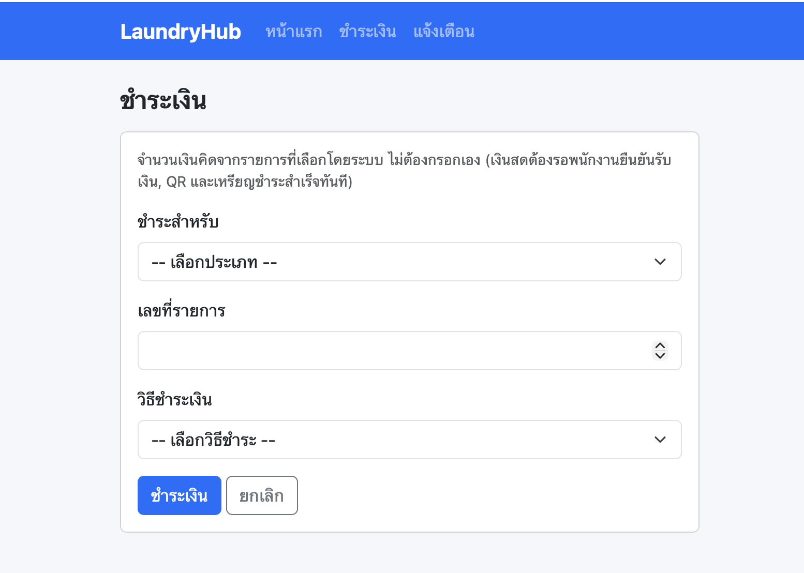
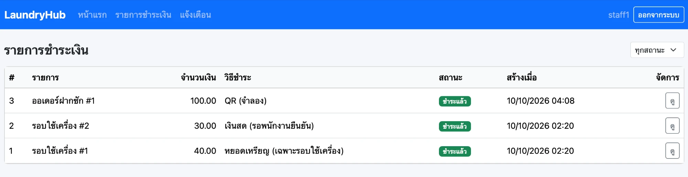
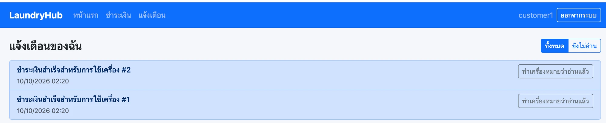

# ร่างรายงาน — ส่วนของโชกุน (Payment / Notification / API Quality)

> ร่างแรกสำหรับรวมเข้าเล่มรายงาน 5 บท ตามรูปแบบที่อาจารย์ให้ตัวอย่าง (บทนำ → ทฤษฎี → วิธีดำเนินการและการออกแบบ → ผล → สรุป)
> เขียนจากเอกสารและผลทดสอบจริงของโปรเจค ไม่ได้ระบุสิ่งที่ยังไม่ได้ทำ ตัวเลขทั้งหมดต้อง**ตรวจซ้ำกับ `doc/test-report/test-report.md` ก่อนส่ง**
> ผู้เขียนต้องอ่านและปรับถ้อยคำเป็นของตัวเอง เล่มรวมควรมีคนเดียวเป็นเจ้าภาพ (เสนอ: โอ๊ค) แล้วแต่ละคนส่งส่วนของตัวเอง
> `…/` = `code/src/main/java/com/laundryhub/`

---

## บทที่ 1 บทนำ (ส่วนที่เกี่ยวกับโมดูลของโชกุน)

### 1.1 ที่มาและความสำคัญ
ระบบ LaundryHub รองรับร้านซักรีดสองรูปแบบในระบบเดียว คือฝากซักและซักหยอดเหรียญแบบบริการตนเอง ทั้งสองรูปแบบต้องมี **การชำระเงิน** (ค่าบริการต่างกัน คิดจากน้ำหนักหรือเวลาใช้เครื่อง) และ **การแจ้งเตือน** (สถานะออเดอร์/การจอง/การชำระเปลี่ยน) ที่เหมือนกัน การแยกสองเรื่องนี้ออกเป็นโมดูลกลางที่ไม่ผูกกับโมดูลออเดอร์หรือโมดูลเครื่องซัก ช่วยให้เพิ่มวิธีชำระหรือช่องทางแจ้งเตือนใหม่ได้โดยไม่แก้โมดูลต้นทาง นอกจากนี้ระบบ REST API ที่ผู้ใช้หลายบทบาทเรียกใช้ จำเป็นต้องตอบ error ในรูปแบบเดียวกันและไม่เปิดเผยข้อมูลภายใน

### 1.2 วัตถุประสงค์ (ส่วนของโมดูลนี้)
1. พัฒนาระบบชำระเงินที่รองรับหลายวิธี (เงินสด, QR จำลอง, เหรียญ) และเพิ่มวิธีใหม่ได้โดยไม่แก้โค้ดเดิม
2. พัฒนาระบบแจ้งเตือนในระบบที่โมดูลอื่นไม่ต้องรู้จัก
3. กำหนดรูปแบบ error มาตรฐานของ REST API ทั้งระบบ และเอกสาร API ด้วย Swagger/OpenAPI
4. ทดสอบโมดูลด้วย Unit Test และการทดสอบกับฐานข้อมูลจริง

### 1.3 ขอบเขตของการศึกษา (ส่วนของโมดูลนี้)
- **ทำ:** `payments` (สร้าง/ดู/แบ่งหน้า/ยืนยันเงินสด), `notifications` (ดู/กรองยังไม่อ่าน/mark read), `GlobalExceptionHandler`, Swagger พร้อม Basic Auth, หน้าเว็บชำระเงิน รายการชำระเงิน/ยืนยันรับเงินสด (พนักงาน) และกล่องแจ้งเตือน (Thymeleaf)
- **ไม่ทำ (ตัดตามขอบเขตโปรเจค):** ไม่ต่อ Payment Gateway จริง (ใช้การจำลอง), ไม่ส่ง SMS/LINE จริง (แจ้งเตือนในระบบเท่านั้น), ไม่ทำ Mobile App
- **ยังไม่ได้ทำ ณ วันที่เขียน:** รายงานยอดขาย (Admin), การวัด code coverage ด้วย Jacoco

### 1.4 ประโยชน์ที่คาดว่าจะได้รับ
ได้ตัวอย่างการใช้ Design Pattern และหลัก SOLID กับโจทย์จริง (ชำระเงินและแจ้งเตือน) ได้ API ที่มีรูปแบบ error สม่ำเสมอ และได้ชุดทดสอบที่ยืนยันกฎธุรกิจสำคัญทั้งในระดับโค้ดและระดับฐานข้อมูล

### 1.5 นิยามศัพท์
| คำ | ความหมาย |
|---|---|
| Payable | สิ่งที่ชำระเงินได้ (ออเดอร์ฝากซัก หรือรอบใช้เครื่อง) เป็น interface เล็ก 4 เมธอด |
| PayableProvider | ตัวค้นหา Payable ตามชนิด ทำให้โมดูลชำระเงินไม่ต้องรู้จักโมดูลอื่นตรงๆ |
| Facade | จุดเข้าเดียวที่ประสานหลายขั้นตอนเพื่อทำงานหนึ่งอย่าง |
| Domain Event | เหตุการณ์ที่โมดูลหนึ่งประกาศเพื่อให้โมดูลอื่นตอบสนอง |
| Constraint | กฎที่ฐานข้อมูลบังคับ (`UNIQUE`, `FK`, `CHECK`) |

---

## บทที่ 2 ทฤษฎีและเทคโนโลยีที่เกี่ยวข้อง (ส่วนที่ใช้ในโมดูลนี้)

### 2.x Design Patterns
- **Strategy** กำหนดกลุ่มอัลกอริทึมให้สลับใช้แทนกันได้ผ่าน interface เดียว ใช้กับวิธีชำระเงิน (`PaymentProcessor`) [Gamma et al., 1994]
- **Factory** รวมการเลือกวัตถุที่ถูกต้องไว้จุดเดียว ในโปรเจคเป็น *Simple Factory แบบ registry* (Spring ฉีด processor ทุกตัวแล้วค้นด้วย Map ตาม enum) ไม่ใช่ GoF *Factory Method* ตามตำรา
- **Facade** ให้ interface เดียวแก่ระบบย่อยหลายส่วน ใช้กับขั้นตอน Checkout (`CheckoutFacade`)
- **Observer** ให้ผู้ประกาศเหตุการณ์ไม่ต้องรู้จักผู้รับ ใช้ผ่าน `ApplicationEventPublisher` และ `@EventListener` ของ Spring

### 2.x หลัก SOLID และสถาปัตยกรรมแบบชั้น
Single Responsibility, Open/Closed, Liskov Substitution, Interface Segregation, Dependency Inversion [Martin, 2003] และ Layered Architecture (Controller → Service → Repository) รวมถึง DTO + Mapper และ Dependency Injection แบบ constructor [Fowler, 2002]

### 2.x REST API, HTTP Status และ OpenAPI
ความหมายของรหัสสถานะ HTTP ตาม RFC 9110 (400, 401, 403, 404, 409, 500) และ OpenAPI/Swagger สำหรับเอกสาร API ที่โต้ตอบได้ (springdoc-openapi)

### 2.x ฐานข้อมูลและการควบคุมความถูกต้อง
PostgreSQL กับ constraint (`PRIMARY KEY`, `FOREIGN KEY`, `UNIQUE`, `CHECK`) และ Flyway สำหรับจัดการเวอร์ชันของ schema

### 2.x การทดสอบซอฟต์แวร์
JUnit 5 และ Mockito สำหรับ Unit Test, Spring MockMvc (standalone) สำหรับทดสอบ controller โดยไม่ต้องรันแอปทั้งตัว และการทดสอบ repository กับฐานข้อมูลจริงด้วย `@DataJpaTest` พร้อม schema ชั่วคราว

---

## บทที่ 3 วิธีดำเนินการและการออกแบบระบบ (ส่วนของโมดูลนี้)

### 3.x ภาพรวมการออกแบบ
โมดูลชำระเงินและแจ้งเตือนอยู่ตรงกลางระหว่างโมดูลออเดอร์กับโมดูลเครื่องซัก โดยพึ่งพากันผ่าน interface (`Payable`, `PayableProvider`) และ event (`PaymentCompletedEvent`) เท่านั้น

| องค์ประกอบ | ตำแหน่ง | หน้าที่ |
|---|---|---|
| `PaymentApiController`, `NotificationApiController` | `…/controller/api/` | รับคำขอ ตรวจสิทธิ์เบื้องต้น แบ่งหน้า |
| `CheckoutFacade` | `…/service/payment/` | ประสานขั้นตอนชำระเงิน ตรวจเจ้าของ ยิง event |
| `PaymentServiceImpl` | `…/service/impl/` | กฎการสร้าง/ยืนยันการชำระ กันจ่ายซ้ำ |
| `PaymentProcessor` + `CashProcessor`, `QrMockProcessor`, `CoinProcessor` | `…/service/payment/` | วิธีชำระแต่ละแบบ (Strategy) |
| `PaymentProcessorFactory` | `…/service/payment/` | เลือก processor ตามวิธีชำระ |
| `NotificationEventListener`, `NotificationServiceImpl` | `…/event/`, `…/service/impl/` | Observer สร้างแจ้งเตือนจาก event |
| `GlobalExceptionHandler`, `ApiErrorResponse` | `…/exception/`, `…/dto/response/` | แปลง exception เป็นรูปแบบ error มาตรฐาน |

ดูแผนภาพประกอบที่ `doc/diagrams/activity-checkout.md` (Activity Diagram) และ `doc/design-patterns.md` (Class Diagram ตำแหน่ง Pattern)

### 3.x การออกแบบฐานข้อมูล
ตาราง `payments` และ `notifications` อยู่ใน `V1__init_schema.sql` (ดู ER Diagram `doc/diagrams/er-diagram.md` และ `doc/data-dictionary.md`)
- `payments` มี FK สองตัว (`order_id`, `session_id`) ที่ nullable ทั้งคู่ เพราะหนึ่งรายการจ่ายให้ออเดอร์**หรือ**รอบใช้เครื่องอย่างใดอย่างหนึ่ง จึงควบคุมด้วย `CHECK chk_payment_target` (ต้องมีค่าเพียงตัวเดียว) และ `UNIQUE` บนทั้งสองคอลัมน์ (หนึ่งรายการมีการชำระได้ครั้งเดียว)
- `Payment` และ `Notification` เก็บ FK เป็นค่า `Long` ไม่ผูก `@OneToOne`/`@ManyToOne` กับ entity ของโมดูลอื่น เพื่อไม่ให้ขึ้นกับโมดูลเหล่านั้นโดยตรง (Dependency Inversion) ขณะที่ฐานข้อมูลยังบังคับ FK

### 3.x การออกแบบกฎธุรกิจและความปลอดภัย
1. **ยอดเงินมาจากเซิร์ฟเวอร์:** `CheckoutRequest` ไม่มีฟิลด์ `amount` ยอดมาจาก `Payable.getPayableAmount()` เท่านั้น
2. **ตรวจสิทธิ์สองชั้น:** `@PreAuthorize` สำหรับรายการทั้งหมดและการยืนยัน (STAFF/ADMIN) และการตรวจ "เป็นเจ้าของ payable" ใน `CheckoutFacade`
3. **กันจ่ายซ้ำสองชั้น:** ตรวจในโค้ดเพื่อให้ข้อความอ่านง่าย และ `UNIQUE` ในฐานข้อมูลเพื่อกันสองคำขอพร้อมกัน
4. **เงินสดรอยืนยัน:** เงินสดมีสถานะ `PENDING` จนกว่าพนักงานยืนยัน ส่วน QR จำลองและเหรียญได้ `PAID` ทันที (เหรียญใช้ได้เฉพาะรอบใช้เครื่อง)
5. **แจ้งเตือนแบบ synchronous:** `@EventListener` ทำงานในธุรกรรมเดียวกับผู้ยิง เพื่อให้ข้อมูลสอดคล้อง (ไม่มีกรณีจ่ายแล้วแต่ไม่มีแจ้งเตือน) โดยยอมรับว่าแจ้งเตือนที่ล้มเหลวจะกระทบธุรกรรมหลัก

### 3.x การออกแบบ API
| Method | Endpoint | สิทธิ์ | ผลสำเร็จ |
|---|---|---|---|
| POST | `/api/v1/payments` | เจ้าของ / STAFF | 201 |
| GET | `/api/v1/payments/{id}` | เจ้าของ / STAFF | 200 |
| GET | `/api/v1/payments?status=&page=&size=&sort=` | STAFF / ADMIN | 200 (แบ่งหน้า) |
| PATCH | `/api/v1/payments/{id}/confirm` | STAFF / ADMIN | 200 |
| GET | `/api/v1/users/{userId}/notifications?unread=` | เจ้าของ / ADMIN | 200 (แบ่งหน้า) |
| PATCH | `/api/v1/notifications/{id}/read` | เจ้าของ | 200 |

รูปแบบ error มาตรฐาน (`ApiErrorResponse`): `timestamp`, `status`, `error`, `message`, `path`, `fieldErrors[]`

### 3.x วิธีทดสอบ
1. **Unit Test** (JUnit 5 + Mockito) ของ Factory, processor, service, facade, listener และ controller (MockMvc แบบ standalone)
2. **ทดสอบกับ PostgreSQL จริง** (`PaymentRepositoryDbTest`) ใช้ schema ชั่วคราวชื่อสุ่ม รัน Flyway แล้วลบทิ้ง เปิดใช้ด้วยตัวแปร `LAUNDRY_DB_TESTS=true` และตรวจชื่อ constraint ที่ฐานข้อมูลตอบกลับ
3. **ทดสอบแอปจริงแบบ manual** ด้วย `curl` และ Swagger UI กับผู้ใช้ตัวอย่างจากไฟล์ seed

---

## บทที่ 4 ผลการพัฒนาและการทดสอบ (ส่วนของโมดูลนี้)

### 4.x ผลการพัฒนา
พัฒนาครบตามตาราง API ในบทที่ 3 พร้อมเอกสาร Swagger (ปุ่ม Authorize แบบ Basic Auth) และเว็บที่ deploy ที่ https://laundry-hub-1ltc.onrender.com (ตรวจพบ endpoint ของ payments/notifications ในเอกสาร API และตอบ 401 รูปแบบ `ApiErrorResponse` เมื่อไม่ล็อกอิน) *(ตรวจ URL และสถานะ deploy อีกครั้งก่อนส่ง)*

### 4.x ผล Unit Test
| โมดูล | จำนวน | ผ่าน | ล้มเหลว |
|---|---:|---:|---:|
| Payment / Notification / API Quality / หน้าเว็บ (ของโมดูลนี้) | 115 | 115 | 0 |
| รอบเต็มทั้งโปรเจค (รันบน `develop`) | 369 | 333 | 0 (ข้าม 36 เทสต์ที่ต้องต่อฐานข้อมูล; เมื่อเปิดเทสต์เหล่านั้นรันได้ 379 ข้อ ผ่านทั้งหมด) |

รายละเอียดรายคลาสดู `doc/test-report/test-report.md` หัวข้อ 2 และ 5

### 4.x ผลทดสอบกับฐานข้อมูลจริง
`PaymentRepositoryDbTest` 13 ข้อผ่านทั้งหมด ยืนยันว่า constraint ทำงานจริง: จ่ายซ้ำออเดอร์/รอบใช้เครื่อง → ถูกปฏิเสธด้วย `payments_order_id_key` / `payments_session_id_key`, ผูกทั้ง order และ session หรือไม่ผูกเลย → `chk_payment_target`, ออเดอร์ที่ไม่มี → `fk_payment_order`, ยอดติดลบ → `payments_amount_check`, วิธีชำระแปลก → `chk_payment_method`, แจ้งเตือนให้ผู้ใช้ที่ไม่มี → `fk_notification_user`

### 4.x ผลทดสอบแอปจริง (22 กรณี)
สรุปจาก `test-report.md` หัวข้อ 3.4: ไม่ล็อกอิน → 401, ลูกค้าเรียกรายการทั้งหมด → 403, พนักงาน → 200, `status` ผิด → 400, `sort` ผิด → 400, ดูแจ้งเตือนของตัวเอง/ของคนอื่น → 200/403, body ว่าง → 400 พร้อม `fieldErrors`, ยืนยันของที่ไม่มี → 404 ฯลฯ และทดสอบวิธีชำระด้วยเหรียญกับรอบใช้เครื่อง (201 PAID) เงินสดที่ต้องรอพนักงานยืนยัน (PENDING → PAID) การจ่ายซ้ำ (409) และแจ้งเตือนที่ถูกสร้างหลังชำระ ทุกกรณีตอบเป็น `ApiErrorResponse` เดียวกัน

### 4.x ผลหน้าเว็บชำระเงินและแจ้งเตือน
หน้าเว็บเรียก `CheckoutFacade` ตัวเดียวกับ REST API จึงใช้กฎสิทธิ์เดียวกัน (เจ้าของหรือพนักงาน) ประกอบด้วยฟอร์มชำระเงิน, หน้ารายละเอียดการชำระ, รายการชำระเงินของพนักงานพร้อมปุ่มยืนยันรับเงินสด และหน้าแจ้งเตือนของผู้ใช้ (กรองยังไม่อ่าน, ทำเครื่องหมายอ่านแล้ว) ทดสอบด้วยเทสต์ระดับ controller 20 ข้อ และเรียกหน้าจริงด้วยบัญชีตัวอย่าง ผลคือสิทธิ์ถูกต้อง (ลูกค้าเปิดหน้าพนักงาน → 403), ข้อความผิดพลาดแสดงบนฟอร์ม และการชำระผ่านหน้าเว็บทำให้เกิดแจ้งเตือนให้ผู้ใช้จริง (รายละเอียดดู `test-report.md` หัวข้อ 3.7)

### 4.x ข้อบกพร่องที่พบและแก้ไข
| # | พบจาก | ปัญหา | การแก้ไข |
|---|---|---|---|
| 1 | เทสต์ล้ม 8 ข้อ | `@RestControllerAdvice` จำกัดขอบเขตผิด handler ไม่ทำงาน | ปรับตัวกรองขอบเขต |
| 2 | รีวิวโค้ด | handler ของ `Exception` กลืน error ของ Spring MVC ทำให้ 405/400/415 เป็น 500 | เพิ่ม handler เฉพาะ + เทสต์ |
| 3 | เทสต์เพิ่ม | 405 เกิดก่อนเลือก controller ตัวกรองของ advice จึงไม่ทำงาน | เอาตัวกรองออกให้ครอบทุก controller |
| 4 | รีวิวโค้ด | `markPaid()` เรียกซ้ำเขียนทับเวลารับเงิน | ทำให้ idempotent |
| 5 | รีวิวโค้ด | `notifyUser` ไม่ตรวจ `userId`/ข้อความ null | ตรวจและโยน `BusinessRuleException` |
| 6 | ทดสอบแอปจริง | `?sort=abc` ได้ 500 | whitelist ฟิลด์ที่เรียงได้ → 400 |
| 7 | ทดสอบแอปจริง | Swagger แสดงพารามิเตอร์แบ่งหน้าเป็นก้อนเดียว | เพิ่ม `@ParameterObject` |
| 8 | ทดสอบหน้าเว็บจริง | URL ที่ไม่มีอยู่ (เช่น `/api/v1/nothing-here`) ได้ 500 | เพิ่ม handler `NoResourceFoundException` → 404 + เทสต์ |
| 9 | ทดสอบหน้าเว็บจริง | dropdown ว่างเปล่า (`map[t]` ใน SpEL ตีความเป็นข้อความ) | เปลี่ยนเป็น `map.get(t)` |

---

## บทที่ 5 สรุปผล อภิปรายผล และข้อเสนอแนะ (ส่วนของโมดูลนี้)

### 5.x สรุปผลการดำเนินงาน
โมดูลชำระเงิน แจ้งเตือน และคุณภาพ API พัฒนาครบตามขอบเขต P0 ของโปรเจค ผ่านการทดสอบทั้งระดับหน่วย ระดับฐานข้อมูล และการใช้งานจริงบนแอป

### 5.x อภิปรายผล
- **Observer แบบ synchronous:** เลือกเพราะต้องการความสอดคล้องของข้อมูล ข้อแลกเปลี่ยนคือแจ้งเตือนที่ล้มเหลวกระทบการชำระเงิน หากต้องแยกขาด ต้องใช้ `@TransactionalEventListener(AFTER_COMMIT)` ร่วมกับธุรกรรมใหม่
- **Factory แบบ registry:** เพิ่ม `CoinProcessor` ได้เป็นคลาสเดียวโดยไม่แก้ Factory/Service (Open/Closed) พิสูจน์ด้วยเทสต์ แต่ไม่ใช่ GoF Factory Method แท้
- **ข้อจำกัดของเทสต์ standalone:** `@PreAuthorize` ไม่ทำงานใน MockMvc แบบ standalone จึงมีเทสต์แยก `PaymentNotificationSecurityTest` (13 ข้อ) ที่เปิด Spring Security และ Thymeleaf จริง (service เป็น mock) ครอบสิทธิ์ของ REST และหน้าเว็บ รวมทั้งตรวจว่า dropdown ทุกอันมีข้อความ

### 5.x ผลลัพธ์การเรียนรู้
การทดสอบและการรีวิวโค้ดโดยเพื่อนช่วยจับบั๊กที่มองไม่เห็นเอง (เช่น พฤติกรรมของ `@RestControllerAdvice` กับ error ที่เกิดก่อนเลือก controller) และการพิสูจน์กฎกับฐานข้อมูลจริงให้ความมั่นใจมากกว่าการทดสอบด้วย mock เพียงอย่างเดียว

### 5.x ปัญหาที่พบในการดำเนินงาน
ดูตารางข้อบกพร่อง 9 ข้อในบทที่ 4 นอกจากนี้มีเรื่องการประสานงานข้ามโมดูล เช่น การเปลี่ยนพอร์ตฐานข้อมูลในโมดูลหนึ่งกระทบทุกคน และการเชื่อมโมดูลชำระเงินกับรอบใช้เครื่องผ่าน `SessionPayableProvider` ของโมดูลเครื่องซัก ซึ่งเสร็จช่วงท้ายโครงงานและทดสอบแล้ว

### 5.x ข้อจำกัด
- ไม่มีเทสต์การชำระซ้ำพร้อมกันจริง (race) ตัว `UNIQUE` ที่กันไว้พิสูจน์แล้ว แต่สถานการณ์แข่งกันยังไม่ได้ทดสอบ
- เทสต์สิทธิ์ mock service จึงไม่ได้ตรวจกฎเจ้าของใน `CheckoutFacade` ร่วมกับฐานข้อมูลจริง (ตรวจด้วย `CheckoutFacadeTest` และการทดสอบ manual)
- เทสต์ที่ต่อฐานข้อมูลจริงเป็นแบบ opt-in และ CI ปัจจุบันไม่ได้รัน
- ข้อความผิดพลาดบนหน้าเว็บชำระเงินบางกรณี (จ่ายซ้ำ, ไม่พบรายการ) ยังเป็นภาษาอังกฤษ เพราะแสดงข้อความจาก service ตรงๆ
- สัญญา `Payable` ไม่มีข้อมูลสถานะ `CheckoutFacade` จึงตรวจไม่ได้ว่ารายการยกเลิกแล้วหรือไม่ ออเดอร์ที่ยกเลิกแล้วยังชำระผ่าน API ได้ (ข้อจำกัดของสัญญาที่ใช้ร่วมกันหลายโมดูล)
- ฟอร์มชำระเงินผ่านเมนูยังให้พิมพ์เลขที่รายการเอง (มีปุ่มชำระเงินจากหน้าออเดอร์และหน้าประวัติรอบใช้งานแล้ว), ยังไม่มีรายงานยอดขาย และยังไม่ได้วัด code coverage

### 5.x ข้อเสนอแนะและแนวทางพัฒนาต่อ
เพิ่มบริการ PostgreSQL ใน CI เพื่อรันเทสต์ฐานข้อมูลทุก PR, ตั้งชื่อ `CHECK` ใน migration ถัดไปให้ชัด, ดึงโค้ดตั้งค่า schema ชั่วคราวของเทสต์เป็นคลาสแม่, จำกัด `max-page-size` ของการแบ่งหน้า, ทำหน้าเว็บ และเชื่อมวิธีชำระด้วยเหรียญกับรอบใช้เครื่องให้ครบวงจร

---

## เอกสารอ้างอิง

> ตรวจรูปแบบการอ้างอิงตามที่อาจารย์กำหนดอีกครั้งก่อนส่ง
- Fielding, R., Nottingham, M., & Reschke, J. (2022). HTTP Semantics (RFC 9110). IETF.
- Fowler, M. (2002). Patterns of Enterprise Application Architecture. Addison-Wesley.
- Gamma, E., Helm, R., Johnson, R., & Vlissides, J. (1994). Design Patterns: Elements of Reusable Object-Oriented Software. Addison-Wesley.
- Martin, R. C. (2003). Agile Software Development, Principles, Patterns, and Practices. Prentice Hall.
- OpenAPI Specification. https://www.openapis.org
- Spring Framework and Spring Boot Reference Documentation. https://spring.io

## ภาคผนวก (ส่วนของโมดูลนี้)
- **ภาคผนวก ก:** Test Report ฉบับเต็ม (`doc/test-report/test-report.md`)
- **ภาคผนวก ข:** Data Dictionary (`doc/data-dictionary.md`) และ ER Diagram (`doc/diagrams/er-diagram.md`)
- **ภาคผนวก ค:** วิธีรันโปรเจคและรันเทสต์ (`README.md`, คำสั่ง `LAUNDRY_DB_TESTS=true mvn test -Dtest=PaymentRepositoryDbTest`)
