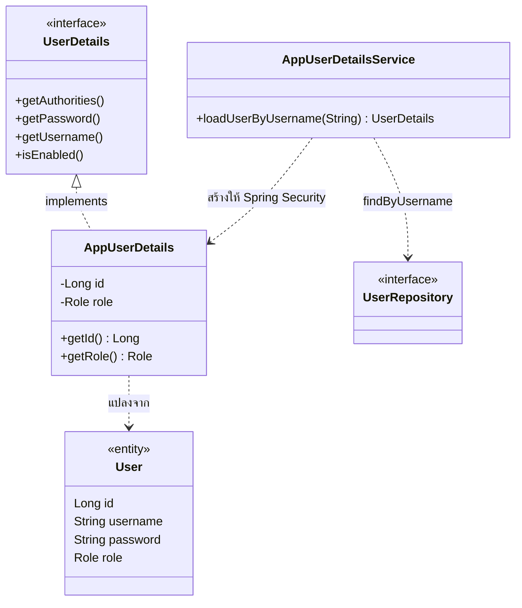

# Design Patterns — ส่วนของโอ๊ค (Foundation / Security / Auth / Branch)

> ส่วนนี้ให้โอ๊ครวมเข้า `doc/design-patterns.md`
> path ย่อ: `code/src/main/java/com/laundryhub/` = `…/` · เลขบรรทัด ณ วันที่ 10 ต.ค. 2569
> **กลุ่ม GoF ของทีมคือ Behavioral (Strategy, State, Observer)** ซึ่งเป็นงานของพีช ปอนด์ โชกุน ส่วนของโอ๊คเป็นโครงสร้างพื้นฐาน จึงเน้น Enterprise Patterns ที่บังคับทุกกลุ่ม และมี Adapter ที่ใช้จริง 1 จุด

## Enterprise / Architectural Patterns (บังคับทุกกลุ่ม)

| Pattern | ปัญหาที่แก้ | ไฟล์/คลาสที่ใช้ | Class Diagram |
|---|---|---|---|
| **Layered Architecture** | ตรรกะหน้าจอ ธุรกิจ และข้อมูลปนกัน แก้จุดหนึ่งกระทบทุกที่ | แยก package `controller` → `service` → `repository` → `domain` ห้ามข้ามชั้น (ไม่มี Controller ไหน import Repository) | [Component Diagram](diagrams/component-diagram.md) |
| **MVC** | ไม่แยกหน้าจอออกจากตรรกะ | Controller: `…/controller/web/AuthWebController.java:16`, `ProfileWebController.java:19`, `BranchWebController.java:22` · Model: `…/domain/entity/User.java:16` และ DTO · View: `templates/**/*.html` (Thymeleaf) พร้อม layout กลาง `templates/fragments/layout.html` | [Component Diagram](diagrams/component-diagram.md) |
| **Repository** | โค้ดเข้าถึง DB กระจายในตรรกะธุรกิจ | `…/repository/UserRepository.java:8`, `CustomerProfileRepository.java:8`, `BranchRepository.java:6` (Spring Data JPA สร้างตัวทำงานให้จากชื่อเมธอด) | [ER Diagram](diagrams/er-diagram.md) |
| **Service Layer** | กฎธุรกิจและ transaction กระจายใน Controller | `…/service/AuthService.java:6` + `…/service/impl/AuthServiceImpl.java:17` (`@Transactional`), `UserServiceImpl.java:17`, `BranchServiceImpl.java:17` | [Component Diagram](diagrams/component-diagram.md) |
| **DTO + Mapper** | ส่ง Entity ออก API แล้ว `password` หลุด และ client ตั้ง `role` เองได้ (mass assignment) | `…/dto/request/RegisterRequest.java:8` (ไม่มีช่อง `role`) · `…/dto/response/UserResponse.java:6` (ไม่มี `password`) · `…/mapper/UserMapper.java:10`, `BranchMapper.java:9` | — |
| **Dependency Injection (Constructor)** | คลาสสร้าง dependency เอง ผูกแน่น ทดสอบยาก | `…/service/impl/AuthServiceImpl.java:23`, `UserServiceImpl.java:23`, `BranchServiceImpl.java:22`, Controller ทุกตัว (เช่น `AuthApiController.java:23`) ไม่มี `@Autowired` บน field | — |

## Pattern เสริมที่ใช้จริง

| Pattern | ปัญหาที่แก้ | ไฟล์/คลาสที่ใช้ | Class Diagram |
|---|---|---|---|
| **Adapter** (GoF Structural) | Spring Security รู้จักแต่ `UserDetails` ส่วนระบบเรามี `User` entity คนละรูปแบบ จึงต้องมีตัวแปลงให้ใช้งานร่วมกันได้ | `…/security/AppUserDetails.java:13` ห่อ `User` ให้เป็น `UserDetails` (ใส่ `ROLE_` นำหน้าบทบาท และพก `id` ไปด้วย) ใช้ผ่าน `AppUserDetailsService.java:10` | ดูด้านล่าง |

### เหตุผลที่เลือก (ไม่ได้ยัด pattern)

- **Layered + Service Layer:** ถ้าไม่แยกชั้น กฎ "สมัครแล้วต้องสร้าง profile ใน transaction เดียว" จะไปอยู่ใน Controller (ทั้งฝั่ง API และฝั่งหน้าเว็บ) ต้องเขียนซ้ำสองที่ เมื่อรวมไว้ที่ `AuthServiceImpl` ทั้งสองฝั่งเรียกจุดเดียวกัน
- **DTO + Mapper:** ทดสอบจริงแล้วว่าส่ง `"role":"ADMIN"` ในคำขอสมัคร ผลคือได้ `CUSTOMER` เพราะ `RegisterRequest` ไม่มีช่องนี้ และ `UserResponse` ไม่มี `password` ให้หลุด
- **Constructor Injection:** ทำให้ `AuthServiceTest` สร้าง `new AuthServiceImpl(mockRepo, mockEncoder, ...)` ได้โดยไม่ต้องเปิด Spring (field injection ทำแบบนี้ไม่ได้) และถ้าลืมส่ง dependency จะ compile ไม่ผ่านทันที
- **Adapter:** เลือกเพราะไม่อยากให้ `User` (Entity ของเรา) ไป implement `UserDetails` ตรงๆ จะทำให้ Entity ผูกกับ Spring Security ใช้ adapter ห่อแทน Entity จึงไม่ต้องรู้จัก Spring Security เลย
  - ข้อแลกเปลี่ยน: มีคลาสเพิ่มอีก 1 ตัว และต้องก๊อปค่า (id, username, password, role) จาก Entity ตอนสร้าง

### Adapter

