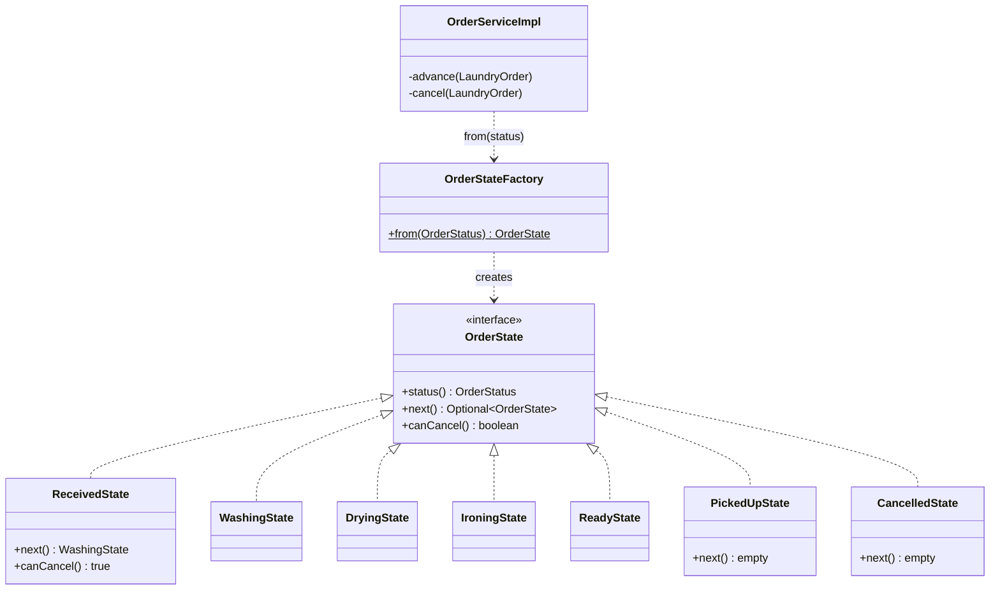
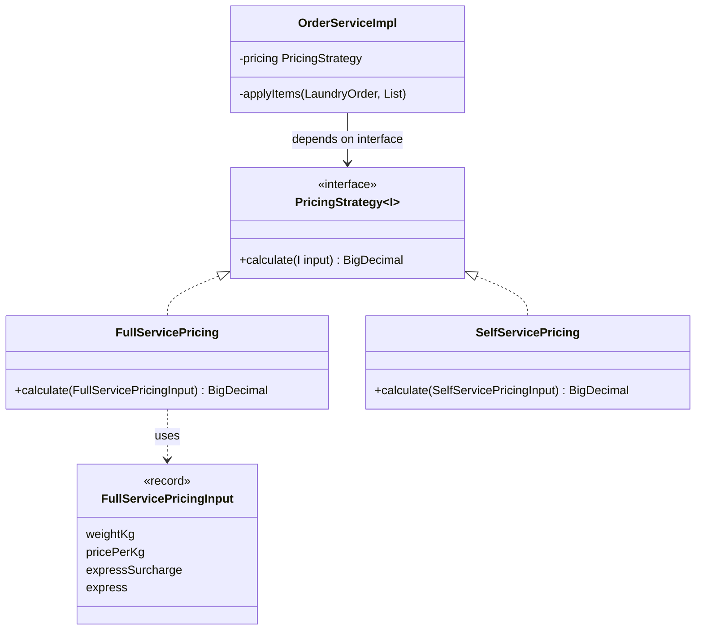

# Design Patterns — ส่วนของพีช (Full-Service Order)

> ส่วนนี้ให้โอ๊ครวมเข้า `doc/design-patterns.md`
> path ย่อ: `code/src/main/java/com/laundryhub/` = `…/` · เลขบรรทัด ณ วันที่ 9 ต.ค. 2569
> Class Diagram ทั้งระบบ: [`doc/diagrams/class-diagram.md`](../diagrams/class-diagram.md) (รูปที่ 2 = โมดูลออเดอร์) · State Diagram: [`doc/diagrams/state-order.md`](../diagrams/state-order.md)

## GoF Patterns (กลุ่ม Behavioral ของทีม + เสริม)

| Pattern | ปัญหาที่แก้ | ไฟล์/คลาสที่ใช้ | Class Diagram |
|---|---|---|---|
| **State** | สถานะออเดอร์ต้องเดินตามลำดับ `RECEIVED → WASHING → DRYING → IRONING → READY → PICKED_UP` ห้ามข้าม/ย้อน และยกเลิกได้เฉพาะ `RECEIVED` ถ้าใช้ `if/switch` กฎจะกระจายอยู่หลายเมธอด | `…/service/state/OrderState.java` (interface) · 7 คลาส `ReceivedState` … `CancelledState` · `OrderStateFactory.java:10` · ผู้ใช้: `OrderServiceImpl.advance()` บรรทัด 151 และ `cancel()` บรรทัด 159 | [ดูด้านล่าง](#state) · [state-order.md](../diagrams/state-order.md) |
| **Strategy** | วิธีคิดราคามีหลายแบบ (ฝากซักคิดตามน้ำหนัก, ซักเองคิดตามเวลา, อนาคตอาจมีโปรลดราคา) ไม่อยากให้ Service ผูกกับสูตรใดสูตรหนึ่ง | `…/service/pricing/PricingStrategy.java` (interface) · `FullServicePricing.java:15` (พีช) · `SelfServicePricing` (ปอนด์) · ผู้ใช้: `OrderServiceImpl.java:51` (field) และบรรทัด 186 (เรียก) | [ดูด้านล่าง](#strategy) |
| **Observer** (ฝั่งผู้ยิง) | เมื่อสถานะออเดอร์เปลี่ยนต้องแจ้งลูกค้า แต่ไม่อยากให้ `OrderService` รู้จักระบบแจ้งเตือน | `OrderServiceImpl.publishStatusChanged()` บรรทัด 169-172 ยิง `…/event/OrderStatusChangedEvent.java` → ผู้ฟัง `NotificationEventListener` (โชกุน) | ดูส่วนของโชกุน |
| **Builder** | `OrderResponse` มี 11 field ถ้าใช้ constructor จะสลับตำแหน่งผิดได้ง่าย (เช่น `customerId` กับ `branchId` เป็น `Long` ทั้งคู่ สลับกันก็ compile ผ่าน) | `…/dto/response/OrderResponse.java:11` (`@Builder` ของ Lombok) · ผู้ใช้: `…/mapper/OrderMapper.java:14` | — |

### เหตุผลที่เลือก (ไม่ได้ยัด pattern)

- **State:** ถ้าไม่ใช้ State จะต้องเขียน `switch (status) { case RECEIVED -> WASHING; case WASHING -> DRYING; ... }` ใน `advance()` และอีกชุดใน `cancel()` ถ้าวันหน้าเพิ่มสถานะ (เช่น `QUALITY_CHECK`) ต้องไล่แก้ทุก switch และลืมได้ง่าย เมื่อใช้ State กฎของแต่ละสถานะอยู่ในคลาสของมันเอง เพิ่มสถานะ = เพิ่ม 1 คลาส + 1 บรรทัดใน Factory
  - ออกแบบให้ผ่าน **LSP**: `next()` คืน `Optional<OrderState>` แทนการ throw สถานะสุดท้าย (`PickedUpState`, `CancelledState`) คืน `Optional.empty()` ผู้เรียกจึงใช้ทุก State ได้แบบเดียวกัน
  - ข้อแลกเปลี่ยน: มี 7 คลาสเล็กๆ แทนที่จะเป็นเมธอดเดียว และยังมี `switch` 1 จุดใน `OrderStateFactory` (แปลง enum ที่เก็บใน DB เป็นคลาส) ซึ่ง Java ตรวจว่าครบทุก case ตอน compile
- **Strategy:** ถ้าไม่ใช้ `OrderServiceImpl` ต้องมีสูตรราคาฝังอยู่ข้างใน และถ้ามีโปรลดราคาต้องแก้ Service เมื่อใช้ Strategy Service ถือแค่ interface (Spring ฉีดตัวจริงให้ตาม generic type) สูตรเองทดสอบแยกได้โดยไม่ต้องใช้ DB (`FullServicePricingTest` 6 เคส)
  - เหตุผลที่ `if (express)` ใน `FullServicePricing` ไม่ขัด OCP: เป็นการอ่านค่าจากข้อมูล (ค่าด่วนต่อกิโลจาก `service_types.express_surcharge`) ไม่ใช่การแยกตามประเภทของวิธีคิดราคา
- **Observer:** ถ้าไม่ใช้ `OrderService` ต้องเรียก `NotificationService` ตรงๆ ทุกจุดที่เปลี่ยนสถานะ สองโมดูลจะผูกกัน เมื่อใช้ event ผู้ยิงแค่ `publishEvent` เพิ่มผู้ฟังได้โดยไม่แก้ OrderService
- **Builder:** ใช้เฉพาะ `OrderResponse` เพราะเป็น DTO เดียวของโมดูลที่มี field เยอะ DTO เล็กอื่น (`OrderItemResponse` 6 field) ยังใช้ constructor ปกติ ไม่ได้ใส่ Builder ทุกคลาสเพื่อให้ครบ

## Enterprise Patterns ในโมดูลออเดอร์

| Pattern | ปัญหาที่แก้ | ไฟล์/คลาสที่ใช้ |
|---|---|---|
| **Layered + Service Layer** | กฎธุรกิจปนกับ HTTP/DB | `OrderApiController` → `OrderService` (interface) → `OrderServiceImpl` → `LaundryOrderRepository` (Controller ไม่ import Repository) |
| **Repository** | SQL กระจายในตรรกะธุรกิจ | `…/repository/LaundryOrderRepository.java:12` query จากชื่อเมธอด (`findByUserId` บรรทัด 15) · `@EntityGraph` บรรทัด 23 ดึง items มาใน query เดียวสำหรับหน้า detail |
| **DTO + Mapper** | ถ้ารับ/คืน Entity ตรงๆ ลูกค้าจะส่ง `totalAmount` มาตั้งราคาเองได้ และ JSON วนไม่จบ (`order → items → order`) | `…/dto/request/CreateOrderRequest.java:11` (ไม่มีช่องราคา/สถานะโดยตั้งใจ) · `…/dto/response/OrderResponse.java` · `…/mapper/OrderMapper.java:11` · `PageResponse<T>` สำหรับรายการแบ่งหน้า |
| **Dependency Injection (Constructor)** | คลาสสร้าง dependency เอง ทดสอบยาก | `OrderServiceImpl.java:55` รับ 7 dependency ผ่าน constructor · `OrderServiceTest` ส่ง mock เข้าไปตรงๆ |

### หมายเหตุด้านประสิทธิภาพ (N+1)
หน้ารายการออเดอร์แบบแบ่งหน้าเคยยิง SQL `1 + N` ครั้ง (items ทีละออเดอร์) แก้ด้วย `@BatchSize(size = 50)` ที่ `…/domain/entity/LaundryOrder.java:60` และ `…/domain/entity/ServiceType.java:12` เหลือ 3 query ต่อหน้า (วัดจาก log `org.hibernate.SQL`) ไม่ใช้ `@EntityGraph` กับหน้ารายการ เพราะ JOIN FETCH collection พร้อม pagination ทำให้ Hibernate ตัดหน้าในหน่วยความจำ

## Class Diagrams

### State

### Strategy

