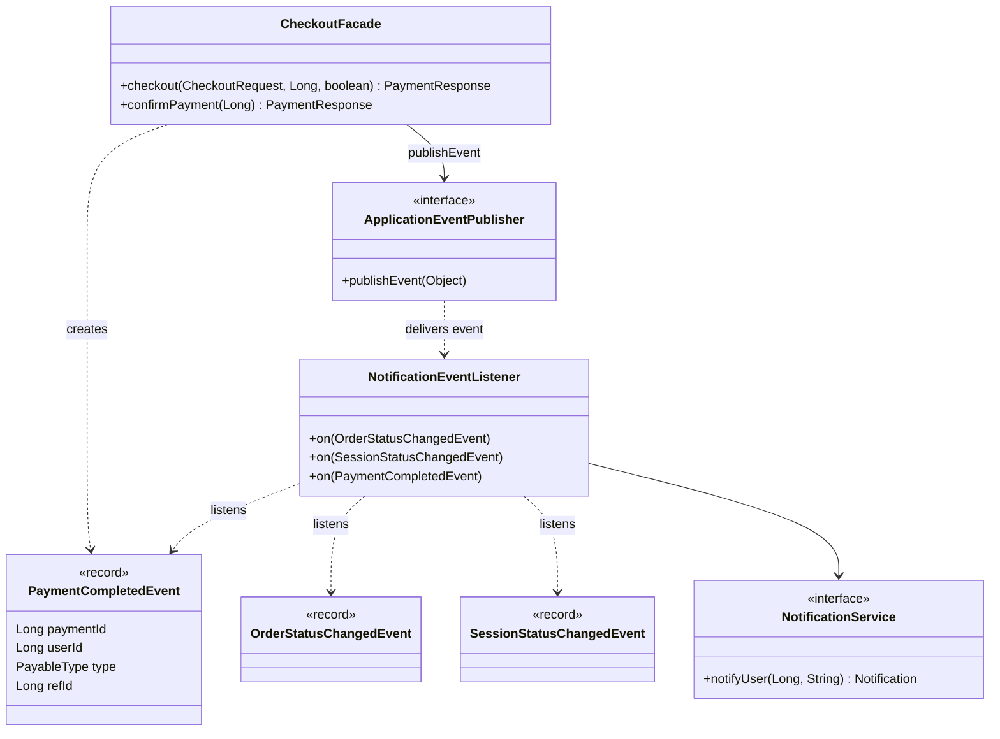
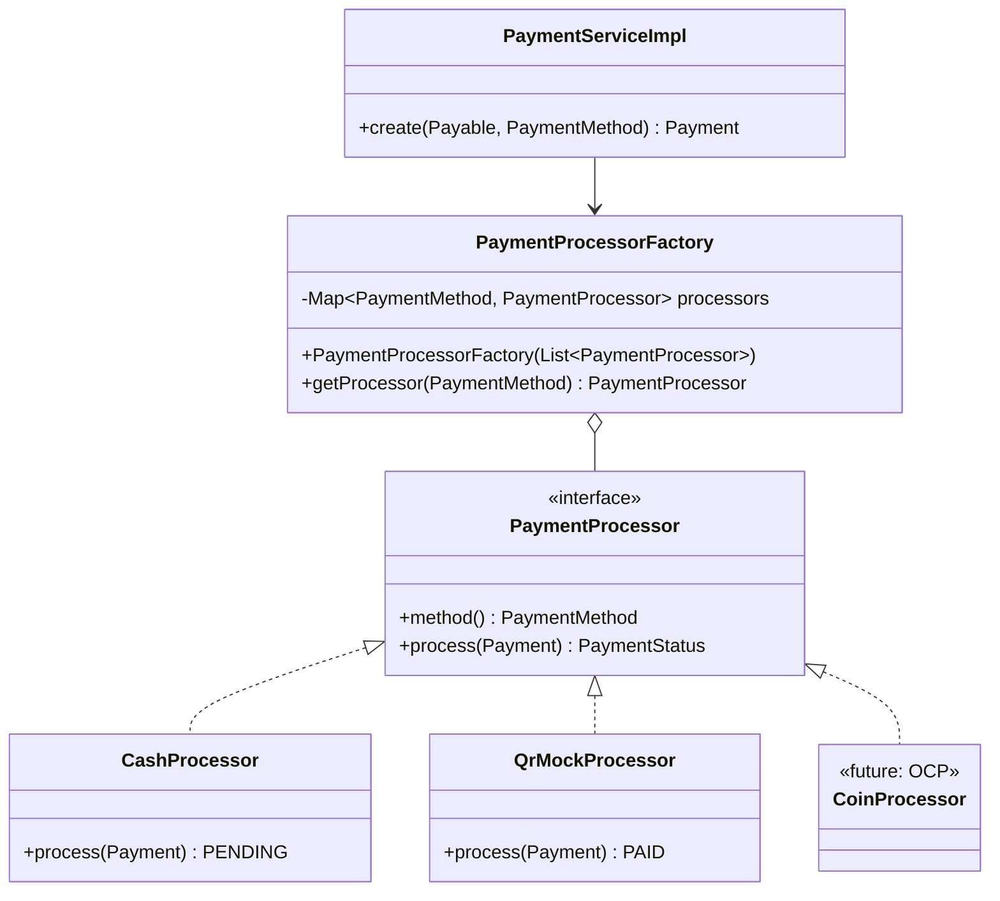
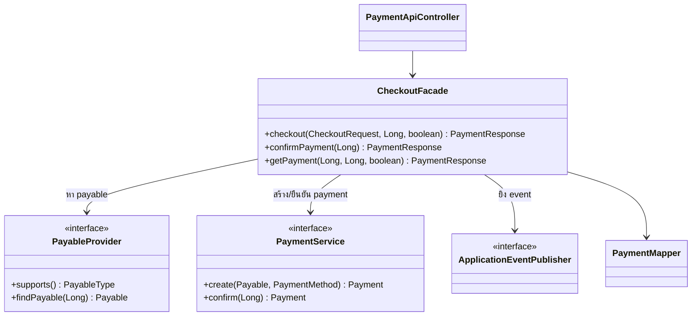

# Design Patterns — ส่วนของโชกุน (Payment / Notification / API Quality)

> ส่วนนี้ให้โอ๊ครวมเข้า `doc/design-patterns.md`
> path ย่อ: `code/src/main/java/com/laundryhub/` = `…/`

## GoF Patterns (กลุ่ม Behavioral ของทีม + เสริม)

| Pattern | ปัญหาที่แก้ | ไฟล์/คลาสที่ใช้ | Class Diagram |
|---|---|---|---|
| **Observer** | เมื่อสถานะออเดอร์/รอบใช้เครื่อง/การชำระเปลี่ยน ต้องแจ้งเตือนผู้ใช้ โดยไม่ให้โมดูลต้นทางต้องรู้จักระบบแจ้งเตือน (loose coupling) | `…/event/NotificationEventListener.java` (`@EventListener`) · event ใน `…/event/*Event.java` · ผู้ยิง `CheckoutFacade.publishCompleted` (บรรทัด 100) | [ดูด้านล่าง](#observer) |
| **Strategy** | วิธีชำระแต่ละแบบ (เงินสด/QR/เหรียญ) มีพฤติกรรมต่างกัน ไม่อยากเขียน `if-else` ตามวิธีชำระ | `…/service/payment/PaymentProcessor.java` (interface) · `CashProcessor` · `QrMockProcessor` | [ดูด้านล่าง](#strategy--factory) |
| **Factory** | เลือก processor ที่ถูกต้องตาม `PaymentMethod` โดยผู้เรียกไม่ต้องรู้จักคลาสจริง | `…/service/payment/PaymentProcessorFactory.java` | [ดูด้านล่าง](#strategy--factory) |
| **Facade** | ขั้นตอนชำระเงินมีหลายส่วน (หา payable, ตรวจสิทธิ์, สร้าง payment, ยิง event) ให้ Controller เรียกจุดเดียว | `…/service/payment/CheckoutFacade.java` | [ดูด้านล่าง](#facade) |

> **หมายเหตุความถูกต้องของ Factory:** `PaymentProcessorFactory` เป็นแบบ *Simple Factory แบบ registry* (Spring ฉีด processor ทุกตัวเข้ามา แล้วค้นด้วย Map ตาม enum) ซึ่งไม่ใช่ GoF *Factory Method* ตามตำรา (ที่ให้คลาสลูกเป็นคนตัดสินใจสร้าง) เราเลือกแบบนี้เพราะเพิ่มวิธีชำระใหม่ได้โดยไม่แก้ Factory (OCP) และให้ Spring จัดการวงจรชีวิตของ processor ให้

### เหตุผลที่เลือก (ไม่ได้ยัด pattern)

- **Observer:** ถ้าไม่ใช้ Observer แล้ว `OrderService` ต้องเรียก `NotificationService` ตรงๆ ทุกจุดที่เปลี่ยนสถานะ ผูกโมดูลเข้าด้วยกัน เมื่อใช้ event ผู้ยิงแค่ `publishEvent(...)` และเพิ่มผู้ฟังได้โดยไม่แก้ผู้ยิง
  - ใช้ `@EventListener` แบบ synchronous จึงรันใน transaction เดียวกับผู้ยิง ถ้าบันทึกแจ้งเตือนพัง ธุรกรรมหลักจะ rollback ด้วย **เลือกแบบนี้เพราะต้องการความสอดคล้องของข้อมูล** (ไม่มีกรณีสถานะเปลี่ยนแล้วแต่ไม่มีแจ้งเตือน) ข้อแลกเปลี่ยนคือแจ้งเตือนที่ล้มเหลวกระทบงานหลัก ถ้าต้องแยกให้ใช้ `@TransactionalEventListener(AFTER_COMMIT)` หรือ `@Async` พร้อมเปิด transaction ใหม่ใน `notifyUser`
- **Strategy + Factory:** ตอนนี้มี 2 วิธีชำระ (+ COIN ที่เพิ่มได้) มีพฤติกรรมต่างกันชัดเจน (เงินสดต้องรอยืนยัน, QR สำเร็จทันที) การแยกเป็นคลาสทำให้เพิ่ม/ทดสอบแต่ละวิธีแยกกันได้
- **Facade:** `checkout` ต้องประสาน 4 ขั้นตอนและหลายโมดูล (provider ของ order/session, service, event) Controller จึงเรียกเมธอดเดียว

### Class Diagrams

#### Observer

#### Strategy + Factory

#### Facade

## Enterprise / Architectural Patterns ในโมดูลนี้

| Pattern | ไฟล์ที่เห็นชัด |
|---|---|
| Repository | `…/repository/PaymentRepository.java`, `NotificationRepository.java` (Spring Data JPA) |
| Service Layer | `…/service/PaymentService.java` + `impl/PaymentServiceImpl.java`, `NotificationService` + `impl/NotificationServiceImpl.java` |
| DTO + Mapper | `…/dto/request/CheckoutRequest.java`, `…/dto/response/PaymentResponse.java`, `NotificationResponse.java`, `…/mapper/PaymentMapper.java`, `NotificationMapper.java` |
| Dependency Injection (Constructor) | ทุกคลาสข้างต้นรับ dependency ทาง constructor |
| MVC / REST | `…/controller/api/PaymentApiController.java`, `NotificationApiController.java` |
| Global Exception Handling (Advice) | `…/exception/GlobalExceptionHandler.java` (`@RestControllerAdvice`) |
