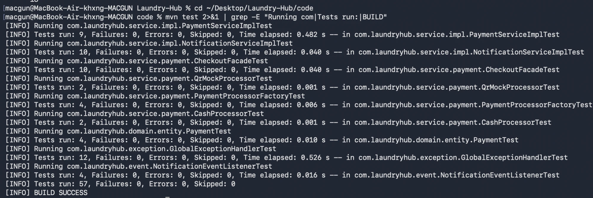
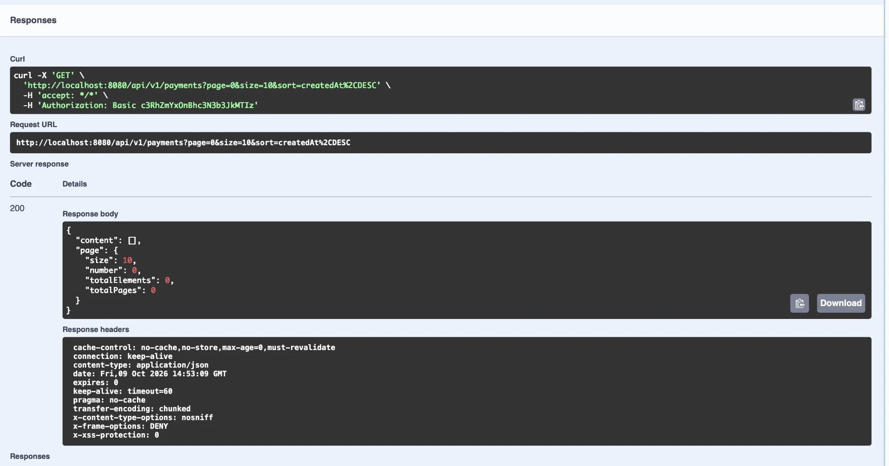
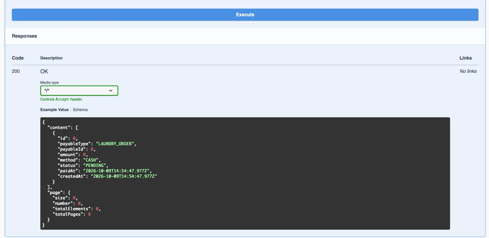

# Test Report — LaundryHub

ผู้รับผิดชอบ: ภีมเดช กลั่นกิ่ง (โชกุน) · Test Lead
ขอบเขตของฉบับนี้: ผลรวมทั้งโปรเจค ([หัวข้อ 5](#5-ผลรวมทั้งโปรเจค)) และรายละเอียดกรณีทดสอบของโมดูลผู้เขียน คือ Payment, Notification และ API Quality (Exception handling) ([หัวข้อ 2–4](#2-สรุปผล-โมดูลของผู้เขียน))
ผลทดสอบรอบล่าสุด: **212 ข้อ — ผ่าน 203, ข้ามโดยเจตนา 9, ล้มเหลว 0** · `BUILD SUCCESS`

## 1. สภาพแวดล้อมและวิธีรัน

| รายการ | ค่า |
|---|---|
| วันที่รันล่าสุด | 9 ต.ค. 2569 (2026-10-09) 22:16 น. (รอบรวมงานของทุกโมดูลบน `develop`) |
| Java | Temurin 17.0.20.1 |
| Maven | 3.10.0 |
| Spring Boot | 3.5.7 |
| Test framework | JUnit 5 + Mockito + Spring Test (MockMvc) ผ่าน `spring-boot-starter-test` |
| ตำแหน่งโค้ดเทสต์ | `test/java/` (ตั้ง `testSourceDirectory` ใน `code/pom.xml`) |

```bash
cd code
mvn test                                        # รันทั้งหมด
mvn test -Dtest=GlobalExceptionHandlerTest      # รันคลาสเดียว
```

ภาพหน้าจอผลรันช่วงแรกของโมดูลผู้เขียน (57 ข้อ ผ่านทั้งหมด `BUILD SUCCESS`) ก่อนที่ทุกโมดูลจะรวมกัน ผลรวมล่าสุดอยู่ในหัวข้อ 5:



## 2. สรุปผล (โมดูลของผู้เขียน)

| โมดูล | คลาสเทสต์ | จำนวน | ผ่าน | ล้มเหลว |
|---|---|---:|---:|---:|
| API Quality | `GlobalExceptionHandlerTest` | 12 | 12 | 0 |
| API Quality | `PageableValidatorTest` | 4 | 4 | 0 |
| Payment (entity) | `PaymentTest` | 4 | 4 | 0 |
| Payment (strategy) | `CashProcessorTest` | 2 | 2 | 0 |
| Payment (strategy) | `QrMockProcessorTest` | 2 | 2 | 0 |
| Payment (strategy) | `CoinProcessorTest` | 3 | 3 | 0 |
| Payment (factory) | `PaymentProcessorFactoryTest` | 5 | 5 | 0 |
| Payment (service) | `PaymentServiceImplTest` | 9 | 9 | 0 |
| Payment (facade) | `CheckoutFacadeTest` | 10 | 10 | 0 |
| Payment (REST) | `PaymentApiControllerTest` | 10 | 10 | 0 |
| Notification (service) | `NotificationServiceImplTest` | 10 | 10 | 0 |
| Notification (observer) | `NotificationEventListenerTest` | 4 | 4 | 0 |
| Notification (REST) | `NotificationApiControllerTest` | 6 | 6 | 0 |
| **รวม** | **13 คลาส** | **81** | **81** | **0** |

ผลของทั้งโปรเจคจาก Maven: `Tests run: 212, Failures: 0, Errors: 0, Skipped: 9` · `BUILD SUCCESS` (ตัวเลขของผู้เขียนข้างบนเป็นส่วนหนึ่งของ 212 ข้อ ดูหัวข้อ 5)

## 3. รายละเอียดกรณีทดสอบ

### 3.1 API Quality — `GlobalExceptionHandlerTest` (12)
ใช้ `MockMvcBuilders.standaloneSetup(...).setControllerAdvice(...)` ไม่ต้องรัน Spring ทั้งตัว ตรวจ status และรูปแบบ JSON (`ApiErrorResponse`)

| กรณี | คาดหวัง |
|---|---|
| `ResourceNotFoundException` | 404 พร้อม `status`, `error`, `message`, `path`, `fieldErrors` ว่าง |
| `BusinessRuleException` | 400 |
| `DuplicateResourceException` | 409 |
| `BookingConflictException` | 409 |
| `DataIntegrityViolationException` | 409 และ**ไม่ส่งข้อความ/ชื่อ constraint ของ DB** ออกไป |
| `AccessDeniedException` | 403 |
| `Exception` ทั่วไป | 500 และ**ไม่ส่งข้อความภายใน** ออกไป |
| `@Valid` ไม่ผ่าน | 400 พร้อม `fieldErrors[0].field` |
| JSON เสียรูป | 400 |
| HTTP method ผิด | 405 พร้อม body `ApiErrorResponse` |
| ขาด query parameter ที่จำเป็น | 400 |
| Content-Type ไม่รองรับ | 415 |

### 3.2 Payment
**`PaymentTest` (4)** — `forPayable` ตั้ง `orderId` อย่างเดียวและดึงยอดจาก Payable · ตั้ง `sessionId` อย่างเดียวสำหรับรอบใช้เครื่อง · `markPaid` ตั้งสถานะและเวลา · `markPaid` เรียกซ้ำไม่เขียนทับ `paidAt`

**`CashProcessorTest` (2)** / **`QrMockProcessorTest` (2)** — `method()` ถูกต้อง · เงินสดคืน `PENDING` · QR จำลองคืน `PAID`

**`CoinProcessorTest` (3)** — `method()` เป็น `COIN` · ใช้กับรอบใช้เครื่องคืน `PAID` ทันที · ใช้กับออเดอร์ฝากซัก → `BusinessRuleException` (ไม่คืน `FAILED` เพราะแถว `FAILED` จะชน `UNIQUE` และทำให้จ่ายด้วยวิธีอื่นต่อไม่ได้)

**`PaymentProcessorFactoryTest` (5)** — คืน processor ถูกตัวตาม method · method ที่ไม่รองรับ (ในเทสต์ที่ไม่ได้ส่ง `CoinProcessor` เข้าไป) → `BusinessRuleException` · `null` → `BusinessRuleException` · processor ซ้ำ method เดียวกัน → ล้มตั้งแต่สร้าง (fail fast) · **เพิ่มวิธีชำระใหม่ (`CoinProcessor`) โดยส่งเข้า constructor เพิ่ม 1 ตัว Factory ไม่ต้องแก้ (OCP)**

**`PaymentServiceImplTest` (9)** — QR → `PAID` ทันทีพร้อม `paidAt` และยอดจาก Payable · เงินสด → `PENDING` · จ่ายซ้ำ (order) → `DuplicateResourceException` และไม่เรียก `save` · จ่ายซ้ำ (session) ตรวจด้วย `sessionId` · วิธีชำระไม่รองรับ → `BusinessRuleException` · `confirm` จาก `PENDING` → `PAID` · `confirm` ที่ `PAID` แล้ว → `DuplicateResourceException` · `confirm` ที่ `FAILED` → `BusinessRuleException` · ไม่พบ payment → `ResourceNotFoundException`

**`CheckoutFacadeTest` (10)** (Mockito: provider/service/publisher เป็น mock)

| กรณี | คาดหวัง |
|---|---|
| ชำระสำเร็จ (`PAID`) | ยิง `PaymentCompletedEvent` ถูกต้อง (userId เจ้าของ, ชนิด, refId) |
| ค้าง `PENDING` (เงินสด) | **ไม่ยิง** event |
| ผู้เรียกไม่ใช่เจ้าของ | `AccessDeniedException` และไม่สร้าง payment |
| ผู้เรียกเป็นพนักงาน | ชำระแทนผู้อื่นได้ |
| ชำระซ้ำ | `DuplicateResourceException` และไม่ยิง event |
| ไม่มี provider ของชนิดนั้น | `BusinessRuleException` |
| ยืนยันรับเงิน | ยิง event ไปยังเจ้าของ |
| ดู payment (เจ้าของ / ไม่ใช่เจ้าของ / พนักงาน) | ผ่าน / `AccessDeniedException` / ผ่านโดยไม่ต้องค้นหาเจ้าของ |

### 3.3 Notification
**`NotificationServiceImplTest` (10)** — สร้างแจ้งเตือนสถานะยังไม่อ่าน · ตัดข้อความที่ยาวเกิน 255 · `userId` null และข้อความ null/ว่าง → `BusinessRuleException` และไม่ `save` · กรอง `unread` ทั้ง 3 แบบ (null/true/false) · `markRead` โดยเจ้าของ · ไม่ใช่เจ้าของ → `AccessDeniedException` และไม่ `save` · ไม่พบ → `ResourceNotFoundException`

**`NotificationEventListenerTest` (4)** — Observer เรียก `notificationService.notifyUser` ด้วยข้อความที่ถูกต้องสำหรับ `OrderStatusChangedEvent`, `SessionStatusChangedEvent` และ `PaymentCompletedEvent` (ออเดอร์/รอบใช้เครื่อง)

### 3.4 ทดสอบกับแอปจริง (manual end-to-end)

รันแอปจริงด้วย `docker compose up -d db` (PostgreSQL 16 พอร์ต 5433) และ `mvn spring-boot:run` เมื่อ 9 ต.ค. 2569 แล้วทดสอบด้วย `curl` และ Swagger UI โดยใช้ผู้ใช้ตัวอย่างจาก `V2__seed_data.sql`

**การเริ่มระบบ:** Flyway ใช้ migration V1/V2 สำเร็จ · Hibernate `ddl-auto: validate` ผ่าน (entity ของ `Payment`/`Notification` ตรงกับตารางจริงทุกคอลัมน์) · `Started LaundryHubApplication` โดยไม่มี error

| # | กรณี | ผู้ใช้ | ผลที่ได้ | ผลที่คาดหวัง |
|---|---|---|---:|---|
| 1 | `GET /api/v1/payments` | ไม่ล็อกอิน | 401 | ผ่าน |
| 2 | `GET /api/v1/payments` | CUSTOMER | 403 + `ApiErrorResponse` | ผ่าน (`@PreAuthorize`) |
| 3 | `GET /api/v1/payments` | STAFF | 200 + `content`/`page` | ผ่าน |
| 4 | `GET /api/v1/payments?status=NOPE` | STAFF | 400 | ผ่าน |
| 5 | `GET /api/v1/payments?sort=abc` | STAFF | 400 (ก่อนแก้ได้ 500) | ผ่านหลังแก้ ดูข้อบกพร่องข้อ 6 |
| 6 | `GET /api/v1/payments?sort=password` | STAFF | 400 | ผ่าน (ไม่เปิดให้เรียงด้วยฟิลด์ที่ไม่อนุญาต) |
| 7 | `GET /api/v1/users/3/notifications` | CUSTOMER เจ้าของ | 200 | ผ่าน |
| 8 | `GET /api/v1/users/2/notifications` | CUSTOMER (ของคนอื่น) | 403 | ผ่าน |
| 9 | `GET /api/v1/users/3/notifications?unread=true` | ADMIN | 200 | ผ่าน |
| 10 | `PATCH /api/v1/notifications/9999/read` | CUSTOMER | 404 | ผ่าน |
| 11 | `POST /api/v1/payments` body ว่าง | CUSTOMER | 400 + `fieldErrors` 3 รายการ | ผ่าน |
| 12 | `POST /api/v1/payments` (ออเดอร์ที่ไม่มี) | CUSTOMER | 404 `Order 1 not found` | ผ่าน (Facade ทำงานต่อกับ `PayableProvider` ของโมดูลออเดอร์) |
| 13 | `PATCH /api/v1/payments/1/confirm` | CUSTOMER | 403 | ผ่าน |
| 14 | `PATCH /api/v1/payments/9999/confirm` | STAFF | 404 | ผ่าน |

error ทุกแบบตอบเป็นรูปแบบ `ApiErrorResponse` เดียวกัน ส่วน 401 ตอนทดสอบในเครื่องรอบนี้ (ก่อนมี handler ของโมดูล Auth) ตอบ body ว่าง ภายหลังโมดูล Auth เพิ่ม `ApiAuthenticationEntryPoint` ทำให้ 401 ตอบเป็น `ApiErrorResponse` ด้วย ยืนยันกับเว็บที่ deploy แล้ว (`GET /api/v1/payments` ไม่ล็อกอิน → 401 พร้อม `ApiErrorResponse`)

ภาพจาก Swagger UI (พารามิเตอร์แบ่งหน้า `page`/`size`/`sort` แยกช่อง และผล 200):





### 3.5 REST Controller และตัวตรวจ `sort`
เทสต์ controller ใช้ `MockMvcBuilders.standaloneSetup(...)` ร่วมกับ `GlobalExceptionHandler` และเตรียมผู้ล็อกอินจำลองใน `SecurityContext` ตรวจ status, รูปแบบ JSON และการส่ง "ผู้ใช้ปัจจุบัน/เป็นพนักงานหรือไม่" ให้ Facade (`@PreAuthorize` ไม่ทำงานในโหมด standalone จึงยืนยันด้วยการทดสอบจริงในหัวข้อ 3.4)

**`PaymentApiControllerTest` (10)** — `POST` ลูกค้า → 201 และส่ง `staff=false` · `POST` พนักงาน → `staff=true` · body ไม่ครบ → 400 พร้อม `fieldErrors` · ไม่ใช่เจ้าของ → 403 · `GET` by id ส่งต่อผู้ใช้ปัจจุบัน · รายการแบ่งหน้า (`content`, `page.totalElements`) · `sort` ที่ไม่มี → 400 ไม่เรียก service · `sort` ที่อนุญาต → 200 · `status` ไม่ถูกต้อง → 400 · `PATCH confirm` → 200

**`NotificationApiControllerTest` (6)** — รายการส่ง `userId` และตัวกรอง `unread` ถูกต้อง · ไม่ส่ง `unread` → `null` · `sort` ที่ไม่มี → 400 · `markRead` ใช้ id ของผู้ล็อกอินเป็นผู้ร้องขอ · ไม่ใช่เจ้าของ → 403 · ไม่พบ → 404

**`PageableValidatorTest` (4)** — ไม่ระบุ `sort` ผ่าน · ฟิลด์ที่อนุญาตผ่าน · ฟิลด์ที่ไม่อนุญาตโยน `BusinessRuleException` พร้อมระบุชื่อฟิลด์และรายการที่ใช้ได้ · มีฟิลด์ผิดปนฟิลด์ถูกก็ถูกปฏิเสธ

### 3.6 เทสต์ที่ต่อ PostgreSQL จริง — `PaymentRepositoryDbTest` (13)
เทสต์แบบ opt-in (รันเมื่อตั้ง `LAUNDRY_DB_TESTS=true`) สร้าง schema ชั่วคราวของตัวเอง รัน Flyway V1/V2 ในนั้นแล้วลบทิ้ง ไม่แตะตารางจริง ใช้รูปแบบเดียวกับ `SelfServiceRepositoryTest` ของโมดูลเครื่องซัก

| กลุ่ม | กรณี | ผลที่ DB ตอบ |
|---|---|---|
| การแมปตาราง | บันทึก `Payment` ของออเดอร์/รอบใช้เครื่องแล้วอ่านกลับ (ล้างแคชก่อนอ่าน ให้อ่านจาก DB จริง) · `existsByOrderId`/`existsBySessionId` · `findByStatus` แบ่งหน้า | ครบทุกคอลัมน์ ตรงกับ `V1__init_schema.sql` |
| `UNIQUE` | จ่ายซ้ำออเดอร์เดียวกัน · จ่ายซ้ำรอบใช้เครื่องเดียวกัน | ถูกปฏิเสธ (`payments_order_id_key`, `payments_session_id_key`) |
| `FK` | จ่ายให้ออเดอร์ที่ไม่มีอยู่ | ถูกปฏิเสธ (`fk_payment_order`) |
| `CHECK chk_payment_target` | ผูกทั้ง order และ session พร้อมกัน · ไม่ผูกอะไรเลย | ถูกปฏิเสธทั้งสองกรณี |
| `CHECK` อื่น | ยอดติดลบ · วิธีชำระที่ไม่อยู่ในรายการ | ถูกปฏิเสธ |
| Notification | บันทึกแล้วกรองตาม `is_read` · แจ้งเตือนให้ผู้ใช้ที่ไม่มี | กรองถูกต้อง · ถูกปฏิเสธ (`fk_notification_user`) |

ผลรัน (9 ต.ค. 2569): `Tests run: 13, Failures: 0, Errors: 0, Skipped: 0` · `BUILD SUCCESS` บรรทัด `ERROR` ที่เห็นใน log ระหว่างรันเป็นข้อความที่ Hibernate บันทึกเมื่อ DB ปฏิเสธข้อมูลผิดที่เราตั้งใจส่งเข้าไป ไม่ใช่เทสต์ล้ม

## 4. ข้อบกพร่องที่พบระหว่างทดสอบและรีวิว (และแก้แล้ว)

**ข้อ 1 — เทสต์ `GlobalExceptionHandlerTest` ล้ม 8 ข้อ**
- ปัญหา: `@RestControllerAdvice(basePackages=...)` จำกัดขอบเขตผิด handler จึงไม่ถูกเรียกกับ controller ที่อยู่นอก package
- แก้ไข: เปลี่ยนตัวกรองขอบเขต (commit `fix`)

**ข้อ 2 — Code Review ของปอนด์ (PR #3)**
- ปัญหา: handler ของ `Exception` กลืน error ของ Spring MVC ทำให้ 405/400/415 กลายเป็น 500
- แก้ไข: เพิ่ม handler เฉพาะ 3 ชนิด พร้อมเทสต์

**ข้อ 3 — เทสต์ที่เพิ่มจากข้อ 2 ล้ม 1 ข้อ**
- ปัญหา: 405 เกิดก่อน Spring เลือก controller (handler เป็น null) ตัวกรอง advice แบบกำหนดเงื่อนไขจึงไม่ทำงาน และ body ไม่ใช่ `ApiErrorResponse`
- แก้ไข: เอาตัวกรองออกให้ advice ครอบทุก controller

**ข้อ 4 — Code Review ของปอนด์ (PR #3)**
- ปัญหา: `markPaid()` เรียกซ้ำแล้วเขียนทับ `paidAt`
- แก้ไข: ทำให้ idempotent พร้อมเทสต์

**ข้อ 5 — Code Review ของปอนด์ (PR #6)**
- ปัญหา: `notifyUser` ไม่ตรวจ `userId` และข้อความที่เป็น null
- แก้ไข: ตรวจแล้วโยน `BusinessRuleException` พร้อมเทสต์

**ข้อ 6 — Code Review ของปอนด์ (PR #10) และยืนยันด้วยการทดสอบจริง**
- ปัญหา: `GET /api/v1/payments?sort=abc` (ฟิลด์ที่ไม่มี) ได้ **500** แทนที่จะเป็น 400 เพราะ error ของ Spring Data หลุดไปถึง handler สุดท้าย
- แก้ไข: เพิ่ม `PageableValidator` ตรวจฟิลด์ที่อนุญาตให้เรียง (whitelist) ใน `PaymentApiController` และ `NotificationApiController` ตอบ 400 พร้อมบอกฟิลด์ที่ใช้ได้ มีเทสต์ 7 ข้อ และยืนยันซ้ำกับแอปจริง

**ข้อ 7 — พบจากการดู Swagger ระหว่างทดสอบจริง**
- ปัญหา: พารามิเตอร์แบ่งหน้าของ payments/notifications แสดงใน Swagger เป็นช่อง `pageable` ก้อนเดียว (JSON) ทดลองใช้งานไม่สะดวก ขณะที่ endpoint ออเดอร์แสดง `page`/`size`/`sort` แยกช่อง
- แก้ไข: เพิ่ม `@ParameterObject` ที่พารามิเตอร์ `Pageable`

## 5. ผลรวมทั้งโปรเจค

ที่มา: รายงาน Maven Surefire ของการรัน `mvn test` บน `develop` รวมงานของทุกคน เมื่อ 9 ต.ค. 2569 22:16 น. (รันซ้ำก่อนส่งงานจริงเพื่อยืนยัน)

| โมดูล | ผู้รับผิดชอบ | คลาสเทสต์ | จำนวนเทสต์ | ผ่าน | ข้าม | ล้มเหลว |
|---|---|---:|---:|---:|---:|---:|
| Payment / Notification / API Quality | โชกุน | 13 | 81 | 81 | 0 | 0 |
| Auth / User / Branch / Security | โอ๊ค | 4 | 29 | 29 | 0 | 0 |
| Full-Service Order | พีช | 4 | 38 | 38 | 0 | 0 |
| Self-Service Machine | ปอนด์ | 5 | 64 | 55 | 9 | 0 |
| **รวม** | | **26** | **212** | **203** | **9** | **0** |

รายคลาสของโมดูลอื่น (จากรายงานเดียวกัน)
- โอ๊ค: `SecurityRulesTest` 13 · `BranchServiceTest` 8 · `UserServiceTest` 5 · `AuthServiceTest` 3
- พีช: `OrderStateTest` 15 · `OrderServiceTest` 14 · `FullServicePricingTest` 6 · `OrderPayableProviderTest` 3
- ปอนด์: `BookingValidatorTest` 19 · `MachineServiceImplTest` 18 · `SelfServicePricingTest` 11 · `MachineStateTest` 7 · `SelfServiceRepositoryTest` (รอบ `mvn test` ปกติ Maven นับว่า**ข้าม 9** โดยเจตนา ส่วนเมื่อเปิดสวิตช์ให้ต่อ PostgreSQL จริงรันได้ **19 ข้อ ผ่านทั้งหมด** ดูด้านล่าง)

**ผลรันแยกของ `SelfServiceRepositoryTest` กับฐานข้อมูลจริง** (9 ต.ค. 2569, PostgreSQL 16 ใน Docker พอร์ต 5433, ตั้ง `LAUNDRY_DB_TESTS=true`):

```bash
docker compose up -d db
LAUNDRY_DB_TESTS=true mvn test -Dtest=SelfServiceRepositoryTest
# Tests run: 19, Failures: 0, Errors: 0, Skipped: 0 · BUILD SUCCESS
```

เทสต์นี้สร้าง schema ชั่วคราวของตัวเอง (ชื่อสุ่ม) รัน Flyway ในนั้นแล้วลบทิ้งตอนจบ จึงไม่แตะตารางจริง เมื่อรวมผลนี้กับผลรันแยกของ `PaymentRepositoryDbTest` (13 ข้อ ดูหัวข้อ 3.6) ทั้งโปรเจคผ่านรวม **235 ข้อ (203 + 19 + 13) ไม่มีล้มเหลว** (รวมจากสามการรัน) ที่ตัวเลขต่างกัน (ข้าม 9 แต่รันจริง 19) เพราะเมื่อข้ามทั้งคลาส Maven นับตามจำนวนเมธอดเทสต์ ซึ่งในไฟล์มี `@Test` 7 เมธอด + `@ParameterizedTest` 2 เมธอด = 9 แต่ตอนรันจริงเทสต์แบบพารามิเตอร์แตกเป็นหลายกรณี รวมเป็น 19 ข้อ (ตรวจจากโค้ดของ `SelfServiceRepositoryTest`)

## 6. ข้อจำกัดและสิ่งที่ยังไม่ได้ทดสอบ

- **เทสต์ที่ต่อฐานข้อมูลจริงเป็นแบบ opt-in** (ต้องตั้ง `LAUNDRY_DB_TESTS=true` และเปิด PostgreSQL) จึงไม่ถูกรวมใน `mvn test` ปกติและ CI ปัจจุบันของทีมไม่ได้รันชุดนี้ ตัวเลขผลรวมหัวข้อ 5 จึงเป็นเทสต์แบบ unit เป็นหลัก ส่วนเทสต์ที่ต่อ DB จริงของ payments/notifications (`PaymentRepositoryDbTest` 13 ข้อ ครอบ `UNIQUE`, `FK`, `CHECK`) ผ่านแล้วตามหัวข้อ 3.6
- **ยังไม่ได้ทดสอบ flow ชำระเงินแบบครบวงจรถึง DB กับรอบใช้เครื่อง** เพราะยังไม่มี `SessionPayableProvider` ของโมดูลเครื่องซัก (มีเฉพาะ `OrderPayableProvider` ของโมดูลออเดอร์) ใน `develop`
- **สิทธิ์ (`@PreAuthorize`) ของ payments/notifications ยืนยันแบบ manual แล้ว** (หัวข้อ 3.4) แต่ยังไม่มีเทสต์อัตโนมัติ เพราะเทสต์ controller แบบ standalone ไม่เปิดใช้ method security
- **เทสต์ repository ของโมดูล Self-Service (`SelfServiceRepositoryTest`) ถูกข้ามโดยเจตนา** ในการรัน `mvn test` ปกติ (Maven นับเป็นข้าม 9) เพราะตั้งให้รันเฉพาะเมื่อกำหนด `LAUNDRY_DB_TESTS=true` และมี PostgreSQL พร้อม (ไม่ให้การรันเทสต์ทั่วไปต้องพึ่งฐานข้อมูล) จึงนับเป็น "ข้าม" ไม่ใช่ "ผ่าน" ในตารางหัวข้อ 5 แต่ได้ยืนยันแยกแล้วว่าผ่านครบ 19 ข้อกับ PostgreSQL จริง (ดูหัวข้อ 5) เทสต์ชุดนี้เป็นของโมดูลเครื่องซัก ไม่ได้ครอบคลุม `payments`/`notifications`
- ตัวเลขในหัวข้อ 5 อ้างอิงการรัน ณ เวลาที่ระบุ หากมีการแก้โค้ดหลังจากนั้นต้องรันใหม่
- **ยังไม่ได้ทดสอบหน้าเว็บ (Thymeleaf)**
- **ยังไม่ได้ตั้งค่า Jacoco** จึงยังไม่มีตัวเลข code coverage (รายการระดับ P2)
- ไม่มีเทสต์การทำงานพร้อมกัน (race) ของการจ่ายซ้ำจริง (สองคำขอพร้อมกัน) ตัว `UNIQUE` ที่กันการจ่ายซ้ำพิสูจน์แล้วในหัวข้อ 3.6 แต่สถานการณ์สองคำขอแข่งกันยังไม่ได้ทดสอบ
- **หมายเหตุตัวเลขหัวข้อ 2 และ 5:** เป็นผลของรอบวันที่ 22:16 ก่อนเพิ่ม `PaymentRepositoryDbTest` เมื่อคลาสนี้เข้า `develop` การรัน `mvn test` ปกติจะนับเทสต์เพิ่ม (เมธอดของคลาสนี้ถูกนับเป็น "ข้าม") ต้องรันรอบสุดท้ายก่อนส่งงานเพื่อยืนยันตัวเลขอีกครั้ง
